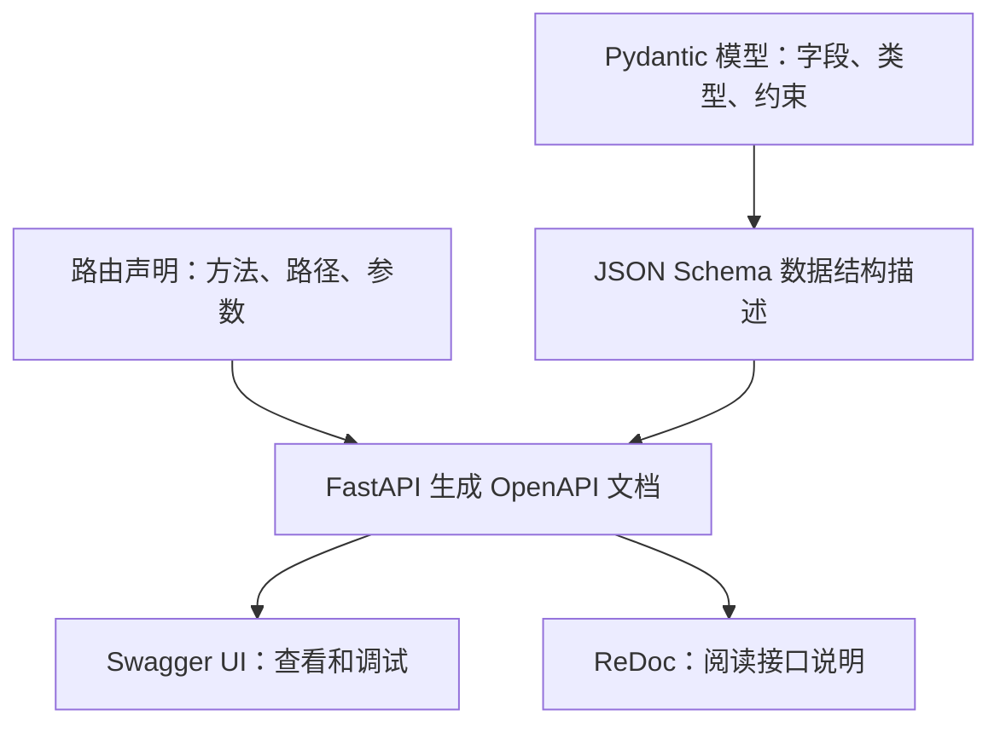

# 01 · FastAPI 框架简介

这篇文档面向刚开始学习 FastAPI 的同学。读完后，你应该能够解释：FastAPI 用来做什么、交互式文档如何使用，以及 Pydantic 为什么会出现在 FastAPI 代码中。

## 1. FastAPI 是什么？

**FastAPI 是一个用 Python 编写 Web API 的框架。** 你可以用它为网页、手机应用或其他程序提供后端接口，例如查询商品、提交订单、返回模型预测结果。

API 可以理解为程序之间约定好的调用入口。以查询商品为例：客户端发送 `GET /products/1` 请求，后端执行对应的 Python 函数，再把商品信息返回给客户端。

先认识几个常见术语：

| 术语 | 含义 | 例子 |
| --- | --- | --- |
| 客户端 | 发起请求的程序 | 浏览器、手机 App、Python 脚本 |
| 请求（Request） | 客户端发送给后端的信息 | 请求查询编号为 1 的商品 |
| 响应（Response） | 后端返回的结果 | 商品名称、价格 |
| 路由（Route） | 将请求的方法和路径对应到处理函数 | `GET /products/1` |
| JSON | 常见的数据交换格式 | `{"name": "笔记本", "price": 12.5}` |

FastAPI 帮你处理路由、参数读取、数据校验和响应生成等通用工作，你主要编写业务逻辑。它利用 Python 类型注解描述接口数据，并能自动生成 API 文档。[官方特性介绍](https://fastapi.tiangolo.com/features/)

## 2. 为什么学习 FastAPI？

- **代码直观**：通过函数和装饰器声明接口，容易把 URL 和处理逻辑联系起来。
- **自动校验数据**：声明字段类型和约束后，框架会检查客户端提交的数据。
- **自带交互式文档**：启动应用后，可以直接在网页中查看和调用接口。
- **编辑器支持好**：类型注解能帮助编辑器提供补全和错误提示。
- **支持同步与异步函数**：既能写普通的 `def`，也能使用 `async def`；异步细节可以在掌握基本接口后再学习。

这些能力来自 FastAPI 与底层组件的配合，其中最需要先认识的是 Starlette 和 Pydantic。[官方特性介绍](https://fastapi.tiangolo.com/features/)

## 3. FastAPI、Pydantic、Starlette 和 Uvicorn 的关系

| 组件 | 主要职责 | 初学时如何理解 |
| --- | --- | --- |
| FastAPI | 组织接口、参数声明、依赖注入和自动文档 | 编写后端接口时直接使用的框架 |
| Pydantic | 按类型和约束校验、转换数据，并支持序列化和数据结构描述 | 定义“数据应该是什么样” |
| Starlette | 提供底层 Web 能力，如请求、响应和中间件 | FastAPI 的 Web 基础 |
| Uvicorn | 运行应用、监听端口并接收网络请求 | 把 FastAPI 应用运行起来的服务器 |

FastAPI 基于 Starlette 和 Pydantic 构建。开发命令 `fastapi dev` 底层使用 Uvicorn 运行应用。Uvicorn 属于 ASGI 服务器；现阶段只需知道 ASGI 是服务器与 Python Web 应用之间的一种接口规范。[FastAPI 特性](https://fastapi.tiangolo.com/features/)、[启动应用](https://fastapi.tiangolo.com/tutorial/first-steps/)

### Pydantic 为什么重要？

普通 Python 类型注解本身不会自动强制检查运行时传入的数据。Pydantic 则会读取模型中的类型声明，在创建模型对象时执行数据校验，并按规则进行必要的转换。[Python 类型介绍](https://fastapi.tiangolo.com/python-types/)、[Pydantic 模型](https://docs.pydantic.dev/latest/concepts/models/)

例如，声明 `price: float` 表示希望得到浮点数价格。在默认的非严格模式下，可解析的字符串 `"12.5"` 可以转换成 `12.5`，但 `"abc"` 无法转换成有效价格。**校验并不意味着拒绝所有与声明类型不同的输入；是否允许转换取决于字段类型和配置。**[Pydantic 数据转换](https://docs.pydantic.dev/latest/concepts/models/#data-conversion)

Pydantic 也是可以独立使用的 Python 库。它的数据模型描述字段和规则，不会自动创建数据库表或保存数据。[Pydantic 模型](https://docs.pydantic.dev/latest/concepts/models/)

## 4. 用一个小例子认识接口

以下示例采用 Python 3.10+ 的类型语法和 Pydantic v2 写法。先理解代码即可；想动手时，可以按后面的步骤运行。

新建 `main.py`，写入：

```python
from fastapi import FastAPI
from pydantic import BaseModel, Field


app = FastAPI(title="我的第一个 FastAPI 应用")


class Product(BaseModel):
    name: str = Field(min_length=1, description="商品名称")
    price: float = Field(gt=0, description="商品价格，必须大于 0")
    description: str | None = None


@app.get("/")
def read_home():
    return {"message": "你好，FastAPI！"}


@app.post("/products", response_model=Product)
def preview_product(product: Product):
    return product
```

这个示例有两个接口：`GET /` 返回问候语；`POST /products` 接收商品信息，校验通过后原样返回，便于观察校验结果。此处没有数据库存储操作。

### 4.1 FastAPI 部分

`app = FastAPI(...)` 创建应用。`@app.get("/")` 是装饰器，用于把 `GET /` 请求关联到下方函数。函数返回的字典会作为 JSON 响应发送给客户端。[第一个应用](https://fastapi.tiangolo.com/tutorial/first-steps/)

`product: Product` 告诉 FastAPI：这个参数应从请求体中读取，并按照 `Product` 模型校验。成功后，函数拿到的是模型对象，可以通过 `product.name`、`product.price` 访问属性。[请求体](https://fastapi.tiangolo.com/tutorial/body/)

`response_model=Product` 声明响应的数据结构，用于响应校验、字段过滤以及生成响应文档。这个例子为了便于理解，输入和输出使用同一个模型。[响应模型](https://fastapi.tiangolo.com/tutorial/response-model/)

### 4.2 Pydantic 部分

`class Product(BaseModel)` 定义一个 Pydantic 数据模型。`Field` 可以补充约束和字段说明：[字段约束](https://fastapi.tiangolo.com/tutorial/body-fields/)

| 字段 | 规则 |
| --- | --- |
| `name` | 必填字符串，至少 1 个字符 |
| `price` | 必填浮点数，必须大于 0；`gt` 表示 greater than |
| `description` | 字符串或 `None`，默认值是 `None`，可以不传 |

这里要区分两个概念：`str | None` 表示允许字符串或空值；`= None` 提供默认值，使字段可以省略。在 Pydantic v2 中，仅写 `description: str | None`，字段仍然是必填的，只是允许传入 JSON 的 `null`。[Pydantic 必填字段](https://docs.pydantic.dev/latest/concepts/models/#required-fields)

## 5. 启动应用

在项目目录打开终端。下面以 macOS / Linux 为例，先创建并激活虚拟环境，再安装 FastAPI：

```bash
python3 -m venv .venv
source .venv/bin/activate
python -m pip install "fastapi[standard]"
```

`fastapi[standard]` 会安装 FastAPI 及常用运行工具，包括开发命令所需的组件。[安装说明](https://fastapi.tiangolo.com/tutorial/#install-fastapi)

确保 `main.py` 已保存，在它所在的目录执行：

```bash
fastapi dev main.py
```

保持终端运行，在浏览器打开 `http://127.0.0.1:8000/`，应该看到：

```json
{"message": "你好，FastAPI！"}
```

`127.0.0.1` 表示本机，`8000` 是默认端口。`fastapi dev` 用于本地开发，支持修改代码后自动重载；终端按 `Ctrl+C` 可以停止服务。[运行说明](https://fastapi.tiangolo.com/tutorial/first-steps/)

## 6. 什么是交互式 API 文档？

**交互式 API 文档既能展示接口说明，也能让你填写参数、发起真实请求并查看响应。** FastAPI 默认提供以下入口；应用运行时，在浏览器访问相应地址即可：[自动文档](https://fastapi.tiangolo.com/tutorial/first-steps/)

| 地址 | 内容 | 用途 |
| --- | --- | --- |
| `http://127.0.0.1:8000/docs` | Swagger UI | 查看接口，在线发送请求、调试接口 |
| `http://127.0.0.1:8000/redoc` | ReDoc | 阅读结构化接口说明；默认集成不提供 Swagger UI 式的在线调试 |
| `http://127.0.0.1:8000/openapi.json` | OpenAPI 描述文件 | 供文档界面、代码生成工具等程序读取 |

### 6.1 在 Swagger UI 中试一次请求

1. 打开 `http://127.0.0.1:8000/docs`。
2. 展开 `POST /products`。
3. 点击 **Try it out**，把请求体替换成下面的 JSON。
4. 点击 **Execute**。
5. 在响应区域查看状态码和响应体。

```json
{
  "name": "学习笔记本",
  "price": 12.5
}
```

按照示例代码，预期状态码是 `200`，响应内容如下。因为没有传入 `description`，模型使用默认值 `None`，输出为 JSON 的 `null`：

```json
{
  "name": "学习笔记本",
  "price": 12.5,
  "description": null
}
```

再把 `price` 改成 `-1` 或 `"abc"` 试一次：前者违反“大于 0”的约束，后者无法解析为浮点数。在默认错误处理下，FastAPI 会返回 `422`，响应的 `detail` 中会说明错误字段和原因；该请求不会进入 `preview_product` 函数。[请求校验错误](https://fastapi.tiangolo.com/tutorial/handling-errors/#override-request-validation-exceptions)

### 6.2 文档为什么能自动生成？

OpenAPI 是描述 HTTP API 的标准，可以记录接口路径、请求方法、参数和响应结构。JSON Schema 用来描述数据本身的结构，例如字段类型和限制。FastAPI 把路由信息与 Pydantic 模型生成的数据结构描述组合成 OpenAPI 文档，再由 Swagger UI 或 ReDoc 展示。[请求模型与自动文档](https://fastapi.tiangolo.com/tutorial/body/#automatic-docs)



因此，示例中的 `price` 类型、大于 0 的限制和字段说明会同时用于校验与文档展示。自动文档来自代码中的声明；业务含义仍需要你通过名称、说明等补充清楚。

## 7. 把一次请求串起来

用上面的商品接口理解各组件如何协作：

1. 客户端（也可以是 Swagger UI）发送 `POST /products` 和 JSON 请求体。
2. Uvicorn 接收网络请求并交给 FastAPI 应用。
3. FastAPI 匹配路由，读取请求数据，并借助 Pydantic 校验商品字段。
4. 校验通过后，执行 `preview_product(product)`；校验失败则返回错误响应。
5. FastAPI 按响应模型处理返回值，向客户端发送 JSON 响应。

这个过程对应前面的代码：**FastAPI 组织接口流程，Pydantic 负责数据规则，Swagger UI 帮助我们查看和调用接口。**

## 8. 入门自测

可以对照示例，尝试回答并验证下面的问题：

- 删除请求中的 `name` 会怎样？——它是必填字段，默认返回 `422`。
- 不传 `description` 会怎样？——使用默认值，响应中为 `null`。
- 把价格写成 `"12.5"` 会怎样？——默认非严格模式下，会转换为数字。
- 在 `/docs` 点击 **Execute** 是模拟调用吗？——它会向正在运行的应用发送真实请求。
- 定义 `Product` 模型会自动创建商品表吗？——不会，数据库操作需要另外实现。

下一篇可以学习“路径参数、查询参数与请求体”，重点理解客户端传来的数据分别从哪里读取。
