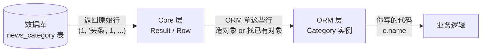

# 08-ORM对象

本篇回答两个一直没讲透的问题：**ORM 对象到底是个什么东西**，以及 **`Result` / `Row` / `scalars()` 这一堆结果类型该怎么理解**。

关键是要放到 [13-SQLAlchemy学习路线](13-SQLAlchemy学习路线.md) 的**分层**里看 —— 这两个问题之所以绕，正是因为它们横跨 Core 和 ORM 两层。单独看任何一层都讲不通。

演示用项目里的 `Category` 模型（`news_category` 表，8 行），在数据库副本上实际运行，输出原样贴出。第 18 节用的 `Book` 模型是同样的道理。

## 一、先回到分层

13 章讲过 SQLAlchemy 是两层叠在一起。把"一次查询"放进这个分层里看，是这样一条流水线：



两句话定义：

> **Row 是 Core 的产物** —— 数据库原样返回的一行，就是个元组。
>
> **ORM 对象是 ORM 的产物** —— ORM 拿着那一行，造出（或找出）一个模型类的实例，并开始追踪它。

**数据库里没有"对象"这回事。** 对象完全是 ORM 在 Python 内存里造出来的东西。理解这一点，后面全部豁然开朗。

## 二、一个 ORM 对象里到底装了什么

别把它想成什么魔法。把它 `__dict__` 打开看看就清楚了：

```python
c = (await db.execute(select(Category).where(Category.id == 1))).scalar_one()
print(c.__dict__)
```

实测：

```text
type(c)       = Category
c.__dict__ 的键 = ['_sa_instance_state', 'created_at', 'id', 'name', 'sort_order', 'updated_at']

拆开看：
   _sa_instance_state   = <sqlalchemy.orm.state.InstanceState object at ...>  ← ORM 的记账本，不是数据
   created_at           = 2026-09-14 09:03:21                                ← 从数据库读来的列值
   id                   = 1                                                  ← 从数据库读来的列值
   name                 = 头条                                                ← 从数据库读来的列值
   sort_order           = 1                                                  ← 从数据库读来的列值
   updated_at           = 2026-09-14 09:03:21                                ← 从数据库读来的列值
```

**一个 ORM 对象 = 普通 Python 对象（属性里存着列值）+ 一个叫 `_sa_instance_state` 的记账本。**

列值就是普普通通的 Python 值：`id` 是 `int`，`name` 是 `str`，`created_at` 是 `datetime`。**它们和数据库已经没有任何连接了** —— 就是一份内存里的副本。

### 记账本里有什么

所有"ORM 感"都来自 `_sa_instance_state`。用 `inspect()` 打开它：

```python
from sqlalchemy import inspect
st = inspect(c)
```

```text
身份 identity        = (1,)        ← 主键，对象的『身份证』
完整 key             = (<class 'models.news.Category'>, (1,), None)
属于哪个 session      = session_id=True
状态                 = persistent=True transient=False detached=False
被改过的字段 dirty     = False
```

记账本记了四件事：

| 记什么 | 用来干嘛 |
| --- | --- |
| **identity（主键）** | 身份映射的依据；UPDATE / DELETE 时的 WHERE 条件 |
| **属于哪个 Session** | 知道该向谁汇报变更 |
| **状态**（transient / pending / persistent / detached） | 决定 flush 时是发 INSERT、UPDATE 还是什么都不发 |
| **每个字段的改动历史** | 脏检查：知道哪些字段被改了，只 UPDATE 这些列 |

对象状态那四种的详细区别，见 [40 章第六节](../40-FastAPI项目-修改用户密码/40-FastAPI项目-修改用户密码.md)。

### 所以"ORM 对象"的准确定义是

> **一个模型类的实例，属性里装着某一行的列值副本，并且带着一本记账本，让 Session 能追踪它、并在 flush 时把改动翻译成 SQL。**

去掉记账本，它就只是个普通对象；去掉 Session，记账本也没人看 —— 这就是"detached（游离）"状态，改了属性也不会写回数据库。

## 三、四个容易混的东西

这四个写法长得像，含义完全不同：

| 写法 | 是什么 | 属于哪层 | 用来干嘛 |
| --- | --- | --- | --- |
| `Category` | **模型类** | ORM（映射到 Core 的表） | 描述表结构、构造查询 |
| `Category.name` | **映射属性**（`InstrumentedAttribute`） | Core 表达式 | 拼 SQL 条件 |
| `c` | **模型实例**（ORM 对象） | ORM | 表示内存里的某一行 |
| `c.name` | **实例上的值** | 纯 Python | 就是个 `str` |

最关键的对比：

```python
Category.name == "头条"     # 造出一个 SQL 条件对象 → 会变成 WHERE news_category.name = ?
c.name == "头条"            # 就是 Python 的字符串比较 → True / False
```

**左边那个 `==` 被 SQLAlchemy 重载了**，返回的不是布尔值而是一个 SQL 表达式对象。右边那个是普通的 Python `==`。

这也解释了 [44 章](../44-FastAPI项目-获取收藏列表/44-FastAPI项目-获取收藏列表.md) 讲的 `desc()` 问题 —— `Category.name` 这种映射属性身上挂着一堆用来造 SQL 的方法（`.desc()`、`.in_()`、`.like()`），而 `c.name` 是个 `str`，只有 `str` 的方法。

## 四、对象是怎么"长出来"的

### 4.1 同一条 SQL，Core 和 ORM 拿回来的东西不一样

这个对比最能说明问题。实测：

```text
Core 连接  conn.execute(text("SELECT id, name, ... FROM news_category WHERE id=1"))
   -> Row  (1, '头条', 1, '2026-09-14 09:03:21', '2026-09-14 09:03:21')
      这就是数据库原样返回的一行，没有『对象』这回事

ORM 会话  db.execute(select(Category).where(Category.id==1))
   -> Category  <Category(id=1, name=头条, sort_order=1)>
      ORM 拿着上面那一行，去『造/找』一个 Category 对象
```

**同一份数据，同一条 SQL。** 区别只在于：Core 连接把行原样给你，ORM 会话多做了一步"把行变成对象"。

### 4.2 ORM 多做的那一步：造对象，或者复用已有的

这一步不是简单地"new 一个"。ORM 会先查**身份映射**：这个主键的对象我是不是已经有了？实测：

```text
第一次查 id=1  -> 新造一个对象  id(obj)=4426498448
第二次查 id=1  -> 复用同一个    id(obj)=4426498448   a is b = True
session 的身份映射里有: [(<class 'models.news.Category'>, (1,), None)]
```

**两次查询拿到的是同一个 Python 对象。** 第二次查询虽然真的发了 SQL、真的读回了数据，但 ORM 发现 `(Category, (1,))` 这个身份已经存在，就把已有对象还给你了。

这是为了避免一种混乱：同一行数据在内存里有两个对象，你改了一个，另一个还是旧值，最后谁写进数据库全看运气。

### 4.3 查"列"而不是查"类" → 根本没有对象

```text
两次查 Category.name -> '头条' / '头条'   是同一个对象吗? False
身份映射里有几个对象: 0                    ← 查列不会进身份映射
改了它 n1 = '改名'，Session 会知道吗? -> 不会，它只是个普通 str
```

`select(Category.name)` 查的是**一个列**，不是一个模型类。ORM 没有造对象的依据（一个 `name` 值不足以代表一行），所以直接把 Core 的原始值给你。

**这是"ORM 对象"和"普通值"的分水岭：**

| 查什么 | 拿到什么 | 有身份吗 | 改了会写回数据库吗 |
| --- | --- | --- | --- |
| `select(Category)` | `Category` 对象 | ✅ | ✅ 会 |
| `select(Category.name)` | `str` | ❌ | ❌ 不会 |
| `select(Category.id, Category.name)` | `Row`（元组） | ❌ | ❌ 不会 |

## 五、Result / Row / scalars —— 一个统一的模型

结果类型之所以让人混乱，是因为名字多（`Result`、`ChunkedIteratorResult`、`ScalarResult`、`Row`、`RowMapping`……）。但背后其实只有一条规则。

### 5.1 一条规则

> **`execute()` 永远返回一个 `Result`；`Result` 里永远装着 `Row`；`Row` 永远是个元组。
> 变的只是元组的格子里装什么。**

实测四种查询：

```text
select(Category)             查整个模型类
   Result 类型 : ChunkedIteratorResult
   一行的类型   : Row   内容 (<Category(id=1, name=头条, sort_order=1)>,)
   row[0] 是    : Category

select(Category.name)        查一列
   Result 类型 : ChunkedIteratorResult
   一行的类型   : Row   内容 ('体育',)
   row[0] 是    : str

select(Category.id, .name)   查两列
   Result 类型 : ChunkedIteratorResult
   一行的类型   : Row   内容 (6, '体育')
   row[0] 是    : int

select(func.count())         查聚合
   Result 类型 : ChunkedIteratorResult
   一行的类型   : Row   内容 (8,)
   row[0] 是    : int
```

**四种情况，`Result` 和 `Row` 的类型完全一样。** 唯一的差别是 `Row` 里装的是 `Category` 对象、`str`、还是 `int` —— 这取决于你 `select()` 里写了什么。

所以 13 章那句"**查什么，决定拿回来的是什么形状**"，准确说法是：**查什么，决定 Row 的格子里装什么**。

### 5.2 `scalars()` 做的事只有一件

```text
.all()             -> ['Row', 'Row', 'Row']        每个都是 Row
手动取 row[0]       -> ['Category', 'Category', 'Category']
.scalars().all()   -> ['Category', 'Category', 'Category']   ← 等价，少写一步
```

**`scalars()` = "每行只取第 0 个格子"。** 就这么简单，没有别的魔法。

它之所以在项目里到处都是，是因为 `select(Category)` 这种查询每行只有一个格子，每次手写 `row[0]` 太啰嗦：

```python
# 这两行完全等价
[row[0] for row in (await db.execute(stmt)).all()]
(await db.execute(stmt)).scalars().all()
```

`scalar_one()` / `scalar_one_or_none()` 同理 —— "取唯一一行的第 0 个格子"，区别是找不到时报错还是返回 `None`。

### 5.3 `mappings()` 把 Row 当字典用

```text
类型 RowMapping   内容 {'id': 6, 'name': '体育'}
```

`Row` 默认按位置访问（`row[0]`、`row[1]`），`mappings()` 换成按列名访问。查多列时比数位置清楚得多 —— [44 章](../44-FastAPI项目-获取收藏列表/44-FastAPI项目-获取收藏列表.md) 的收藏列表查了 9 个字段，用的就是它。

### 5.4 一张选择表

| 你想要 | 用什么 | 拿到 |
| --- | --- | --- |
| 一批 ORM 对象 | `.scalars().all()` | `list[Category]` |
| 一个 ORM 对象（必须有） | `.scalar_one()` | `Category`，没有就报错 |
| 一个 ORM 对象（可能没有） | `.scalar_one_or_none()` | `Category` 或 `None` |
| 多列，想按列名取 | `.mappings().all()` | `list[RowMapping]` |
| 多列，按位置取就行 | `.all()` | `list[Row]` |
| 一个聚合值 | `.scalar_one()` | `int` 等 |

### 5.5 结果会被消耗

一个 `Result` 读完就空了，不能重复读 —— [40 章](../40-FastAPI项目-修改用户密码/40-FastAPI项目-修改用户密码.md) 里连续两次 `result.scalars().first()` 报 `ResourceClosedError`，就是这个原因。要用两次就先存成变量。

各结果类型的完整方法表、异步结果类型、以及更细的规则，见 [09-SQLAlchemy查询结果与取值](09-SQLAlchemy查询结果与取值.md)。**本节给的是心智模型，09 是查阅用的参考手册。**

## 六、ORM 对象 ≠ 字典 ≠ JSON

这三个东西经常被混为一谈，其实处在完全不同的位置：

```mermaid
flowchart LR
    A["ORM 对象<br/>Category 实例"] -->|jsonable_encoder| B["dict<br/>{'id':1,'name':'头条'}"]
    B -->|json.dumps| C["JSON 字符串<br/>'{\"id\":1,...}'"]
    C -->|HTTP 响应| D[前端]
```

| | ORM 对象 | dict | JSON 字符串 |
| --- | --- | --- | --- |
| 有身份、能被追踪 | ✅ | ❌ | ❌ |
| 改了会写回数据库 | ✅ | ❌ | ❌ |
| 能直接存进 Redis | ❌ | ❌ | ✅ |
| 能直接发给前端 | ❌ | 要先序列化 | ✅ |

[47 章](../47-FastAPI项目-设计缓存策略和缓存新闻列表/47-FastAPI项目-设计缓存策略和缓存新闻列表.md)里那个 `jsonable_encoder` 就卡在第一个箭头上 —— 实测直接 `json.dumps(ORM 对象)` 会抛 `TypeError: Object of type Category is not JSON serializable`，必须先转成 dict。

**一个常见的误解是"查出来的东西可以直接返回给前端"。** 实际上 FastAPI 在背后默默做了 ORM 对象 → dict → JSON 这两步转换。知道这条链路，遇到 `datetime` 序列化失败、字段名不对（驼峰/蛇形）这类问题时才知道该在哪一环下手。

## 七、什么时候该用 ORM 对象，什么时候不该

| 场景 | 建议 | 为什么 |
| --- | --- | --- |
| 要改数据再存回去 | **用 ORM 对象** | 只有它能被 Session 追踪、自动生成 UPDATE |
| 只读几个字段返给前端 | 查列 + `mappings()` | 不需要身份追踪，少读几列也省事 |
| 统计、聚合 | 查聚合 + `scalar_one()` | 拿一个数就够了 |
| 存进缓存 | 先转成 dict | ORM 对象存不进 Redis |

项目里两种都有：[crud/users.py](../../toutiao_backend/crud/users.py) 改密码时查的是 `User` 对象（要改要存），[44 章](../44-FastAPI项目-获取收藏列表/44-FastAPI项目-获取收藏列表.md) 的收藏列表查的是 9 个具体字段（只读，直接组装响应）。

## 八、小结

- **数据库里没有"对象"。** ORM 对象是 ORM 层拿着 Core 层返回的行，在内存里造出来的。
- **ORM 对象 = 普通 Python 对象（属性存着列值副本）+ 一个记账本 `_sa_instance_state`。** 记账本里是主键身份、所属 Session、状态、改动历史。
- **`Category` / `Category.name` / `c` / `c.name` 是四样不同的东西**：前两个用来造 SQL，后两个是内存里的数据。
- **`execute()` 永远返回 `Result`，`Result` 里永远是 `Row`，`Row` 永远是元组。** 变的只是格子里装什么。
- **`scalars()` 就是"每行取第 0 格"**，`mappings()` 就是"把 Row 当字典"。
- **查类才有对象，查列只有值。** 只有对象才有身份、才会被追踪、改了才会写回数据库。

## 九、本篇核对了哪些实际行为

在项目数据库副本上运行（原库未改动）：

| 验证内容 | 结果 |
| --- | --- |
| `c.__dict__` 的内容 | 5 个列值 + 1 个 `_sa_instance_state` |
| `inspect(c)` 的记账本 | `identity=(1,)`，`persistent=True`，绑定了 session |
| Core 连接执行同一条 SQL | 返回 `Row (1, '头条', 1, ...)`，没有对象 |
| ORM 会话执行 `select(Category)` | 返回 `Category` 实例 |
| 同一主键查两次 | **`a is b` 为 `True`**，身份映射复用了对象 |
| 查 `Category.name` 两次 | 不是同一对象，身份映射里 **0 个对象** |
| 四种 select 的 Result 类型 | 全部是 `ChunkedIteratorResult`，行全部是 `Row` |
| 四种 select 的 `row[0]` | `Category` / `str` / `int` / `int` |
| `.scalars().all()` 与手动 `row[0]` | 结果完全一致 |
| `.mappings()` | 返回 `RowMapping`，`{'id': 6, 'name': '体育'}` |

相关笔记：[13-SQLAlchemy学习路线](13-SQLAlchemy学习路线.md)、[09-SQLAlchemy查询结果与取值](09-SQLAlchemy查询结果与取值.md)、[14-SQLAlchemy关系relationship与关联加载](14-SQLAlchemy关系relationship与关联加载.md)。

继续学习：[第 18 节：ORM 操作数据——查询](../18-FastAPI进阶-ORM操作数据-查询/18-FastAPI进阶-ORM操作数据-查询.md)。
