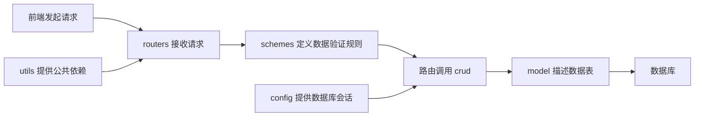

# 29 · FastAPI 项目：模块化路由

核心步骤：**设计模块化目录结构 → 编写独立路由模块 → 在 `main.py` 中通过 `include_router()` 注册路由模块。**

前置知识：[路由与 Python 装饰器](../03-FastAPI路由/03-FastAPI路由与Python装饰器.md)、[依赖注入](../14-FastAPI进阶-依赖注入/14-FastAPI依赖注入.md)。本篇结合新闻浏览项目，学习如何将新闻、用户等接口组织为同一个应用中的多个模块。

第 3 节提供按文件拆分的完整基础示例；其他代码块会标明是替换方案还是局部示例。本文中的后端文件需要练习时自行创建，目前笔记中的示例不代表新闻后端已实现。

## 1. 为什么使用模块化路由？

### 1.1 接口都写在 `main.py` 中会遇到什么问题？

项目初期，可以直接在主应用上声明所有接口：

```python
from fastapi import FastAPI

app = FastAPI()


@app.get("/api/news/list")
def list_news():
    return {"code": 200, "data": {"list": []}}


@app.get("/api/user/info")
def get_user_info():
    return {"code": 200, "data": {"username": "demo"}}
```

随着新闻、分类、用户、收藏、浏览历史等接口增加，单文件会逐渐出现以下问题：

| 问题 | 在新闻项目中的表现 | 拆分后的改善 |
| --- | --- | --- |
| 文件过长，定位困难 | 修改收藏接口时，需要在大量无关代码中寻找函数 | 收藏接口集中在 `routers/favorite.py` |
| 重复配置 | 每个新闻接口都重复写 `/api/news` 和新闻标签 | 在路由组或注册时统一设置 |
| 职责混杂 | 应用初始化、新闻查询、用户校验写在一起 | 主入口组装应用，业务模块管理各自接口 |
| 协作冲突 | 不同功能的修改集中在同一个文件 | 不同业务可以分别维护 |
| 难以单独验证 | 测试新闻接口时需要理解整个主文件 | 可将新闻路由注册到测试应用中验证 |

模块化路由是**按业务组织接口的一种代码结构**。拆分之后仍然可以是一个 FastAPI 应用、一个服务地址；它本身不会自动实现数据库分层、用户鉴权，也不意味着拆成微服务。

FastAPI 提供 `APIRouter` 来组织这些路由，再将它们纳入同一个应用。[官方多文件应用教程](https://fastapi.tiangolo.com/tutorial/bigger-applications/)

## 2. 相关类与对象

### 2.1 `FastAPI`：整个应用的入口

```python
from fastapi import FastAPI

app = FastAPI(
    title="新闻资讯 API",
    description="提供新闻浏览和用户相关接口",
    version="0.1.0",
)
```

- `FastAPI` 是类，`FastAPI(...)` 创建应用实例，`app` 是保存实例的变量名。
- 应用对象交给 Uvicorn 等 ASGI 服务器，由服务器接收网络请求并调用应用。
- 应用统一管理路由注册、中间件、异常处理器、生命周期以及接口文档。
- 本项目在 `main.py` 中创建主应用，各业务模块创建自己的路由组。

| 常用参数或方法 | 含义 |
| --- | --- |
| `title`、`description` | 接口文档中的应用名称和介绍 |
| `version` | 当前业务 API 的版本说明，不是安装的 FastAPI 版本，也不会自动添加 URL 前缀 |
| `docs_url` | Swagger UI 路径，默认 `/docs`；设为 `None` 可关闭该页面 |
| `openapi_url` | OpenAPI 描述文件路径，默认 `/openapi.json` |
| `lifespan` | 配置应用启动和关闭时的资源管理 |
| `app.include_router(...)` | 将业务路由组纳入应用 |
| `app.add_middleware(...)` | 注册应用中间件，例如 CORS 中间件 |

参数详见 [FastAPI 类参考](https://fastapi.tiangolo.com/reference/fastapi/)。

### 2.2 `APIRouter`：组织一组相关路由

```python
from fastapi import APIRouter

router = APIRouter(prefix="/news", tags=["新闻"])


@router.get("/list")
def list_news():
    return {"code": 200, "data": {"list": []}}
```

这里的 `router` 是 `APIRouter` 实例。`@router.get()`、`@router.post()`、`@router.put()`、`@router.delete()` 的声明方式，与之前学习的 `@app.get()` 等方法类似。

这个模块先在路由组中登记 `/news/list`，主应用注册该路由组后，才能通过主应用访问它。路由组不会自行创建 `/docs` 页面；其文档由主应用统一生成。

| 常用参数 | 示例 | 作用 |
| --- | --- | --- |
| `prefix` | `"/news"` | 为组内路由添加共同路径前缀 |
| `tags` | `["新闻"]` | 为组内接口添加文档分组标签 |
| `dependencies` | `[Depends(check_login)]` | 为组内接口声明共同依赖，例如登录校验 |
| `responses` | `{404: {"description": "新闻不存在"}}` | 补充 OpenAPI 中的响应说明 |
| `default_response_class` | `JSONResponse` | 设置默认响应类型；默认就是 JSON 响应 |
| `include_in_schema` | `False` | 将接口从 OpenAPI 文档中隐藏，接口仍可访问 |
| `deprecated` | `True` | 在文档中标记接口已弃用，不会禁止调用 |

`responses` 只声明文档信息，不会自动执行错误判断。要在新闻不存在时真正返回 HTTP 404，需要在处理流程中抛出 `HTTPException(status_code=404, ...)` 等。[APIRouter 参数参考](https://fastapi.tiangolo.com/reference/apirouter/)

### 2.3 `APIRoute`：一条具体的 API 路由

`APIRoute` 的导入位置是 `fastapi.routing`。通常不需要手动创建它：执行 `@router.get(...)` 等装饰器时，FastAPI 会建立对应的路由对象。

它保存路径、允许的 HTTP 方法、处理函数（`endpoint`）、响应模型等信息，并参与参数验证、依赖解析和响应生成。`APIRouter` 负责组织这些路由对象。

| 名称 | 对应层次 | 在本项目中的例子 |
| --- | --- | --- |
| `FastAPI` | 完整应用 | `main.py` 中的 `app` |
| `APIRouter` | 一组相关接口 | `news.py` 中的 `router` |
| `APIRoute` | 具体 API 路由 | `GET /news/list` 对应的路由对象 |
| 路径操作函数 | 业务处理函数 | `list_news()` |

这三者是协作关系。`APIRouter` 并不是 `FastAPI` 的子类；在本地 FastAPI 0.141.1 中，前者继承 Starlette 的 `Router`，后者继承 `Starlette`。应用内部通过 `app.router` 使用一个 `APIRouter` 管理路由。

后续如果要定制一组接口的请求处理过程，可以继承 `APIRoute`，再通过 `APIRouter(route_class=自定义类)` 使用它。本章掌握默认行为即可。[自定义 APIRoute](https://fastapi.tiangolo.com/how-to/custom-request-and-route/)

## 3. 如何实现：拆分新闻和用户路由

### 3.1 第一步：创建目录结构

练习时，在项目根目录按下面的结构创建文件：

```text
fastApi-learn/
├── pyproject.toml
└── toutiao_backend/
    ├── __init__.py
    ├── main.py
    └── routers/
        ├── __init__.py
        ├── news.py
        └── user.py
```

两个 `__init__.py` 保持为空即可。这里用它们将目录组织为常规 Python 包：`toutiao_backend` 是包，`routers` 是子包，`news.py` 是模块。Python 也支持没有 `__init__.py` 的命名空间包，本项目练习统一采用常规包结构。[Python 模块与包](https://docs.python.org/3/tutorial/modules.html#packages)

本节只创建路由练习所需的文件。`crud`、`model`、`schemes`、`utils`、`config` 的完整职责见根目录 [后端设计与开发约定](../../BACKEND_DESIGN.md)。

### 3.2 第二步：编写新闻路由模块

文件：`toutiao_backend/routers/news.py`。以下是该文件的完整基础示例：

```python
from fastapi import APIRouter, HTTPException, Query

router = APIRouter(prefix="/news", tags=["新闻"])

# 固定数据只用于观察路由与分页，后续再替换为 CRUD 查询。
NEWS = [
    {"id": 1, "title": "学习 FastAPI 模块化路由", "categoryId": 1},
    {"id": 2, "title": "新闻项目开发记录", "categoryId": 2},
]


@router.get("/list", summary="获取新闻列表")
def list_news(
    category_id: int | None = Query(default=None, alias="categoryId", ge=1),
    page: int = Query(default=1, ge=1),
    page_size: int = Query(default=10, alias="pageSize", ge=1, le=100),
):
    items = NEWS
    if category_id is not None:
        items = [item for item in NEWS if item["categoryId"] == category_id]

    start = (page - 1) * page_size
    return {
        "code": 200,
        "message": "success",
        "data": {
            "list": items[start : start + page_size],
            "total": len(items),
        },
    }


@router.get(
    "/detail",
    summary="获取新闻详情",
    responses={404: {"description": "新闻不存在"}},
)
def get_news_detail(news_id: int = Query(alias="id", ge=1)):
    for item in NEWS:
        if item["id"] == news_id:
            return {"code": 200, "message": "success", "data": item}

    raise HTTPException(status_code=404, detail="新闻不存在")
```

需要关注的几点：

- 新闻模块创建 `APIRouter`，不需要导入主应用 `app`。
- `prefix="/news"` 统一添加业务前缀，装饰器只写 `/list`、`/detail`。
- `alias` 将 Python 中的 `category_id`、`page_size`、`news_id` 对应到前端使用的 `categoryId`、`pageSize`、`id`。
- `Query(ge=1)` 表示参数必须大于或等于 1；`le=100` 限制最大值。详情参数没有默认值，因此是必填查询参数。
- `Query()` 是参数声明辅助函数；`HTTPException` 是异常类。`raise` 会终止当前处理流程并交给异常处理器生成响应。
- 示例异常沿用 FastAPI 默认结构，例如 `{"detail": "新闻不存在"}`。统一成项目要求的 `code/message/data` 错误结构，需要后续实现异常处理器。

这里用普通 `def` 完成内存数据查询。以后接入异步数据库操作时，可改为 `async def` 并在需要的位置使用 `await`，路由拆分方式相同。

### 3.3 第三步：编写用户路由模块

文件：`toutiao_backend/routers/user.py`。以下是该文件的完整基础示例：

```python
from fastapi import APIRouter

router = APIRouter(prefix="/user", tags=["用户"])


@router.get("/info", summary="获取演示用户资料")
def get_user_info():
    return {
        "code": 200,
        "message": "success",
        "data": {"id": 1, "username": "demo", "bio": "正在学习模块化路由"},
    }
```

该接口返回固定演示用户，没有实现登录或鉴权。真实的 `/api/user/info` 应当从已验证的令牌中确定当前用户，第 5 节会演示如何给路由组添加共同依赖。

`news.py` 和 `user.py` 都可以使用变量名 `router`，因为它们属于不同模块：`news.router` 与 `user.router` 是两个不同对象。

### 3.4 第四步：在主应用注册路由

文件：`toutiao_backend/main.py`。以下是该文件的完整基础示例：

```python
from fastapi import FastAPI

from toutiao_backend.routers import news, user

app = FastAPI(title="新闻资讯 API", version="0.1.0")

app.include_router(news.router, prefix="/api")
app.include_router(user.router, prefix="/api")


@app.get("/", tags=["系统"], summary="查看服务状态")
def root():
    return {"message": "新闻资讯 API 已启动"}
```

`from toutiao_backend.routers import news, user` 导入的是模块；`news.router` 和 `user.router` 才是传给 `include_router()` 的路由组对象。仅导入模块，不执行注册，主应用不会自动发现这些接口。

也可以在 `main.py` 中用 `from .routers import news, user` 做相对导入。本篇统一使用完整包名，便于看清导入来源。

### 3.5 第五步：启动和验证

先完成上述文件，再在**项目根目录 `fastApi-learn/`** 执行：

```bash
uv sync
uv run uvicorn toutiao_backend.main:app --reload --host 127.0.0.1 --port 8000
```

`toutiao_backend.main:app` 中，冒号前是 Python 模块路径，冒号后是该模块中的应用变量名。`--reload` 用于开发时修改代码后自动重载。不要在 `toutiao_backend/` 内直接执行同一条命令，也不要把 `python toutiao_backend/main.py` 当作启动服务器的命令。

访问 `http://127.0.0.1:8000/docs`，应当看到“系统”“新闻”“用户”三个分组。可以通过浏览器地址栏、Swagger UI 或 `.http` 文件验证：

```http
### 新闻列表
GET http://127.0.0.1:8000/api/news/list

### 按分类和分页查询
GET http://127.0.0.1:8000/api/news/list?categoryId=1&page=1&pageSize=1

### 新闻详情
GET http://127.0.0.1:8000/api/news/detail?id=1

### 演示用户资料
GET http://127.0.0.1:8000/api/user/info
```

| 请求 | 预期 HTTP 状态码 | 预期结果 |
| --- | --- | --- |
| `GET /api/news/list` | 200 | `data.list` 包含两条新闻，`data.total` 为 2 |
| `GET /api/news/list?categoryId=1&pageSize=1` | 200 | 返回第一条新闻，筛选后的 `data.total` 为 1 |
| `GET /api/news/list?page=3&pageSize=1` | 200 | `data.list` 为空，`data.total` 仍为 2 |
| `GET /api/news/detail?id=1` | 200 | 返回 ID 为 1 的新闻 |
| `GET /api/news/detail?id=999` | 404 | 响应体为 `{"detail": "新闻不存在"}` |
| `GET /api/news/detail` | 422 | 缺少必填查询参数 `id` |
| `GET /api/news/list?page=0` | 422 | 分页参数不符合约束 |
| `GET /news/list` | 404 | 缺少注册时添加的 `/api` 前缀 |
| `POST /api/news/list` | 405 | 路径存在，但未声明 POST 方法 |

这是路由练习，固定新闻数据只包含少数字段。完整前端联调还需要实现其余接口、响应字段和跨域配置。

## 4. `include_router()` 与路径前缀

### 4.1 最终 URL 如何拼接？

`include_router()` 是方法，不是类。`FastAPI` 和 `APIRouter` 都提供它，因此既可以将路由组加入主应用，也可以加入另一个路由组。

对于第 3 节的新闻列表：

```text
注册时的 prefix     + 路由组的 prefix  + 装饰器中的路径
"/api"             + "/news"          + "/list"
= "/api/news/list"
```

查询字符串 `?page=1&pageSize=10` 不参与上述路径拼接。`tags=["新闻"]` 也不会改变 URL。

本项目可以约定：主入口统一负责 `/api`，业务模块负责 `/news`、`/user`、`/favorite`、`/history`，具体接口负责 `/list`、`/info` 等末尾路径。避免在不同位置重复写同一段前缀。

### 4.2 前缀和斜杠的规则

- 非空 `prefix` 必须以 `/` 开头，不能以 `/` 结尾，例如 `/news`。
- 装饰器中非空的路径以 `/` 开头，例如 `/list`。
- `prefix="/news"` 配合 `@router.get("/")`，得到 `/news/`。
- `prefix="/news"` 配合 `@router.get("")`，得到 `/news`；空路径要求组合后仍有有效路径。
- 默认通常会对末尾斜杠差异进行重定向；调用方仍应按定义的完整路径访问。

规则可查阅 [APIRouter 参考](https://fastapi.tiangolo.com/reference/apirouter/)。

### 4.3 进阶：先聚合业务路由，再注册到主应用

当模块增多，可以新增 `toutiao_backend/routers/api.py` 作为汇总入口。以下是第 3 节注册方式的**替换方案**。

`toutiao_backend/routers/api.py`：

```python
from fastapi import APIRouter

from toutiao_backend.routers import news, user

api_router = APIRouter(prefix="/api")
api_router.include_router(news.router)
api_router.include_router(user.router)
```

将 `main.py` 替换为：

```python
from fastapi import FastAPI

from toutiao_backend.routers.api import api_router

app = FastAPI(title="新闻资讯 API", version="0.1.0")
app.include_router(api_router)


@app.get("/", tags=["系统"], summary="查看服务状态")
def root():
    return {"message": "新闻资讯 API 已启动"}
```

最终业务路径保持不变。不要同时保留原来的两行注册语句，否则会重复注册接口。练习中按“声明业务路由 → 聚合路由 → 注册应用”的顺序组织代码即可。

从请求处理和文档生成的角度看，所有这些业务路由仍属于同一个主应用。FastAPI 0.141.1 保留被纳入的路由组及其路由对象，并组合前缀、依赖等配置；不应将其实现简单描述为“把函数复制进 `main.py`”。[路由纳入主应用的说明](https://fastapi.tiangolo.com/tutorial/bigger-applications/#include-the-apirouters-for-users-and-items)

## 5. 给一组路由添加共同依赖

收藏接口通常都要求登录，可以把共同校验放在路由组层面。下面是一个**可选扩展练习**，用于观察依赖的执行范围。

先创建空的 `toutiao_backend/utils/__init__.py`，再创建 `toutiao_backend/utils/dependencies.py`：

```python
from fastapi import Header, HTTPException


def check_login(authorization: str | None = Header(default=None)) -> None:
    # 固定令牌仅供本章练习，不包含真实登录、签名校验或有效期处理。
    if authorization != "demo-token":
        raise HTTPException(status_code=401, detail="请先登录")
```

新增 `toutiao_backend/routers/favorite.py`：

```python
from fastapi import APIRouter, Depends

from toutiao_backend.utils.dependencies import check_login

router = APIRouter(
    prefix="/favorite",
    tags=["收藏"],
    dependencies=[Depends(check_login)],
)


@router.get("/list", summary="获取演示收藏列表")
def list_favorites():
    return {"code": 200, "message": "success", "data": {"list": []}}
```

如果使用第 3 节的 `main.py`，增加以下导入和注册；注册语句放在 `app` 创建之后：

```python
from toutiao_backend.routers import favorite

app.include_router(favorite.router, prefix="/api")
```

如果使用第 4.3 节的聚合方式，则在 `routers/api.py` 中导入 `favorite`，并执行 `api_router.include_router(favorite.router)`，这里不再添加 `/api`。两种方式选择一种。

```http
### 没有令牌，预期 401
GET http://127.0.0.1:8000/api/favorite/list

### 携带演示令牌，预期 200
GET http://127.0.0.1:8000/api/favorite/list
Authorization: demo-token
```

`Header()` 声明从请求头读取 `Authorization`。`Depends(check_login)` 传入的是函数对象，没有立即调用函数；请求匹配收藏接口后，FastAPI 会先执行校验，再调用路径操作函数。

| 依赖声明位置 | 作用范围 |
| --- | --- |
| `FastAPI(dependencies=[...])` | 应用内的路径操作 |
| `app.include_router(..., dependencies=[...])` | 通过这次注册纳入的路径操作 |
| `APIRouter(dependencies=[...])` | 路由组中的路径操作 |
| `@router.get(..., dependencies=[...])` | 当前路径操作 |
| 函数参数 `current_user = Depends(get_current_user)` | 当前函数需要接收的依赖结果 |

这些层级的依赖会共同生效。路由组上的依赖适合只检查“能否继续”；其返回值不会自动传入路径操作函数。如果业务需要当前用户对象，应通过函数参数声明接收结果的依赖。[装饰器依赖的返回值说明](https://fastapi.tiangolo.com/tutorial/dependencies/dependencies-in-path-operation-decorators/)

`Depends()` 是 FastAPI 导出的依赖声明辅助函数，调用后返回依赖配置对象，不是路由类。它与 `APIRouter` 的职责不同。

项目中登录和注册接口需要允许未登录用户访问，因此不要直接给包含这些接口的整个用户路由组加登录依赖。可对资料修改等接口单独配置，或拆成公开路由组和需要鉴权的路由组。

## 6. `include_router()` 与 `mount()` 有什么区别？

日常交流中可能把 `include_router()` 称作“挂载路由”，但 FastAPI 中有单独的 `mount()` 方法，两者含义不同。

| 对比 | `app.include_router(router)` | `app.mount("/sub", sub_app)` |
| --- | --- | --- |
| 传入对象 | `APIRouter` 路由组 | 独立的 ASGI 应用，例如另一个 `FastAPI` 实例 |
| 组织方式 | 将业务路由纳入当前应用 | 把指定路径下的请求交给子应用 |
| 接口文档 | 路由默认汇入主应用 `/docs` | FastAPI 子应用有独立文档，默认位于 `/sub/docs` |
| 本项目适用场景 | 新闻、用户、收藏等业务模块 | 确实需要独立子应用时再使用 |

新闻后端当前只需要一个应用统一提供接口，使用 `APIRouter` 加 `include_router()` 即可。[独立子应用与挂载](https://fastapi.tiangolo.com/advanced/sub-applications/)

## 7. 模块化路由如何接入后端分层？

在完整新闻项目中，路由模块主要描述 HTTP 接口和组织业务调用，后续可以把第 3 节的内存查询迁移到 CRUD 层：



图中的 `schemes` 和 `model` 提供结构定义：验证通常由 FastAPI 按声明执行，数据库访问由 CRUD 使用 ORM 模型完成，并不是每个框都必须写一次显式函数调用。

| 目录或文件 | 开发时放什么 |
| --- | --- |
| `main.py` | 创建应用、注册路由、中间件和异常处理器 |
| `routers/news.py` | 新闻接口路径、参数声明、依赖注入及业务调用 |
| `crud/news.py` | 新闻增删改查和分页查询 |
| `model/news.py` | SQLAlchemy 新闻表及分类表模型 |
| `schemes/news.py` | Pydantic 请求、响应模型 |
| `utils/dependencies.py` | 当前用户解析等公共依赖 |
| `config/database.py` | 引擎、会话工厂及会话依赖 |

为了避免循环导入，应当由 `main.py` 导入业务路由，业务路由再导入 CRUD、数据模型和依赖模块。业务路由不应反过来 `from toutiao_backend.main import app`。

`schemes` 沿用本项目已经约定的命名；其他项目中常见的 `schemas` 通常承担相同职责。

## 8. 常见问题与排查

| 现象 | 常见原因 | 检查或处理方式 |
| --- | --- | --- |
| 写了接口，但 `/docs` 没有显示，访问也返回 404 | 忘记注册路由，或启动了另一个应用 | 检查 `include_router()` 和启动命令中的模块路径 |
| `/docs` 中没有接口，但请求成功 | 设置了 `include_in_schema=False` | 检查文档显示配置；隐藏文档不等于限制访问 |
| 地址意外变成 `/api/news/news/list` | 重复添加业务前缀 | 按每一层的 `prefix` 和装饰器路径逐段拼接 |
| 启动时提示前缀错误 | 写成 `news` 或 `/news/` | 非空前缀改为 `/news` |
| 出现 `ModuleNotFoundError` | 工作目录不对，或包名拼写不一致 | 从项目根目录启动，检查包结构 |
| 两个路由模块只有一个被注册 | 连续导入同名 `router`，后一次覆盖前一次绑定 | 导入模块后使用 `news.router`、`user.router`，或为对象设置导入别名 |
| 出现循环导入错误 | 路由模块反向导入主应用 | 公共功能移到依赖或配置模块，保持清晰的导入方向 |
| 正确路径返回 405 | HTTP 方法不匹配 | 对照装饰器检查 GET、POST 等方法 |
| 配置了 `responses={404: ...}`，仍未返回 404 | 把文档声明当成业务处理 | 在数据不存在时显式抛出异常 |
| 登录接口也返回“请先登录” | 登录校验依赖覆盖了公开接口 | 缩小依赖范围或拆分路由组 |

还要注意**固定路径与动态路径的声明顺序**。下面是独立的局部示例：

```python
from fastapi import APIRouter

router = APIRouter(prefix="/news")


# 固定路径放在可能匹配它的动态路径之前。
@router.get("/list")
def list_news():
    return []


@router.get("/{news_id}")
def get_news(news_id: int):
    return {"id": news_id}
```

如果先注册 `/{news_id}`，请求 `/news/list` 可能先匹配它，再因 `list` 不能转换为整数而返回 422；不会因为参数验证失败就自动继续寻找后面的 `/list`。同一路径、同一 HTTP 方法也不应重复声明来实现“覆盖”。[路径匹配顺序](https://fastapi.tiangolo.com/tutorial/path-params/#order-matters)

## 9. 动手巩固

1. 完成第 3 节的文件，启动应用，逐项验证请求表中的结果。
2. 在 `news.py` 中增加 `GET /categories`，返回 `data` 为分类数组的成功响应。确认完整路径为 `/api/news/categories`。
3. 将新闻路由的 `tags` 改成 `资讯`，观察文档分组改变，但请求路径保持不变。
4. 暂时移除新闻路由注册，确认接口无法通过主应用访问，然后恢复。
5. 使用第 4.3 节的聚合方式替换直接注册，确认新闻和用户接口路径不变。
6. 完成第 5 节的收藏路由，分别使用缺失、错误和正确的演示令牌请求，检查 401 与 200 响应。
7. 用自己的话说明：`FastAPI`、`APIRouter`、`APIRoute` 分别管理什么？仅导入模块为什么不等于完成路由注册？

后续接入数据库时，保留已经约定的 URL 和参数名称，再逐步将演示数据替换为 CRUD 查询与真实鉴权。
