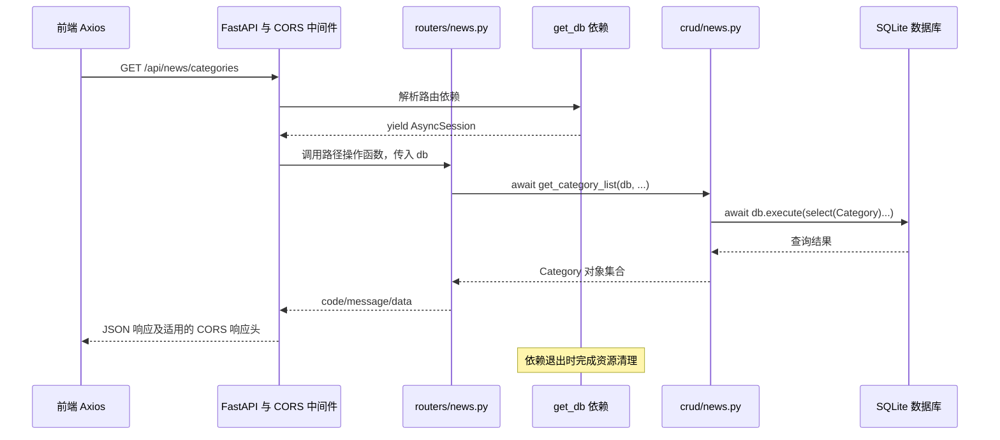

# 31 · FastAPI 项目：获取新闻分类与 CORS 跨域

核心操作：

1. **模块化路由**：按照前后端接口约定定义路径和 HTTP 方法。
2. **定义模型类**：按照数据库表定义字段及映射关系。
3. **数据库 CRUD**：编写查询函数，接收数据库会话并返回查询结果。
4. **路由调用逻辑**：通过依赖注入取得会话，调用 CRUD，组织响应数据。
5. **前后端联调**：确认接口地址、数据格式和浏览器跨域配置。

本篇先总结分类接口的完整流程，再解释 CORS 的原因和解决方法。代码片段标注为“建议实现”的部分，是学习和后续修改的参考，不代表已经改入业务文件。

前置笔记：[模块化路由](../29-FastAPI项目-模块化路由/29-FastAPI项目-模块化路由.md)、[数据库与 ORM 配置](../30-FastAPI项目-数据库与ORM配置/30-FastAPI项目-数据库与ORM配置.md)、[依赖注入](../14-FastAPI进阶-依赖注入/14-FastAPI依赖注入.md)。

## 1. 先确定前端需要什么接口

当前前端在 `xwzx-news/src/store/modules/news.js` 中请求：

```javascript
const response = await axios.get(
  `${apiConfig.baseURL}/api/news/categories`
);
```

`apiConfig.baseURL` 当前是 `http://127.0.0.1:8000`，因此实际请求地址是：

```text
GET http://127.0.0.1:8000/api/news/categories
```

前端检查 `response.data.code === 200`，并把 `response.data.data` 当作数组展开。因此建议返回：

```json
{
  "code": 200,
  "message": "success",
  "data": [
    { "id": 1, "name": "头条", "sort_order": 1 },
    { "id": 2, "name": "社会", "sort_order": 2 }
  ]
}
```

这只是响应结构示例。当前数据库有 8 个分类，真实响应应根据查询结果返回。

这里有两层 `data`：`response.data` 是 Axios 解析后的响应体；第二个 `.data` 才是业务响应中的分类数组。分类接口的 `data` 不是 `{ "list": [...] }`，不要照搬新闻分页列表的响应结构。

HTTP 状态码与 JSON 中的 `code` 也是两回事：`response.status` 是 HTTP 状态码，`response.data.code` 是项目自行约定的业务字段。

## 2. 从模块化路由到查询结果：完整流程

### 2.1 当前目录分别承担什么职责？

```text
toutiao_backend/
├── main.py                 # 创建应用、注册路由和中间件
├── config/
│   └── db_conf.py          # 引擎、会话工厂、get_db 依赖
├── models/
│   ├── Bases.py            # ORM 基类和公共时间字段
│   └── news.py             # Category 分类模型
├── crud/
│   └── news.py             # 分类查询函数
└── routers/
    └── news.py             # 接收 HTTP 请求并组织响应
```

本章使用当前实际代码中的 `models/` 和 `Bases.py` 命名。根目录设计文档中早期规划的名称可能不同，导入时要以实际文件为准。

### 2.2 应用启动和处理请求是两个阶段

**启动阶段：**导入模型、CRUD 和路由模块，创建 `FastAPI` 实例，把 `APIRouter` 注册到应用中。声明查询函数或执行 `select(Category)` 本身，不等于已经从数据库读出了数据。

**请求阶段：**请求到达并匹配路径后，FastAPI 解析参数、执行依赖，才调用路径操作函数和数据库查询。



CORS 是否允许前端读取结果，是浏览器根据响应头判断的；它与数据库是否查到了记录属于不同环节。

## 3. 按步骤实现分类查询

### 3.1 模块化路由：前缀加具体路径

当前新闻模块使用：

```python
from fastapi import APIRouter

router = APIRouter(prefix="/api/news", tags=["news"])
```

分类接口应在这个路由组上声明 `/categories`，主入口再执行 `app.include_router(news.router)`：

```text
路由组前缀 /api/news + 接口路径 /categories
= /api/news/categories
```

`tags` 控制文档分组，`prefix` 改变 URL。只定义 `APIRouter` 而没有注册到主应用，接口不能通过该主应用访问。

本项目已经在路由组中写了完整 `/api/news` 前缀，主入口注册时不要再重复添加 `/api`。

### 3.2 模型类：将 `news_category` 映射为 `Category`

`toutiao_backend/models/news.py` 的模型整理后可以写成：

```python
from sqlalchemy import Integer, String
from sqlalchemy.orm import Mapped, mapped_column

from models.Bases import Base


class Category(Base):
    __tablename__ = "news_category"

    id: Mapped[int] = mapped_column(Integer, primary_key=True, autoincrement=True)
    name: Mapped[str] = mapped_column(
        String(50), unique=True, index=True, nullable=False
    )
    sort_order: Mapped[int] = mapped_column(
        Integer, default=0, nullable=False
    )

    def __repr__(self) -> str:
        return f"<Category id={self.id!r} name={self.name!r}>"
```

| 代码 | 作用 |
| --- | --- |
| `class Category(Base)` | 继承 ORM 基类，参与表映射 |
| `__tablename__` | 明确映射的数据库表名 |
| `Mapped[int]` | 声明映射属性在 Python 中的类型 |
| `mapped_column(...)` | 配置数据库字段类型和约束 |
| `primary_key=True` | 声明主键，ORM 据此识别记录 |
| `__repr__` | 方便调试时识别对象，不负责 JSON 序列化 |

`Base` 中的 `created_at`、`updated_at` 也会参与映射。执行 `select(Category)` 时，ORM 通常会查询这些继承字段，所以它们必须与数据库中的真实列名对应。

本次检查中，`models/Bases.py` 的这两个字段与 `sql/news_app.db` 中的 `news_category` 表已经匹配。如果以后误写成 `create_at`、`update_at`，可能产生 `no such column`，这是模型与数据库不一致导致的后端错误。

### 3.3 数据库会话：由 `get_db` 交给路由

当前 `config/db_conf.py` 中已经有：

- 异步引擎 `engine`，连接 `sql/news_app.db`。
- 会话工厂 `AsyncSessionLocal`，用于创建会话。
- `get_db()` 依赖，通过 `yield session` 把会话交给 FastAPI。

路由通过 `db: AsyncSession = Depends(get_db)` 声明需要会话，FastAPI 负责执行依赖并传入结果。`AsyncSession` 是操作数据库的会话，不是查询结果，也不是数据库表。

当前 `get_db` 包含提交、回滚和关闭逻辑。对于本章纯查询，结果来自 `execute`，并不是执行了 `commit` 才能拿到查询结果。带 `yield` 依赖的退出时机受依赖作用域影响，参见 [FastAPI 带 yield 的依赖](https://fastapi.tiangolo.com/tutorial/dependencies/dependencies-with-yield/)。

### 3.4 CRUD：接收会话，构造并执行查询

`toutiao_backend/crud/news.py` 的建议实现：

```python
from sqlalchemy import select
from sqlalchemy.ext.asyncio import AsyncSession

from models.news import Category


async def get_category_list(
    db: AsyncSession,
    *,
    skip: int = 0,
    limit: int = 100,
):
    stmt = (
        select(Category)
        .order_by(Category.sort_order, Category.id)
        .offset(skip)
        .limit(limit)
    )
    result = await db.execute(stmt)
    return result.scalars().all()
```

| 步骤 | 返回或作用 |
| --- | --- |
| `select(Category)` | 构造查询语句对象，还没有执行 SQL |
| `.order_by(...)` | 按分类排序值、ID 排序，使返回顺序明确 |
| `.offset(skip)` | 跳过前 `skip` 条 |
| `.limit(limit)` | 最多取 `limit` 条 |
| `await db.execute(stmt)` | 执行查询，等待数据库返回，得到结果对象 |
| `result.scalars()` | 从行结果中提取这里选中的 `Category` 对象 |
| `.all()` | 收集这些对象，供路由组织响应 |

对于这里 `AsyncSession.execute()` 返回的缓冲结果，后面的 `.scalars().all()` 不再写 `await`。`stream()` 等流式查询的使用方式另有区别。

没有 `ORDER BY`，数据库不保证结果顺序。分类字段叫 `sort_order`，也不意味着数据库会自动按它排序。

### 3.5 为什么 CRUD 里不建议直接写 `Depends(get_db)`？

当前代码将 `Depends(get_db)` 写在 CRUD 函数的默认参数中，同时路由显式传入了 `db`，所以当前调用能工作。

但 `Depends` 不会在任意普通函数调用中自动执行：

```text
路由显式传入 db → CRUD 收到 AsyncSession，可以查询
普通调用省略 db → CRUD 可能收到 Depends 配置对象，不能调用 execute
```

建议把职责分开：FastAPI 路由负责依赖注入，CRUD 把 `db` 当作必传的普通参数。这样在脚本、测试或其他业务函数中，也能明确地传入会话使用它。

示例中的 `*` 还要求 `skip`、`limit` 按名称传入，可减少参数顺序混淆。详见 [星号与参数解包](../00-python基础补充/10-星号与参数解包.md)。

### 3.6 路由：调用 CRUD 并返回约定结构

`toutiao_backend/routers/news.py` 的建议实现，需要与第 3.4 节的 CRUD 签名配套使用：

```python
from fastapi import APIRouter, Depends, Query
from sqlalchemy.ext.asyncio import AsyncSession

from config.db_conf import get_db
from crud import news

router = APIRouter(prefix="/api/news", tags=["news"])


@router.get("/categories", summary="获取新闻分类")
async def get_category_news(
    skip: int = Query(default=0, ge=0),
    limit: int = Query(default=100, ge=1, le=100),
    db: AsyncSession = Depends(get_db),
):
    category_list = await news.get_category_list(db, skip=skip, limit=limit)
    return {
        "code": 200,
        "message": "success",
        "data": [
            {
                "id": category.id,
                "name": category.name,
                "sort_order": category.sort_order,
            }
            for category in category_list
        ],
    }
```

路由需要 `await` CRUD 函数，否则得到的是协程对象，查询尚未按预期完成。

这里显式选出三个字段，是为了让接口结构清楚。当前 FastAPI 可以编码本项目返回的这些 ORM 对象，并不代表所有 ORM 对象、所有加载状态都适合直接作为响应；后续也可以在 `schemes` 中定义 Pydantic 响应模型，通过 `response_model` 约束输出。[FastAPI 响应模型](https://fastapi.tiangolo.com/tutorial/response-model/)

## 4. 当前前端拿不到数据：已确认哪些问题？

整理笔记时，对当前代码与数据库副本进行了验证：

| 检查项 | 当前结果 | 含义 |
| --- | --- | --- |
| 数据库分类记录 | 8 条 | 当前不是分类表没有数据 |
| 当前模型时间字段 | 与数据库匹配 | 当前未发现时间列拼写错误 |
| `GET /api/news/category` | HTTP 200，返回 8 条分类 | 当前后端查询链路能够工作 |
| `GET /api/news/categories` | HTTP 404 | 前端请求路径与当前后端不一致 |
| 带允许来源示例值的请求 | 没有 `Access-Control-Allow-Origin` | 主应用尚未配置 CORS |

因此有两项独立调整：

1. 把后端路径统一到前端使用的 `/api/news/categories`，例如采用第 3.6 节。
2. 给主应用配置允许实际前端来源的 CORS 中间件。

当前后端成功响应使用 `msg`，前端分类成功分支读取的是 `code` 和 `data`，所以 `msg` 不是这次成功数据读取失败的直接原因。示例统一为 `message`，是为了与其他接口约定保持一致。

前端的 `catch` 中还有一组本地默认分类，因此页面上出现分类标签，也不能单独证明后端请求已经成功。应同时检查 Network 中的真实请求和响应。

## 5. 什么是 CORS 跨域资源共享？

### 5.1 什么叫“同源”？

浏览器中的源（Origin）由三个部分组成：

```text
协议 + 主机 + 端口
```

以 `http://localhost:5173` 为基准：

| 地址 | 是否同源 | 原因 |
| --- | --- | --- |
| `http://localhost:5173/home` | 是 | 路径变化不改变源 |
| `http://localhost:5173/api/news/categories` | 是 | 仍是相同协议、主机和端口 |
| `http://localhost:8000` | 否 | 端口不同 |
| `http://127.0.0.1:5173` | 否 | 主机字符串不同，虽然都可能指向本机 |
| `https://localhost:5173` | 否 | 协议不同 |

同一台电脑上的前后端也可能跨域。路径、查询参数不属于源；“跨域”也不只发生在两个不同的域名之间。[MDN 同源策略](https://developer.mozilla.org/en-US/docs/Web/Security/Defenses/Same-origin_policy)

本项目 Vite 未固定端口，以下示例使用常见的 `5173`。实际端口可能因占用而变化，应以启动输出和浏览器的 `location.origin` 为准。

### 5.2 CORS 解决什么问题？

浏览器的同源策略限制页面脚本读取其他源的数据。**CORS（Cross-Origin Resource Sharing，跨源资源共享）是服务器通过 HTTP 响应头声明允许哪些来源读取响应的机制。**

例如，前端页面来自 `http://localhost:5173`，请求 `http://127.0.0.1:8000`：

```http
GET /api/news/categories HTTP/1.1
Host: 127.0.0.1:8000
Origin: http://localhost:5173
```

后端认可该来源时，可以在响应中提供：

```http
Access-Control-Allow-Origin: http://localhost:5173
Vary: Origin
```

浏览器据此决定是否把响应暴露给前端 JavaScript。`Origin` 通常由浏览器生成，前端不需要手动伪造；`Access-Control-Allow-Origin` 则应由服务端响应提供。

所以，“后端日志显示 200”与“Axios 能读到数据”不是同一件事。对于不需要预检的请求，后端可能已经执行并返回数据，只是浏览器没有把响应交给页面脚本。[MDN CORS](https://developer.mozilla.org/en-US/docs/Web/HTTP/Guides/CORS)

CORS 不是数据库权限，也不是登录校验或 API 防火墙。curl、Python 客户端等通常不执行浏览器的同源策略；服务端仍需独立检查身份和业务权限。

### 5.3 为什么 `/docs` 或 curl 能请求，前端却失败？

如果从后端自己的 `http://127.0.0.1:8000/docs` 调用同一后端，通常属于同源请求。curl 也不会替浏览器拦截跨域响应。

这两种方式适合确认“后端接口是否工作”，但不能单独证明“前端所在源已经获得 CORS 许可”。验证跨域时，需要带上实际前端的 `Origin` 并检查响应头，最后在浏览器中确认。

## 6. 普通请求与预检请求

### 6.1 分类 GET 通常可以直接发送

当前分类请求使用普通 `axios.get()`，没有手动添加 `Authorization` 等非安全列出的请求头，通常不需要预检。

流程为：浏览器发送带 `Origin` 的 GET → 后端查询 → 后端返回响应及适用的 CORS 头 → 浏览器检查是否允许 JavaScript 读取。

**不是所有跨域请求都会先发 OPTIONS。**是否预检取决于 HTTP 方法、请求头、内容类型等条件。

### 6.2 什么情况下会先发 OPTIONS？

常见情况包括：

- 使用 `PUT`、`PATCH`、`DELETE` 等方法。
- 添加 `Authorization` 或自定义请求头。
- 发送 `Content-Type: application/json` 的跨域请求。

浏览器会先询问服务器是否允许即将发送的请求，例如：

```http
OPTIONS /api/news/categories HTTP/1.1
Origin: http://localhost:5173
Access-Control-Request-Method: GET
Access-Control-Request-Headers: authorization
```

`Access-Control-Request-Method` 写的是**后续真实请求的方法 GET**，不是预检自身的方法 OPTIONS。

服务器允许后，浏览器才发送真实请求。预检通常不携带真正的业务认证令牌，而是声明后续需要使用哪些方法和请求头；不要要求预检先通过业务登录检查。[MDN 预检请求](https://developer.mozilla.org/en-US/docs/Web/HTTP/Guides/CORS#preflighted_requests)

FastAPI 使用的 `CORSMiddleware` 会处理带 `Origin` 和 `Access-Control-Request-Method` 的 OPTIONS，通常无需为每个接口手写一个 OPTIONS 路由。

## 7. 解决方案一：在 FastAPI 主应用配置 CORS

### 7.1 本项目 `main.py` 的建议实现

配合第 3.4、3.6 节的分类接口，`toutiao_backend/main.py` 可以写成：

```python
from fastapi import FastAPI
from fastapi.middleware.cors import CORSMiddleware

from routers import news

app = FastAPI(title="新闻资讯 API")

# 写前端页面的源；如果 Vite 使用其他端口，应同步调整。
ALLOWED_ORIGINS = [
    "http://localhost:5173",
    "http://127.0.0.1:5173",
]

app.add_middleware(
    CORSMiddleware,
    allow_origins=ALLOWED_ORIGINS,
    allow_credentials=False,
    allow_methods=["GET", "POST", "PUT", "PATCH", "DELETE", "OPTIONS"],
    allow_headers=["Content-Type", "Authorization"],
)

app.include_router(news.router)


@app.get("/")
def read_root():
    return {"message": "Hello World"}
```

`CORSMiddleware` 来自 Starlette，通过 FastAPI 的导入路径即可使用。它属于应用级中间件，配置在 `main.py`，而不是放进分类 CRUD 或模型类中。[FastAPI CORS 配置](https://fastapi.tiangolo.com/tutorial/cors/)

这份配置声明跨域政策，不会替你创建 POST、PUT 等业务接口。分类路由仍然只支持自己注册的方法。

### 7.2 参数解释

| 参数 | 含义 | 本章配置 |
| --- | --- | --- |
| `allow_origins` | 允许的前端源 | 两个常见的本地 Vite 来源 |
| `allow_credentials` | 是否支持浏览器以携带凭据的模式进行跨源请求 | 当前分类查询不需要 Cookie，设为 `False` |
| `allow_methods` | 允许预检声明的真实请求方法 | 显式列出项目常用方法 |
| `allow_headers` | 允许浏览器在跨域请求中携带的请求头 | JSON 内容类型和授权头 |
| `expose_headers` | 允许前端读取额外的响应头 | 本章没有自定义响应头需求，可省略 |
| `max_age` | 预检结果可缓存的秒数 | 默认即可，不是分类数据缓存时间 |

配置来源时注意：

- 应写前端地址，例如 `http://localhost:5173`，不是因为后端在 8000 就只填 8000。
- 不带 `/home`、`/api`、查询参数或末尾 `/`。
- `localhost` 与 `127.0.0.1` 分别匹配，端口也需要对应。
- 上线后应配置真实前端来源，而不是依赖本地开发来源列表。

`allow_headers` 是允许的**请求头**，`expose_headers` 是允许 JavaScript 读取的额外**响应头**，不要混淆。[Starlette CORSMiddleware](https://starlette.dev/middleware/#corsmiddleware)

### 7.3 Cookie 与手动 Authorization 要分清

当前分类 GET 没有 Cookie 会话需求，也没有设置 Axios 的 `withCredentials: true`，因此示例不要求 `allow_credentials=True`。

若以后使用跨源 Cookie 登录，需要前端开启相应凭据模式，后端设置 `allow_credentials=True`，并正确配置 Cookie 的属性。允许来源应显式列出，不能使用浏览器不接受的 `Access-Control-Allow-Origin: *` 配合携带凭据的请求。

前端手动设置 `Authorization` 请求头，会涉及该头的预检许可；**手动加授权头不等于自动启用了 Axios 的 Cookie 凭据模式**。本章已经把 `Authorization` 放入 `allow_headers`。

### 7.4 用当前导入方式正确启动

当前业务代码使用 `from routers import news`、`from models.Bases import Base` 等导入方式，因此从项目根目录启动时，可以执行：

```bash
uv run uvicorn main:app --app-dir toutiao_backend --reload --host 127.0.0.1 --port 8000
```

`--app-dir toutiao_backend` 让 Uvicorn 在该目录下查找 `main` 及其导入模块。它适配的是当前代码；如果未来统一改为 `from toutiao_backend...` 的完整包导入，启动方式也应同步调整。

修改后确认实际服务已重载。浏览器仍访问旧进程、旧端口或另一个应用时，文件里写好 CORS 也不会影响那个服务。

## 8. 解决方案二：开发时使用 Vite 代理

这是另一种联调方式：让浏览器先请求前端开发服务器自己的 `/api`，再由 Vite 在服务器端转发到 FastAPI。

```text
浏览器页面：http://localhost:5173
    → 请求 http://localhost:5173/api/news/categories（同源）
    → Vite 转发到 http://127.0.0.1:8000/api/news/categories
```

`xwzx-news/vite.config.js` 的示例配置：

```javascript
import { defineConfig } from 'vite'
import vue from '@vitejs/plugin-vue'

export default defineConfig({
  plugins: [vue()],
  server: {
    proxy: {
      '/api': {
        target: 'http://127.0.0.1:8000',
        changeOrigin: true,
      },
    },
  },
})
```

同时在 `src/config/api.js` 中，将现有 `apiConfig` 的基础地址改为空字符串，使接口使用相对路径：

```javascript
export const apiConfig = {
  baseURL: '',
}
```

该文件还含其他配置，实际调整时定位 `apiConfig` 修改即可。

如果请求仍写绝对地址 `http://127.0.0.1:8000`，浏览器会直接访问后端，不会经过 Vite 代理。本例不移除 `/api` 前缀，因为后端路由本来就需要它。

`changeOrigin` 主要调整转发给上游的 Host 头，不是关闭浏览器同源策略的开关。真正改变浏览器请求路径的是前端使用相对 `/api` 地址。[Vite server.proxy](https://vite.dev/config/server-options#server-proxy)

修改代理配置后重启 Vite。开发代理不会自动变成线上部署配置；生产环境需要使用相应反向代理统一来源，或继续为分离的前后端配置 CORS。

直接请求后端时检查方案一；通过 Vite 代理时检查方案二的转发路径。排查时先确认请求实际经过哪条链路。

## 9. 按顺序验证，区分 CORS、404 和 500

### 9.1 先验证接口路径和业务响应

采用文中的建议路径后，执行：

```bash
curl -i "http://127.0.0.1:8000/api/news/categories"
```

预期 HTTP 200，响应中的 `code` 为 200、`data` 为分类数组。如果这里是 404，先检查路由路径和注册；如果是 500，先看后端异常日志。

当前原代码还使用 `/category`，因此未调整路由前，直接测试 `/categories` 会得到 404，这是预期的路径不匹配现象。

### 9.2 带上实际前端来源检查响应头

将下面的来源替换成浏览器页面实际的 `location.origin`：

```bash
curl -i "http://127.0.0.1:8000/api/news/categories" \
  -H "Origin: http://localhost:5173"
```

预期响应包含：

```http
Access-Control-Allow-Origin: http://localhost:5173
Vary: Origin
```

没有 `Origin` 的 curl 请求不一定得到 CORS 响应头，所以验证时不能漏掉它。curl 只帮助观察状态和头部，不会像浏览器一样阻止读取响应。

### 9.3 手动模拟预检

虽然当前分类 GET 通常无需预检，仍可以用它练习验证中间件配置：

```bash
curl -i -X OPTIONS "http://127.0.0.1:8000/api/news/categories" \
  -H "Origin: http://localhost:5173" \
  -H "Access-Control-Request-Method: GET" \
  -H "Access-Control-Request-Headers: Authorization"
```

文中配置下预期 HTTP 200，同时允许该 Origin、GET 方法及 Authorization 头。请求头名称不区分大小写，响应中显示为不同大小写不影响含义。

**预检成功不证明业务路由存在。**中间件可能在进入路由匹配前就回复 OPTIONS，因此不存在的路径也可能预检成功，仍需验证真正的 GET。

### 9.4 回到浏览器看 Network

打开开发者工具，检查：

1. 页面实际的 `location.origin`。
2. Request URL 是否是预期地址，末尾是 `/categories` 还是 `/category`。
3. 请求是直接访问 8000，还是经过 Vite 的 5173 代理。
4. 是否出现 OPTIONS，它的状态、请求方法声明和请求头声明是什么。
5. 真实 GET 的状态码、CORS 响应头和 JSON 内容。
6. 前端是否读取了 `response.data.data`，该值是否确实是数组。

### 9.5 典型结果如何判断？

| 现象 | 常见解释 | 下一步 |
| --- | --- | --- |
| GET 200，有数据，但浏览器提示缺少允许来源头 | CORS 未配置或来源不匹配 | 检查 Origin 与 `allow_origins` |
| GET 404 | 路径、前缀或应用注册不一致 | 本项目先检查单复数路径 |
| GET 500 / `no such column` | 后端模型或查询报错 | 查看后端堆栈和真实表结构 |
| OPTIONS 400 | 预检来源、方法或请求头未获允许 | 检查对应 CORS 参数 |
| OPTIONS 404 / 405 | 可能没有中间件处理，或请求未经过目标应用 | 检查启动入口、代理和中间件 |
| GET 来自未允许的 Origin，仍显示 HTTP 200 | 后端可能已处理，但未提供允许该来源读取的头 | 浏览器仍可拦截响应，不要只看状态码 |
| curl 成功，Axios 报网络错误 | 可能是 CORS，也可能是浏览器网络限制 | 综合 Network、Console 与后端日志判断 |
| 页面显示默认分类 | 前端错误分支回退到本地数据 | 检查实际 API 是否成功 |

不要在前端添加 `Access-Control-Allow-Origin` 请求头来尝试解决问题，它应该是服务端响应头。`fetch(..., { mode: 'no-cors' })` 也不适合读取分类 JSON：这种模式可能得到无法读取内容的 opaque 响应。

## 10. 为什么有时“真正的 500”会显示成 CORS 错误？

使用 `app.add_middleware(CORSMiddleware, ...)` 时，普通响应以及经过正常异常处理流程的 404 等响应，可以经过 CORS 中间件添加头部。

但某些未处理异常生成的 500 响应可能由更外层的错误处理中间件产生，从而没有经过内部 CORS 的响应处理。浏览器看到缺少 CORS 头，可能同时报告跨域错误，掩盖实际的数据库或业务异常。

因此，**浏览器提到 CORS 时，也要看后端有没有同时发生异常。**允许来源配置不能修复 SQL 字段名错误、连接失败或路由函数抛出的异常。

若需要让应用未处理异常生成的响应也经过 CORS，可以采用 Starlette 文档介绍的“在整个应用外层包装 `CORSMiddleware`”方式。下面是第 7 节 `app.add_middleware(...)` 的替代片段，使用同一份 `ALLOWED_ORIGINS`，放在所有应用路由配置完成后：

```python
app = CORSMiddleware(
    app=app,
    allow_origins=ALLOWED_ORIGINS,
    allow_credentials=False,
    allow_methods=["GET", "POST", "PUT", "PATCH", "DELETE", "OPTIONS"],
    allow_headers=["Content-Type", "Authorization"],
)
```

选择这种方式时，移除前面重复的 CORS 中间件注册。包装后的 `app` 是交给 Uvicorn 的 ASGI 应用；路由和其他 FastAPI 配置应先在内部应用上完成。这是为了让错误响应也能被正确读取，不会消除产生 500 的原因。[Starlette CORS 全局包装](https://starlette.dev/middleware/#corsmiddleware-global-enforcement)

## 11. 本章复习与练习

1. 用自己的话串起 `main.py → router → get_db → CRUD → Category → 数据库 → JSON`，指出哪些发生在启动时，哪些发生在请求期间。
2. 根据前端调用确认分类接口的完整路径，解释为什么只修改 CORS 仍可能返回 404。
3. 对查询增加明确排序，观察 `sort_order` 与返回顺序之间的关系。
4. 请求 `?skip=0&limit=2`，确认返回前两个分类；请求 `?limit=0`，确认验证失败。
5. 分别用允许和不允许的 Origin 请求，比较 CORS 响应头，而不仅是 HTTP 状态码。
6. 构造带 Authorization 的预检，区分 OPTIONS 许可与真实接口是否存在。
7. 解释为什么前端默认分类、Swagger UI 成功和 curl 成功，都不能单独证明浏览器跨域联调已成功。

本章完成的关键是：查询链路能返回正确结构，浏览器也能从实际前端来源读取该结构。后续开发新闻列表、详情、收藏等接口时，可以复用同样的分层与排查顺序。
