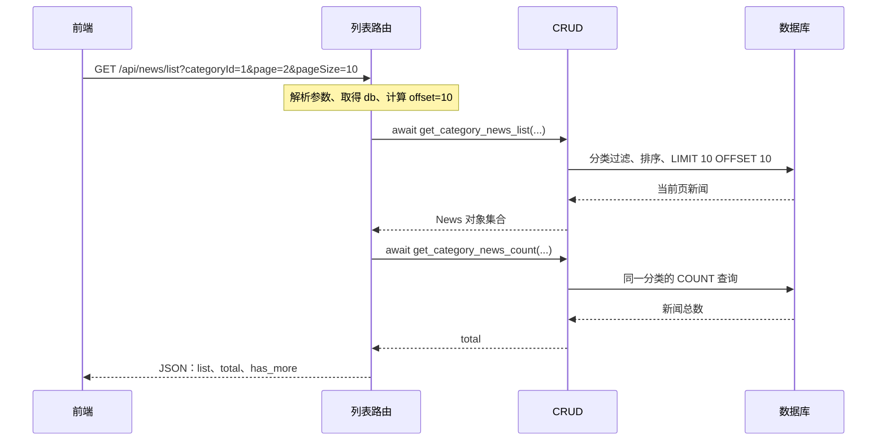

# 32 · FastAPI 项目：获取新闻列表

上一章完成了新闻分类查询。本章继续实现：**前端选择一个分类，后端按分类查询新闻，每次返回一页数据，并告知总条数和是否还有下一页。**

实现顺序是：确定接口约定 → 定义新闻模型 → 获取数据库会话 → 查询当前页 → 查询总数 → 计算分页信息 → 路由组织响应 → 前后端联调。

本篇依据当前项目代码整理。现有代码已经包含列表查询、总数统计和分页响应；下文标为“建议实现”的代码还补充了参数校验、明确排序和前端字段映射，供后续修改参考。将示例合并到已有文件时，保留分类、详情等其他接口，并同步修改同名 CRUD 函数及其调用。

前置笔记：[数据库与 ORM 配置](../30-FastAPI项目-数据库与ORM配置/30-FastAPI项目-数据库与ORM配置.md)、[获取新闻分类与 CORS](../31-FastAPI项目-获取新闻分类/31-FastAPI项目-获取新闻分类.md)。

## 第一步：确定新闻列表接口的输入和输出

### 1.1 前端发送什么？

当前 `xwzx-news/src/store/modules/news.js` 发送的参数是：

```javascript
const params = {
  categoryId: this.currentCategory,
  page: isRefresh ? 1 : Math.ceil(this.newsList.length / 10) + 1,
  pageSize: 10
};

const response = await axios.get(
  `${apiConfig.baseURL}/api/news/list`,
  { params }
);
```

例如，查询分类 `1` 的第 `2` 页，每页 `10` 条：

```text
GET http://127.0.0.1:8000/api/news/list?categoryId=1&page=2&pageSize=10
```

这些值放在 URL 的查询字符串中，后端用 `Query` 声明。

| 前端参数 | 后端变量 | 含义 | 建议默认值与限制 |
| --- | --- | --- | --- |
| `categoryId` | `category_id` | 要查询的分类 ID | 默认 `1`，必须大于等于 `1` |
| `page` | `page` | 页码，从第 `1` 页开始 | 默认 `1`，必须大于等于 `1` |
| `pageSize` | `page_size` | 每页最多返回多少条 | 默认 `10`，范围为 `1～100` |

**当前代码有一个需要对齐的地方：**后端把 `page` 的别名写成了 `pageNum`，前端却发送 `page`。此时发送 `page=2` 并不会让后端取得第二页，而是继续使用默认页码 `1`。本篇建议实现统一使用前端已有的 `page`。

### 1.2 后端返回什么？

沿用项目的 `code`、`msg`、`data` 包装，`data` 内包含：

| 字段 | 类型 | 含义 |
| --- | --- | --- |
| `list` | 数组 | 当前页的新闻 |
| `total` | 整数 | 当前分类下符合条件的新闻总数 |
| `has_more` | 布尔值 | 当前页之后是否还有新闻 |

下面是假设某分类只有一条新闻时的响应示例：

```json
{
  "code": 200,
  "msg": "success",
  "data": {
    "list": [
      {
        "id": 101,
        "title": "新闻标题示例",
        "description": "新闻摘要示例",
        "image": null,
        "author": "新闻编辑部",
        "categoryId": 1,
        "views": 120,
        "publishTime": "2026-09-14T09:00:00"
      }
    ],
    "total": 1,
    "has_more": false
  }
}
```

`total` 不是当前页长度；`list` 也不是整个分类的全部新闻。列表页展示标题、摘要等简要信息，正文 `content` 可以由详情接口提供。

当前 `NewsItem.vue` 读取 `news.publishTime`。直接返回 ORM 对象时，实际字段是 `publish_time`，所以需要在响应中明确映射；请求参数的 `alias` 不会自动改变响应字段名。

## 第二步：定义并理解 News 模型

位置：[toutiao_backend/models/news.py](../../toutiao_backend/models/news.py)。该文件已有 `Category` 和 `News`，本章使用 `News` 对应数据库中的 `news` 表。

以下是当前新闻模型主要声明的整理版，省略了注释和 `__repr__`：

```python
from datetime import datetime

from sqlalchemy import ForeignKey, Index, Integer, String, Text
from sqlalchemy.orm import Mapped, mapped_column

from models.Bases import Base


class News(Base):
    __tablename__ = "news"

    __table_args__ = (
        Index("idx_news_category_id", "category_id"),
        Index("idx_publish_time", "publish_time"),
    )

    id: Mapped[int] = mapped_column(
        Integer, primary_key=True, autoincrement=True
    )
    category_id: Mapped[int] = mapped_column(
        Integer, ForeignKey("news_category.id"), nullable=False
    )
    title: Mapped[str] = mapped_column(String(255), nullable=False)
    content: Mapped[str] = mapped_column(Text, nullable=False)
    description: Mapped[str | None] = mapped_column(String(500))
    image: Mapped[str | None] = mapped_column(String(255))
    author: Mapped[str | None] = mapped_column(String(50))
    views: Mapped[int] = mapped_column(Integer, default=0, nullable=False)
    publish_time: Mapped[datetime | None] = mapped_column()
```

### 2.1 关键声明分别做什么？

| 声明 | 在本接口中的作用 |
| --- | --- |
| `__tablename__ = "news"` | 指定查询哪张表 |
| `Mapped[int]` | 声明 ORM 映射属性的 Python 类型 |
| `mapped_column(...)` | 定义列类型、主键、是否可空等信息 |
| `ForeignKey("news_category.id")` | 声明新闻所属分类的外键关系 |
| `String(255)` / `Text` | 分别描述有长度声明的字符串列和正文文本列 |
| `Index(...)` | 声明数据库索引，可用于优化相关查询 |
| `Base` | 提供 ORM 基类能力，以及项目公共的创建、更新时间字段 |

`Optional[str]` 与 `str | None` 表达相同的类型含义。SQLAlchemy 可以根据 `Mapped` 注解推断部分列类型和可空性，例如根据 `datetime` 推断时间类型；显式指定的 `nullable` 等配置也会影响最终声明。参见 [SQLAlchemy 类型与可空性推断](https://docs.sqlalchemy.org/en/20/orm/declarative_tables.html#mapped-column-derives-the-datatype-and-nullability-from-the-mapped-annotation)。

模型声明还需要与已经创建的表核对。例如当前模型把 `publish_time` 标记为可空，而 SQLite 脚本创建的是 `NOT NULL DEFAULT CURRENT_TIMESTAMP`。实际数据库约束以表结构为准，仅修改 Python 注解不会修改已有表。

### 2.2 外键、查询条件和索引不要混淆

`ForeignKey` 表达数据关系与约束；本次查询仍然要写 `where(News.category_id == category_id)`。因为只需要新闻表中的字段，所以不必为了按分类筛选而额外联表查询。

**索引也不会自动给结果排序。**即使已经创建发布时间索引，想让最新新闻排在前面，查询中仍须明确写 `order_by`。数据库是否采用某个索引，由查询计划决定，不能理解为“声明了索引，就一定不会扫描表”。

当前 SQLite 初始化脚本已经创建了分类索引 `fk_news_category_idx` 和时间索引 `idx_publish_time`。模型中的分类索引名称不同，学习时应核对已有索引，避免重复创建。模型声明本身不会自动在现有数据库中新增或重建索引。

## 第三步：复用数据库会话依赖

位置：[toutiao_backend/config/db_conf.py](../../toutiao_backend/config/db_conf.py)。当前连接的是项目根目录下的 `sql/news_app.db`，已有异步引擎、会话工厂和 `get_db`。

路由通过下面的参数取得一个 `AsyncSession`：

```python
db: AsyncSession = Depends(get_db)
```

一次请求中的基本过程是：

```text
get_db 创建会话并 yield
    → FastAPI 将会话传给路由的 db 参数
    → 路由把 db 显式传给两个 CRUD 查询函数
    → 查询结束后，依赖完成事务收尾和会话清理
```

当前 `get_db` 在正常退出时执行 `commit`，异常时执行 `rollback`。列表读取本身只有 `SELECT`，CRUD 中不需要额外提交，也不需要为两次查询分别创建引擎。

当前 CRUD 的 `db` 参数也写了 `Depends(get_db)`，但普通 Python 函数调用不会自动解析这个依赖。现有路由之所以能工作，是因为调用时已经传入真实的 `db`。下文建议把 CRUD 的 `db` 改成必传参数，让依赖注入集中在路由入口。

## 第四步：编写“查询当前页”的 CRUD 函数

位置：[toutiao_backend/crud/news.py](../../toutiao_backend/crud/news.py)。

现有代码的核心查询是：

```python
stmt = (
    select(News)
    .where(News.category_id == category_id)
    .offset(skip)
    .limit(page_size)
)
```

它已经完成分类过滤和分页。建议补上明确的排序，并让 `db` 成为必传参数：

```python
from sqlalchemy import select
from sqlalchemy.ext.asyncio import AsyncSession

from models.news import News


async def get_category_news_list(
    category_id: int,
    db: AsyncSession,
    skip: int = 0,
    page_size: int = 10,
):
    stmt = (
        select(News)
        .where(News.category_id == category_id)
        .order_by(News.publish_time.desc(), News.id.desc())
        .offset(skip)
        .limit(page_size)
    )
    result = await db.execute(stmt)
    return result.scalars().all()
```

### 4.1 一行一行理解查询

| 代码 | 含义 |
| --- | --- |
| `select(News)` | 构造查询新闻实体的语句 |
| `.where(News.category_id == category_id)` | 只保留指定分类的新闻 |
| `.order_by(News.publish_time.desc(), News.id.desc())` | 发布时间降序；时间相同则按 ID 降序 |
| `.offset(skip)` | 跳过前 `skip` 条结果 |
| `.limit(page_size)` | 最多取 `page_size` 条 |
| `await db.execute(stmt)` | 通过异步会话执行查询 |
| `result.scalars().all()` | 从结果中取出本页全部 `News` 对象 |

构造 `stmt` 时还没有读取数据，执行 `db.execute` 才会向数据库发出查询。`where` 中的 `==` 在这里构造 SQL 比较表达式，SQLAlchemy 会绑定参数，无须自己拼接 SQL 字符串。参见 [SQLAlchemy SELECT 查询](https://docs.sqlalchemy.org/en/20/tutorial/data_select.html)。

对应 SQL 可以理解为以下形式，其中 `:category_id`、`:page_size`、`:skip` 是参数占位符，不是字符串拼接：

```sql
SELECT *
FROM news
WHERE category_id = :category_id
ORDER BY publish_time DESC, id DESC
LIMIT :page_size OFFSET :skip;
```

为什么还要按 `id` 排序？多条新闻可能有相同发布时间，追加唯一 ID 可以确定这些新闻之间的顺序，让数据不变时的分页结果保持稳定。

### 4.2 为什么用 scalars().all()？

查询 `select(News)` 后，下面两种写法含义不同：

```python
result.all()            # Row 集合，每一行中包含一个 News 对象
result.scalars().all()  # 提取每行的第一个结果项，得到 News 对象集合
```

这里的“第一个结果项”是整个 `News` 实体，不是自动提取新闻的 `id`。如果查询写成 `select(News.id, News.title)`，再调用 `scalars()`，拿到的才会是第一列 `id`。

上面两行是二选一的示意：读取结果会消费它，不要先对同一个 `result` 调用 `all()`，再期待第二次还能读到同一批数据。

本例的 `AsyncSession.execute()` 返回缓冲后的普通结果对象，因此执行查询时需要 `await`，随后调用 `scalars().all()` 不需要再加 `await`。流式查询 `stream()` 使用不同的结果接口。参见 [SQLAlchemy AsyncSession.execute](https://docs.sqlalchemy.org/en/20/orm/extensions/asyncio.html#sqlalchemy.ext.asyncio.AsyncSession.execute)。

## 第五步：编写“查询分类新闻总数”的 CRUD 函数

仍然放在 `crud/news.py`，与列表查询函数配合使用。建议实现：

```python
from sqlalchemy import func, select
from sqlalchemy.ext.asyncio import AsyncSession

from models.news import News


async def get_category_news_count(
    category_id: int,
    db: AsyncSession,
) -> int:
    stmt = select(func.count(News.id)).where(
        News.category_id == category_id
    )
    result = await db.execute(stmt)
    return result.scalar_one()
```

对应的 SQL 是：

```sql
SELECT COUNT(id)
FROM news
WHERE category_id = :category_id;
```

`func.count(News.id)` 表示让数据库统计匹配记录中非空 ID 的数量。ID 是非空主键，因此这里就是匹配的新闻条数。

`scalar_one()` 取出唯一一行中的第一个结果项，并要求恰好有一行。这里是没有 `GROUP BY` 的整体 `COUNT` 查询，即使没有匹配新闻，也会得到一行数值 `0`，不会因为没有新闻就返回 `None`。

两个查询的分类条件必须一致。统计总数时不加分页条件，否则无法表达整个分类的新闻数量，也不要用 `len(news_list)` 代替 `total`。

例如一个分类有 `50` 条新闻，每页 `10` 条，第二页的 `len(news_list)` 是 `10`，但 `total` 仍然是 `50`。

## 第六步：理解分页与 has_more 的计算

### 6.1 页码如何换算成 offset？

前端使用从 `1` 开始的页码，数据库分页使用从 `0` 开始的跳过条数：

```python
offset = (page - 1) * page_size
```

| 页码 `page` | 每页 `page_size` | 跳过 `offset` | 本页在排序结果中的位置 |
| --- | --- | --- | --- |
| 1 | 10 | 0 | 第 1～10 条 |
| 2 | 10 | 10 | 第 11～20 条 |
| 3 | 10 | 20 | 第 21～30 条 |

CRUD 中的 `skip` 和这里的 `offset` 都表示“跳过多少条”；它不是页码，也不是某条新闻的 ID。

### 6.2 如何判断还有下一页？

沿用当前代码的判断逻辑：

```python
has_more = offset + len(news_list) < total
```

含义是：如果“已经跳过的条数 + 本页实际返回条数”仍小于总数，就还有后续数据。

假设总数为 `23`，每页 `10` 条：

| 页码 | `offset` | 本页条数 | 判断 | `has_more` |
| --- | --- | --- | --- | --- |
| 1 | 0 | 10 | `0 + 10 < 23` | `true` |
| 2 | 10 | 10 | `10 + 10 < 23` | `true` |
| 3 | 20 | 3 | `20 + 3 < 23` | `false` |
| 4 | 30 | 0 | `30 + 0 < 23` | `false` |

总数刚好为 `20` 时，第二页虽然返回满 `10` 条，但 `20 < 20` 为假，因此已经没有下一页。不能仅凭“本页是满页”就断定还有更多数据。

如果分类没有新闻，或者传入一个不存在的正整数分类 ID，本例约定返回 `list: []`、`total: 0`、`has_more: false`。如果业务要求不存在的分类返回 `404`，需要额外验证分类是否存在，单靠列表查询无法区分这两种情况。

## 第七步：在路由中串起整个流程

位置：[toutiao_backend/routers/news.py](../../toutiao_backend/routers/news.py)。下面是与前端参数、字段对应的**建议实现**。

示例展示了所需导入和路由声明；现有文件已有 `router`，合并时复用同一个实例，只替换 `/list` 对应函数。第四、第五步中调整过 CRUD 参数顺序，这里统一用关键字传参。

```python
from fastapi import APIRouter, Depends, Query
from sqlalchemy.ext.asyncio import AsyncSession

from config.db_conf import get_db
from crud import news

router = APIRouter(prefix="/api/news", tags=["news"])


@router.get("/list")
async def get_category_news_list(
    category_id: int = Query(
        1, ge=1, description="分类 ID", alias="categoryId"
    ),
    page: int = Query(1, ge=1, description="页码，从 1 开始"),
    page_size: int = Query(
        10, ge=1, le=100, description="每页数量", alias="pageSize"
    ),
    db: AsyncSession = Depends(get_db),
):
    # 1. 将页码换算成数据库偏移量。
    offset = (page - 1) * page_size

    # 2. 查询当前分类的这一页新闻。
    news_list = await news.get_category_news_list(
        category_id=category_id,
        db=db,
        skip=offset,
        page_size=page_size,
    )

    # 3. 统计同一分类的全部新闻数量。
    total = await news.get_category_news_count(
        category_id=category_id,
        db=db,
    )

    # 4. 选择列表需要的字段，并转换成前端使用的命名。
    items = [
        {
            "id": item.id,
            "title": item.title,
            "description": item.description,
            "image": item.image,
            "author": item.author,
            "categoryId": item.category_id,
            "views": item.views,
            "publishTime": item.publish_time,
        }
        for item in news_list
    ]

    # 5. 返回列表、总数及是否还有下一页。
    return {
        "code": 200,
        "msg": "success",
        "data": {
            "list": items,
            "total": total,
            "has_more": offset + len(news_list) < total,
        },
    }
```

### 7.1 Query 参数声明怎么读？

以 `category_id: int = Query(1, ge=1, alias="categoryId")` 为例：

| 部分 | 含义 |
| --- | --- |
| `category_id` | Python 函数内部的变量名 |
| `int` | FastAPI 按整数解析、校验输入 |
| `Query(1, ...)` | 不传参数时使用默认值 `1` |
| `ge=1` | 输入必须大于等于 `1` |
| `alias="categoryId"` | 从 URL 中名为 `categoryId` 的参数读取值 |
| `description` | 在自动接口文档中说明参数用途 |

`page` 的内外名称一致，因此建议直接省略别名。`page_size` 的 `le=100` 限制了单页最大数量。非法值，例如 `page=0`、`pageSize=0`、`pageSize=101` 或 `page=abc`，在本例中会触发 HTTP `422` 参数校验错误。参见 [FastAPI 参数别名](https://fastapi.tiangolo.com/tutorial/query-params-str-validations/#alias-parameters)与[数值范围校验](https://fastapi.tiangolo.com/tutorial/path-params-numeric-validations/)。

### 7.2 ORM 对象如何变成 JSON？

本例先用列表推导式把 `News` 对象转成字典，明确指定需要输出的字段。其中：

```text
News.category_id   → JSON 中的 categoryId
News.publish_time  → JSON 中的 publishTime
```

普通路由直接返回字典时，FastAPI 会处理 JSON 兼容编码，例如将 Python 的 `datetime` 转成 ISO 格式字符串，将 `None` 转成 JSON 的 `null`。这不是调用模型的 `__repr__` 来生成 JSON。参见 [FastAPI JSON 编码](https://fastapi.tiangolo.com/tutorial/encoder/)。

这里省略 `content` 能减少发送给前端的数据，但第四步的 `select(News)` 仍会从数据库读取正文列。以后需要进一步减少数据库读取量时，可以改为选择列表需要的列。

也可以在 `schemes/` 中定义 Pydantic 响应模型，再使用 `response_model` 明确响应结构和字段别名。本章先用显式字典展示转换过程，便于理解每个字段来自哪里。

### 7.3 一次请求的完整流程



这里顺序执行两次查询即可，不要让两个并发任务共用同一个 `AsyncSession`。它是有状态的事务对象，不能当成可任意并发使用的连接工具。参见 [SQLAlchemy 异步会话与并发任务](https://docs.sqlalchemy.org/en/20/orm/extensions/asyncio.html#using-asyncsession-with-concurrent-tasks)。

## 第八步：注册接口并对接前端

### 8.1 复用已有路由注册

`toutiao_backend/main.py` 已包含：

```python
from fastapi import FastAPI
from routers import news

app = FastAPI()
app.include_router(news.router)
```

这是入口文件的相关片段。已有注册无需再添加一次，新写在同一 `router` 上的 `/list` 也会被注册。

最终接口路径为：

```text
路由前缀 /api/news + 路径 /list = /api/news/list
```

在项目根目录启动后端。当前代码使用 `from routers`、`from models` 等导入方式，因此需要将 `toutiao_backend` 设为应用搜索目录：

```bash
.venv/bin/python -m uvicorn main:app --app-dir toutiao_backend --reload --host 127.0.0.1 --port 8000
```

然后访问 `http://127.0.0.1:8000/docs`，找到 `GET /api/news/list`。数据库已经初始化时无需为本接口重新执行建库脚本。

### 8.2 前端如何使用分页结果？

当前前端从 `response.data.data.list` 取新闻。其中，第一层 `data` 是 Axios 的响应体，第二层 `data` 是项目自定义的业务字段。

刷新或切换分类时从第一页开始并替换列表，加载下一页时追加新闻。现有前端通过“本页条数小于 `pageSize`”判断结束，暂时没有使用后端的 `has_more`。

可将 `getNewsList` 中处理成功响应的代码改为以下写法，直接使用后端结果：

```javascript
if (response.data && response.data.code === 200) {
  const { list, has_more } = response.data.data;

  this.newsList = isRefresh
    ? list
    : [...this.newsList, ...list];

  this.finished = !has_more;
}
```

这样总数恰好是整页倍数时，也能在最后一页立即停止加载，避免再请求一次空页。继续保留已有的异常处理，以及 `finally` 中对 `loading`、`refreshing` 的复位。

前端目前用已有列表长度推导下一页，并把每页数量写成了 `10`；这要求每次加载的页大小保持一致。以后如果允许用户改变页大小，建议显式维护页码与页大小状态。

## 第九步：验证接口与排查常见问题

### 9.1 用 curl 对比第一页和第二页

下面请求适用于第七步统一为 `page` 后的建议实现。URL 要加引号，避免 shell 把 `&` 当成后台执行符号。

```bash
curl -sS 'http://127.0.0.1:8000/api/news/list?categoryId=1&page=1&pageSize=10'
curl -sS 'http://127.0.0.1:8000/api/news/list?categoryId=1&page=2&pageSize=10'
```

写作时，当前 SQLite 数据库分类 `1` 有 `50` 条新闻，分类 `2` 有 `51` 条。数据不变时，可按下面的表检查建议实现：

| 请求参数 | 预期结果 |
| --- | --- |
| `categoryId=1&page=1&pageSize=10` | `10` 条，`total=50`，`has_more=true` |
| `categoryId=1&page=2&pageSize=10` | 下一批 `10` 条，与第一页 ID 不重复 |
| `categoryId=1&page=5&pageSize=10` | 最后 `10` 条，`has_more=false` |
| `categoryId=1&page=6&pageSize=10` | 空列表，`total=50`，`has_more=false` |
| `categoryId=2&page=6&pageSize=10` | 最后 `1` 条，`total=51`，`has_more=false` |
| `categoryId=999999&page=1&pageSize=10` | 当前无匹配数据，空列表、总数 `0` |
| `page=0`、`page=-1` 或 `page=abc` | HTTP `422` |
| `pageSize=0` 或 `pageSize=101` | HTTP `422` |
| `categoryId=0` | HTTP `422` |

还应检查每条新闻的 `categoryId` 是否正确，以及响应中是否包含前端读取的 `publishTime`。

**如果正在验证尚未调整的当前代码：**分页参数要使用 `pageNum`；当前代码没有上述数值范围限制，响应也仍是 `publish_time`、`category_id`。不要把建议实现的预期结果误认为当前代码已经具备的行为。

### 9.2 结合现象定位问题

| 现象 | 优先检查的位置 |
| --- | --- |
| 请求第二页仍然返回第一页 | 浏览器 Network 中发送的是 `page` 还是 `pageNum`，是否与 `Query(alias=...)` 一致 |
| 有标题但发布时间为空 | 前端读取 `publishTime`，响应是否仍为 `publish_time` |
| 新闻顺序不符合“最新优先” | CRUD 是否显式写了 `order_by`，不要只检查索引 |
| 每个分类的 `total` 都一样 | `COUNT` 查询是否遗漏分类过滤 |
| 最后一页仍然继续请求 | 前端是否使用 `has_more`；整页不能单凭长度判断还有数据 |
| 数据库中有记录但返回空列表 | 请求的分类 ID、offset，以及实际连接的 `sql/news_app.db` |
| 接口返回 `404` | `/api/news` 前缀、`/list` 路径以及 `include_router` |
| curl 成功而浏览器提示跨域 | 浏览器页面 Origin 与 CORS 响应头，参照第 31 章 |
| 返回 `500` | 后端异常日志、实际表结构和数据库连接；CORS 配置不能修复数据库查询错误 |

### 9.3 分页实现的适用范围

`offset/limit` 容易理解，适合本阶段的数据规模。即使增加了稳定排序，如果用户翻页期间有新闻插入或删除，不同请求之间的数据位置仍可能变化，出现重复或遗漏；列表与总数两次查询在并发写入时是否看到同一快照，也取决于数据库事务配置。

以后数据量大、需要频繁加载更多时，可以进一步学习游标分页，例如用上一页最后一条新闻的发布时间和 ID 定位下一页。本章先掌握参数校验、分类过滤、排序、分页、统计与响应这条完整流程。
