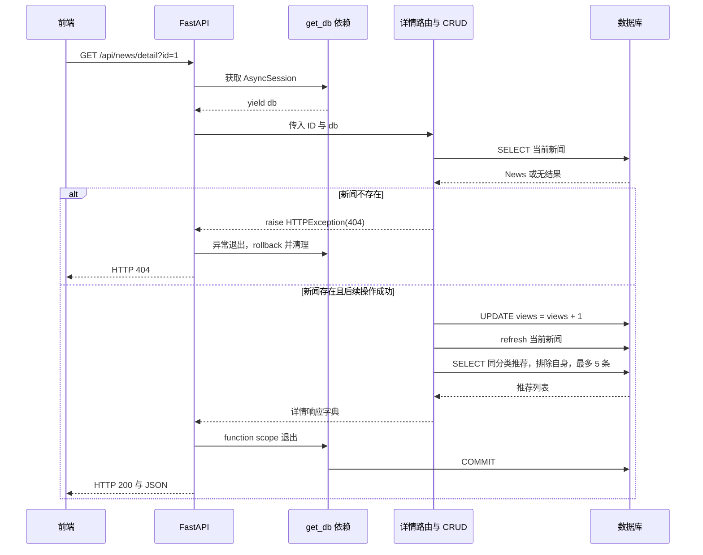

# 33 · FastAPI 项目：获取新闻详情

本章的目标是：**前端传入新闻 ID，后端查出新闻，将点击量加 1，再查询推荐新闻，最后一起返回。**

三个业务步骤的顺序是：

```text
根据 ID 获取新闻
    → 不存在：返回 404，结束处理
    → 存在：点击量 +1
    → 获取同分类的推荐新闻，排除当前新闻
    → 返回新闻详情、更新后的点击量、推荐新闻列表
```

当前项目已经实现了这条流程。本篇先解释已有实现，再给出补充参数校验、事务边界和响应字段整理后的建议代码。建议代码用于学习和后续修改，合并时应同步调整相关 CRUD 和路由调用，保留分类、列表等其他接口。

前置笔记：[获取新闻列表](../32-FastAPI项目-获取新闻列表/32-FastAPI项目-获取新闻列表.md)、[数据库与 ORM 配置](../30-FastAPI项目-数据库与ORM配置/30-FastAPI项目-数据库与ORM配置.md)。

## 第一步：确定详情接口的输入与输出

### 1.1 前端如何传入新闻 ID？

当前 `xwzx-news/src/store/modules/news.js` 中的实际请求是：

```javascript
const response = await axios.get(
  `${apiConfig.baseURL}/api/news/detail?id=${id}`
);

if (response.data && response.data.code === 200) {
  this.newsDetail = response.data.data;
}
```

例如查看 ID 为 `1` 的新闻：

```text
GET http://127.0.0.1:8000/api/news/detail?id=1
```

这里有两个不同用途的地址：

| 地址 | 用途 | ID 的位置 |
| --- | --- | --- |
| 前端页面 `/news/detail/1` | Vue Router 展示详情页面 | 路径参数 `route.params.id` |
| 后端接口 `/api/news/detail?id=1` | FastAPI 提供详情数据 | 查询参数 `id` |

不要因为前端页面使用路径参数，就在当前后端接口中使用 `Path`。后端 `/detail` 路径没有 `{id}`，应使用 `Query`。

### 1.2 响应包含什么？

当前 `NewsDetail.vue` 使用标题、作者、发布时间、点击量、图片、正文和推荐列表。下面是结构示例，数值和标题仅用于演示：

```json
{
  "code": 200,
  "msg": "success",
  "data": {
    "id": 1,
    "title": "新闻标题示例",
    "content": "第一段正文。\n\n第二段正文。",
    "image": null,
    "author": "新闻编辑部",
    "publishTime": "2026-09-15T09:00:00",
    "categoryId": 1,
    "views": 101,
    "relatedNews": [
      {
        "id": 2,
        "title": "同分类的其他新闻",
        "image": null
      }
    ]
  }
}
```

假设请求前点击量为 `100`，没有其他访问时，处理成功后数据库与响应中的 `views` 都应为 `101`。

`relatedNews` 始终是数组，没有推荐时返回 `[]`。当前推荐卡片只读取 `id`、`title`、`image`，点击卡片后再根据它的 ID 获取完整详情。

## 第二步：明确模型与各模块的职责

本章继续使用已有的 `News` 模型，无须创建新的详情表。

| 位置 | 本章职责 |
| --- | --- |
| [models/news.py](../../toutiao_backend/models/news.py) | `News` 对应 `news` 表，提供 `id`、`views`、`category_id` 等属性 |
| [config/db_conf.py](../../toutiao_backend/config/db_conf.py) | 提供异步会话 `AsyncSession` 和 `get_db` 依赖 |
| [crud/news.py](../../toutiao_backend/crud/news.py) | 查询单条新闻、更新点击量、查询推荐新闻 |
| [routers/news.py](../../toutiao_backend/routers/news.py) | 接收 ID、判断异常、依次调用 CRUD、组织响应 |
| [main.py](../../toutiao_backend/main.py) | 创建应用并注册新闻路由 |

与本次业务直接有关的字段是：

| 字段 | 作用 |
| --- | --- |
| `id` | 主键，用于唯一定位当前新闻 |
| `category_id` | 获取当前分类，并筛选同分类推荐新闻 |
| `views` | 非空整数，保存点击量 |
| `publish_time` | 展示发布时间，并参与推荐排序 |
| `title`、`content`、`image`、`author` | 提供详情页展示内容 |

三个 CRUD 函数复用本次请求中的同一个 `db`，由路由显式传入。普通 Python 调用不会自动解析 CRUD 参数上的 `Depends(get_db)`；下文建议把 CRUD 的 `db` 写成必传参数。

## 第三步：根据 ID 查询新闻

### 3.1 CRUD：查询并返回 News 对象或 None

位置：`toutiao_backend/crud/news.py`。保留当前查询思路，整理为：

```python
from sqlalchemy import select
from sqlalchemy.ext.asyncio import AsyncSession

from models.news import News


async def get_news_detail(
    news_id: int,
    db: AsyncSession,
) -> News | None:
    stmt = select(News).where(News.id == news_id)
    result = await db.execute(stmt)
    return result.scalar_one_or_none()
```

对应 SQL 可以理解为：

```sql
SELECT * FROM news WHERE id = :news_id;
```

`select(News)` 构造查询语句，`where` 指定主键条件，`await db.execute(stmt)` 执行数据库查询。

### 3.2 scalar_one_or_none() 为什么适合这里？

| 方法 | 含义 | 适用场景 |
| --- | --- | --- |
| `result.scalar_one_or_none()` | 提取唯一一行的第一个结果项；没有结果时返回 `None`，多于一行时报错 | 本章按主键查详情 |
| `result.scalar_one()` | 要求恰好一行，否则报错 | 明确保证只有一行的结果，例如整体 `COUNT` |
| `result.scalars().all()` | 提取各行的第一个结果项，组成集合 | 列表、推荐新闻 |

对于 `select(News)`，“第一个结果项”就是整个 `News` 对象，不是新闻 ID。主键保证至多匹配一条新闻，因此返回值适合标注为 `News | None`。

也可以用主键查询的简写：

```python
news_one = await db.get(News, news_id)
```

`AsyncSession.get()` 同样可能返回 `None`，并且可能复用会话中已有的对象；它不能直接替代任意条件查询，也不能当成“强制重新读取最新值”的方法。参见 [SQLAlchemy AsyncSession.get](https://docs.sqlalchemy.org/en/20/orm/extensions/asyncio.html#sqlalchemy.ext.asyncio.AsyncSession.get)。

### 3.3 路由：查不到就停止后续操作

```python
news_one = await news.get_news_detail(news_id=news_id, db=db)
if news_one is None:
    raise HTTPException(status_code=404, detail="新闻不存在")
```

必须在读取 `news_one.id`、`news_one.category_id` 等属性之前判断是否为 `None`。否则不存在的 ID 会变成 `AttributeError`，通常最终表现为 HTTP `500`。

`raise HTTPException(...)` 会中断后续业务逻辑；在没有自定义异常处理器时，上面的错误响应体是 `{"detail": "新闻不存在"}`，HTTP 状态码为 `404`。只返回 `{"code": 404}` 不会自动改变 HTTP 状态码。参见 [FastAPI 错误处理](https://fastapi.tiangolo.com/tutorial/handling-errors/)。

## 第四步：点击量加 1

### 4.1 在数据库中执行自增

当前项目使用的核心语句是：

```python
update(News).where(News.id == news_id).values(views=News.views + 1)
```

对应的核心 SQL 是：

```sql
UPDATE news
SET views = views + 1
WHERE id = :news_id;
```

实际执行的 SQL 还可能包含模型公共字段 `updated_at` 的更新；上面只突出点击量逻辑。

建议 CRUD 如下。与当前代码的主要差别是：暂不在函数内部 `commit`，把提交交给本次请求的统一事务收尾，原因见第七步。

```python
from sqlalchemy import update
from sqlalchemy.ext.asyncio import AsyncSession

from models.news import News


async def update_news_views(
    news_id: int,
    db: AsyncSession,
) -> int:
    stmt = (
        update(News)
        .where(News.id == news_id)
        .values(views=News.views + 1)
    )
    result = await db.execute(stmt)
    return result.rowcount
```

| 代码 | 含义 |
| --- | --- |
| `update(News)` | 构造更新新闻表的语句 |
| `.where(News.id == news_id)` | 只更新指定新闻，不能遗漏 |
| `.values(views=News.views + 1)` | 让数据库用当前列值计算新值 |
| `await db.execute(stmt)` | 执行更新，更新已进入当前事务 |
| `result.rowcount` | 读取本次更新匹配的行数 |

### 4.2 为什么不直接使用 news_one.views += 1？

两种写法的计算位置不同：

```python
news_one.views += 1                 # 在 Python 中用已读取的值计算
stmt = update(News).values(views=News.views + 1)  # 构造数据库列运算
```

第二行仅演示表达式区别，真正执行时必须像上面的完整 CRUD 一样添加指定 ID 的 `where`。

假设数据库当前点击量为 `100`，两个请求都先读到 `100`：

| 时间 | 请求 A | 请求 B |
| --- | --- | --- |
| 1 | 读到 `100` | 读到 `100` |
| 2 | Python 中计算 `101` | Python 中计算 `101` |
| 3 | 写入 `101` | 也写入 `101` |

在没有额外并发控制时，这种“读出旧值再写回固定值”的方式可能丢失一次计数。数据库表达式 `views = views + 1` 在更新语句中完成自增，避免这种覆盖；两个更新都成功提交时，结果应增加 `2`。

原子自增并不表示所有并发请求一定成功：数据库锁冲突、事务回滚等仍需按实际运行情况处理。它解决的是自增计算方式的问题。

### 4.3 rowcount 不是最新点击量

按唯一主键更新时，本项目的普通 SQLite 更新通常会得到：

| `rowcount` | 含义 |
| --- | --- |
| `1` | 匹配了一条新闻 |
| `0` | 没有匹配新闻，可能 ID 不存在或记录已被删除 |

例如点击量从 `100` 增加到 `101`，`rowcount` 是 `1`，不是 `101`。也不能把它赋给 `news_one`，再访问 `news_one.title`。

严格地说，`rowcount` 表示匹配行数，不一定等于值真正变化的行数，也不表示事务已经提交。某些驱动或语句形式不能提供可靠行数时会返回 `-1`，尤其不能把所有使用 `RETURNING` 的结果都假定为具有相同的行数行为。参见 [SQLAlchemy 更新语句与 rowcount](https://docs.sqlalchemy.org/en/20/tutorial/data_update.html#getting-affected-row-count-from-update-delete)。

### 4.4 怎样保证响应读取到更新后的 views？

当前代码先查出 `news_one`，随后执行 ORM 更新。SQLAlchemy 默认的会话同步策略可以同步已加载对象；在当前 SQLite 环境中验证，原实现返回的 `news_one.views` 已经加了 `1`。因此不能简单认为“执行了 UPDATE，Python 对象一定还是旧值”。参见 [SQLAlchemy 会话同步策略](https://docs.sqlalchemy.org/en/20/orm/queryguide/dml.html#selecting-a-synchronization-strategy)。

为了明确展示从数据库读取更新后数据的过程，建议路由在更新成功后执行：

```python
await db.refresh(news_one)
```

`refresh` 会重新查询并刷新这个 ORM 对象的属性，不会再次增加点击量，也不负责提交事务。它可以读取本事务刚刚执行的更新，不需要为了刷新先 `commit`。

不要在已经执行 SQL 自增后，再写一次 `news_one.views += 1`，否则可能把计数增加两次。项目中的 `expire_on_commit=False` 只是不让对象在提交后自动过期，并不代表所有场景下都会自动取得数据库最新值。

## 第五步：获取推荐新闻列表

### 5.1 先确定推荐规则

本阶段使用简单、可解释的规则：

1. 与当前新闻属于同一个分类。
2. 排除当前新闻本身。
3. 点击量高的排在前面。
4. 点击量相同时，发布时间新的优先。
5. 最多返回 `5` 条。

当前代码已经实现这些条件。建议再追加 `id` 降序作为最后的排序条件，让点击量和发布时间都相同时，结果顺序仍能确定。

### 5.2 CRUD：组合筛选、排序与数量限制

当前 `get_recommend_news()` 内部又查询了一次当前新闻，以获取分类 ID。路由已经拿到了这个对象，可以直接把 `category_id` 传入，避免重复查询。

以下建议实现返回 `News` 对象集合，由路由统一选择响应字段；当前实现是在 CRUD 中直接返回字典，合并时要与第六步路由一起调整。

```python
from sqlalchemy import select
from sqlalchemy.ext.asyncio import AsyncSession

from models.news import News


async def get_recommend_news(
    news_id: int,
    category_id: int,
    db: AsyncSession,
    limit: int = 5,
):
    stmt = (
        select(News)
        .where(
            News.id != news_id,
            News.category_id == category_id,
        )
        .order_by(
            News.views.desc(),
            News.publish_time.desc(),
            News.id.desc(),
        )
        .limit(limit)
    )
    result = await db.execute(stmt)
    return result.scalars().all()
```

对应核心 SQL：

```sql
SELECT *
FROM news
WHERE id <> :news_id
  AND category_id = :category_id
ORDER BY views DESC, publish_time DESC, id DESC
LIMIT :limit;
```

`where(条件一, 条件二)` 中的两个条件按 `AND` 组合，即必须同时满足。不要写成 Python 的 `条件一 and 条件二` 来组合 SQLAlchemy 表达式。

`order_by` 中的优先级由左到右，发布时间只是同等点击量下的第二排序依据。`desc()` 表示降序；没有 `order_by` 时不能假定结果默认按某个字段升序。

`limit(5)` 是“最多 5 条”，不是必须凑够 5 条。如果当前分类只有这一条新闻，排除自身后返回空数组即可，详情仍然可以正常展示。

### 5.3 推荐项需要返回完整正文吗？

当前推荐 CRUD 返回的字典还包含 `content`、作者、点击量等字段，但推荐卡片只使用 `id`、`title`、`image`。第六步只输出这三个字段，点击推荐项后再调用详情接口。

注意：仅减少返回字典的字段，只能减少接口响应的数据量；`select(News)` 仍然会读取包括正文在内的映射列。需要进一步减少数据库读取量时，可以学习只选择 `News.id`、`News.title`、`News.image`，以及相应的结果提取方式。

## 第六步：在路由中串联三个业务步骤

位置：`toutiao_backend/routers/news.py`。下面是配合前面三个 CRUD 函数的完整建议实现。

已有 `router` 应直接复用，避免重复创建导致前面注册的分类、列表接口丢失。示例中的导入和路由声明用于说明上下文。

```python
from fastapi import APIRouter, Depends, HTTPException, Query
from sqlalchemy.ext.asyncio import AsyncSession

from config.db_conf import get_db
from crud import news

router = APIRouter(prefix="/api/news", tags=["news"])


@router.get("/detail")
async def read_news_detail(
    news_id: int = Query(..., ge=1, description="新闻 ID", alias="id"),
    db: AsyncSession = Depends(get_db, scope="function"),
):
    # 1. 根据 ID 查询当前新闻。
    news_one = await news.get_news_detail(news_id=news_id, db=db)
    if news_one is None:
        raise HTTPException(status_code=404, detail="新闻不存在")

    # 2. 在数据库中将点击量加 1。
    affected_rows = await news.update_news_views(news_id=news_one.id, db=db)
    if affected_rows == 0:
        raise HTTPException(status_code=404, detail="新闻不存在或已被删除")
    if affected_rows != 1:
        raise HTTPException(status_code=500, detail="无法确认点击量更新结果")

    # 刷新对象，读取本事务更新后的数据。
    await db.refresh(news_one)

    # 3. 查询同分类的其他新闻，作为推荐列表。
    related_news = await news.get_recommend_news(
        news_id=news_one.id,
        category_id=news_one.category_id,
        db=db,
        limit=5,
    )

    # 4. 在会话关闭前，把需要的属性组织成普通字典。
    return {
        "code": 200,
        "msg": "success",
        "data": {
            "id": news_one.id,
            "title": news_one.title,
            "content": news_one.content,
            "image": news_one.image,
            "author": news_one.author,
            "publishTime": news_one.publish_time,
            "categoryId": news_one.category_id,
            "views": news_one.views,
            "relatedNews": [
                {
                    "id": item.id,
                    "title": item.title,
                    "image": item.image,
                }
                for item in related_news
            ],
        },
    }
```

### 6.1 为什么将 ID 改成必填？

当前路由使用 `Query(1, alias="id")`，因此没有传 ID 时也会查询新闻 `1`，并增加它的点击量。建议使用：

```python
news_id: int = Query(..., ge=1, description="新闻 ID", alias="id")
```

| 部分 | 含义 |
| --- | --- |
| `news_id` | Python 内部使用的变量名 |
| `int` | 将输入按整数解析、校验 |
| `...` | 参数必填，不能省略 |
| `ge=1` | ID 必须大于等于 `1` |
| `alias="id"` | 从 URL 查询参数 `id` 读取值 |

这样，缺少 ID、`id=0`、`id=-1` 或 `id=abc` 会得到 HTTP `422`；合法的正整数 ID 在数据库中不存在时才返回 `404`。参见 [FastAPI 数值参数校验](https://fastapi.tiangolo.com/tutorial/path-params-numeric-validations/)。

### 6.2 响应字段需要和前端一致

数据库和 Python 使用 `publish_time`、`category_id`，当前前端读取 `publishTime`、`categoryId`，所以在响应字典中显式转换名称。

`relatedNews` 对应一个数组，不能直接把未处理的查询结果对象 `result` 放进去。本例先提取推荐的 ORM 对象，再用列表推导式转换成字典。

普通路由返回字典时，FastAPI 会将其中的时间对象等转换成 JSON 兼容数据。以后可以在 `schemes/` 中声明 Pydantic 响应模型，使字段类型和结构也出现在接口文档中。

## 第七步：理解事务提交与异常回滚

### 7.1 execute、refresh、commit、rollback 有什么区别？

| 操作 | 本章含义 |
| --- | --- |
| `await db.execute(update_stmt)` | 执行自增语句，更新进入当前事务 |
| `await db.refresh(news_one)` | 重新读取数据库中的对象属性 |
| `await db.commit()` | 提交本事务的更新 |
| `await db.rollback()` | 撤销本事务尚未提交的更新 |

当前 `update_news_views()` 内部会立即 `commit()`。因此后面推荐查询即使失败，这次点击量也已经保存，外层的 `rollback()` 无法撤销先前提交的事务。

这取决于业务希望如何统计访问。本篇建议实现选择：**三个业务步骤作为一个事务处理，推荐查询失败时，也撤销本次点击量更新。**如果以后希望推荐失败仍能展示详情并保留点击量，可以单独设计推荐降级策略。

### 7.2 复用现有 get_db 收尾

当前 `get_db` 已经包含以下结构：

```python
async def get_db():
    async with AsyncSessionLocal() as session:
        try:
            yield session
            await session.commit()
        except Exception:
            await session.rollback()
            raise
        finally:
            await session.close()
```

因此建议 CRUD 只执行查询和更新，统一由该依赖提交或回滚。不要在推荐查询前提前提交，也不要捕获异常后悄悄返回成功，否则依赖可能按成功路径提交事务。

### 7.3 scope="function" 为什么出现在路由里？

本项目声明的 FastAPI 版本支持 `Depends` 的 `scope` 参数。对于含 `yield` 的依赖，默认退出时机在响应发送之后；`scope="function"` 让它在路由函数结束后、响应发送之前退出。

本例的 `get_db` 在退出时提交事务，所以采用 `scope="function"`，使提交先完成，再发送成功响应。如果提交报错，仍能返回错误，而不是已经发出 `200` 才发现数据库没有保存。参见 [FastAPI 依赖退出时机与 scope](https://fastapi.tiangolo.com/tutorial/dependencies/dependencies-with-yield/#early-exit-and-scope)。

这也解释了为什么路由在会话关闭前就把 ORM 属性整理成普通字典。提交成功不等于客户端一定收到了响应；网络中断后重试仍可能产生另一次计数。

以下时序图对应建议实现：



以上流程使用同一个会话顺序执行。不要通过 `asyncio.gather` 让这些有先后依赖的操作并发共用一个 `AsyncSession`。

## 第八步：启动接口并进行前端联调

### 8.1 路由如何注册？

`main.py` 已经通过 `app.include_router(news.router)` 注册新闻路由，因此继续在现有 `router` 中增加 `/detail` 即可：

```text
前缀 /api/news + 路径 /detail = /api/news/detail
```

在项目根目录启动，沿用当前模块导入方式：

```bash
.venv/bin/python -m uvicorn main:app --app-dir toutiao_backend --reload --host 127.0.0.1 --port 8000
```

访问 `http://127.0.0.1:8000/docs`，找到 `GET /api/news/detail`，输入一个存在的 ID 进行调试。

### 8.2 点击推荐新闻后的页面更新

当前 `NewsDetail.vue` 在 `onMounted` 中请求详情，点击推荐卡片时执行 `router.push('/news/detail/新ID')`。

同一详情组件之间只改变路由 ID 时，Vue Router 可能复用组件实例，`onMounted` 不会因此再次执行。若出现“地址变了，正文没变”，应监听 `route.params.id` 的变化，再请求新详情。参见 [Vue Router 路由参数变化](https://router.vuejs.org/guide/essentials/dynamic-matching.html#reacting-to-params-changes)。

可以在已有首次加载逻辑之外增加下面的监听。它只处理 ID 变化，不设置 `immediate: true`，避免和当前 `onMounted` 重复发出首次请求：

```javascript
// 将 watch 合并进已有的 vue 导入；复用现有 route 和 newsStore。
import { watch } from 'vue';

watch(
  () => route.params.id,
  async (newId, oldId) => {
    if (newId === oldId) return;
    const id = Number(newId);
    if (!Number.isInteger(id) || id < 1) return;

    newsStore.newsDetail = {};
    await newsStore.getNewsDetail(id);
  }
);
```

此片段只演示重新获取详情。当前页面还有浏览历史和收藏状态处理，后续可把它们整理成统一的页面加载函数，在首次挂载和 ID 变化时复用。

联调时也应区分请求失败与加载中：当前 store 捕获异常后主要打印日志，页面可能保留旧详情或持续显示“加载中”。可以继续补充清空旧数据、错误提示与重试入口。

## 第九步：检查结果与排查问题

### 9.1 验证三个业务步骤

详情请求会修改点击量。验证加 1 时记录请求前后的值即可，不要把刷新接口当成不改变数据的查询；也可以像本笔记验证时一样使用数据库副本。

先查看当前值，再请求详情，最后复查数据库。以下命令从项目根目录执行：

```bash
sqlite3 -readonly sql/news_app.db 'SELECT id, category_id, views FROM news WHERE id = 1;'
curl -i 'http://127.0.0.1:8000/api/news/detail?id=1'
sqlite3 -readonly sql/news_app.db 'SELECT id, category_id, views FROM news WHERE id = 1;'
```

没有其他访问时，数据库点击量应恰好增加 `1`，响应中的 `views` 应与更新后的值一致。推荐列表中每一项应满足：同分类、不是当前新闻、按约定排序，总数不超过 `5`。

### 9.2 建议实现的验证清单

| 场景 | 预期结果 |
| --- | --- |
| 请求存在的新闻 ID | HTTP `200`，正文等字段正确，点击量加 `1` |
| 连续请求同一新闻两次 | 没有其他访问时，累计加 `2` |
| 请求不存在的正整数 ID | HTTP `404`，其他新闻的点击量不变 |
| 缺少 `id`、`id=0`、`id=-1`、`id=abc` | HTTP `422` |
| 当前分类没有其他新闻 | `relatedNews: []`，详情仍然成功 |
| 当前分类其他新闻不足 5 条 | 返回实际数量，不补重复数据 |
| 当前分类其他新闻超过 5 条 | 按排序取前 5 条，排除自身 |
| 只查询推荐新闻 | 不增加推荐项的点击量；真正打开其详情时才加 `1` |
| 推荐查询抛出异常 | 本篇建议事务方案中，点击量更新回滚 |
| 点击某条推荐新闻 | 请求新 ID 的详情，页面内容随之变化 |

当前业务代码与建议实现有几处差异：ID 目前有默认值 `1` 且没有 `ge=1`，更新点击量在 CRUD 中立即提交，推荐函数内部还会再查一次当前新闻并返回较多字段。验证时要根据实际运行版本判断预期。

### 9.3 常见疑问

| 问题 | 原因或处理方式 |
| --- | --- |
| 为什么缺少 `await db.get(...)` 会出错？ | 异步调用得到协程，必须 `await` 才能获得 `News` 对象或 `None` |
| 为什么 `rowcount` 总是 `1`？ | 它是匹配行数，更新后的点击量应从新闻对象或查询结果读取 |
| 为什么查不到新闻时报 `500`？ | 检查是否在判断 `None` 前访问了对象属性 |
| 为什么数据库加了 1，响应仍显示旧值？ | 核对会话同步方式，可显式 `await db.refresh(news_one)` |
| 为什么一次打开加了 2？ | 查看 Network 是否重复请求，或是否同时做了 SQL 自增和对象自增 |
| 为什么推荐列表包含自己？ | 遗漏 `News.id != news_id` |
| 为什么推荐排序偶尔变化？ | 检查是否显式排序，以及是否追加 ID 处理点击量、时间均相同的情况 |
| 为什么推荐失败了，计数仍保存？ | 更新后已经提前 `commit`，后续回滚无法撤销已提交事务 |
| 为什么点击推荐只改变了 URL？ | 检查组件复用时是否监听了路由 ID |

最后需要明确计数口径：当前需求统计的是“详情接口处理所产生的访问次数”，不是去重后的阅读人数。刷新、重试、重复触发请求都可能增加点击量；如果以后需要按用户去重或防止重复计数，应另行设计访问记录与统计规则。
