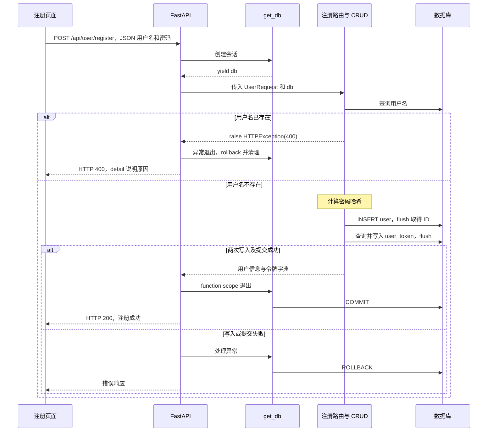

# 34 · FastAPI 项目：注册用户

本章完成的功能是：**接收用户名和密码，创建用户，生成并保存访问令牌，全部成功后提交事务，最后返回用户信息和令牌，让前端进入登录状态。**

注册同时涉及请求体验证、密码哈希、ORM 映射、数据库事务和前后端响应约定。本篇依据当前项目中已经修复的代码整理，并在后半部分记录本次遇到的错误、原因、修复方式及验证结果。

前置笔记：[数据库与 ORM 配置](../30-FastAPI项目-数据库与ORM配置/30-FastAPI项目-数据库与ORM配置.md)、[获取新闻分类与 CORS](../31-FastAPI项目-获取新闻分类/31-FastAPI项目-获取新闻分类.md)、[获取新闻详情与事务](../33-FastAPI项目-获取新闻详情/33-FastAPI项目-获取新闻详情.md)。

## 第一步：确定注册接口的输入与输出

### 1.1 从注册页面到后端接口

前端页面地址为 `http://localhost:5173/register`，用户填写用户名、密码、确认密码后提交表单。

当前 `Register.vue` 会检查两次密码是否一致，再调用 `userStore.register()`。真正的 HTTP 请求位于 [xwzx-news/src/store/user.js](../../xwzx-news/src/store/user.js)：

```javascript
const response = await axios.post(
  `${apiConfig.baseURL}/api/user/register`,
  {
    username: userData.username,
    password: userData.password
  }
);
```

当前后端地址配置为 `http://127.0.0.1:8000`，因此请求是：

```text
POST http://127.0.0.1:8000/api/user/register
Content-Type: application/json
```

请求体示例：

```json
{
  "username": "learn_demo",
  "password": "Example-register-123!"
}
```

确认密码用于前端检查，本项目没有把它发送到后端。前端校验不能替代后端校验，因为其他客户端也能直接调用接口。

### 1.2 成功响应必须符合前端约定

```json
{
  "code": 200,
  "message": "注册成功",
  "data": {
    "token": "此处为生成的令牌字符串",
    "userInfo": {
      "id": 5,
      "username": "learn_demo",
      "bio": "这个人很懒，什么都没留下",
      "avatar": null
    }
  }
}
```

这里的 ID 和令牌只是结构示例。前端读取的是 `response.data.data.token` 和 `response.data.data.userInfo`；第一层 `data` 是 Axios 响应体，第二层 `data` 是项目自定义字段。

响应只选择需要的用户字段，不返回密码及其哈希。HTTP 状态码与响应体中的 `code` 是两个不同概念，不能通过返回 `{"code": 400}` 自动改变 HTTP 状态码。

## 第二步：区分请求模型与数据库模型

### 2.1 UserRequest 负责请求体验证

当前 [models/users.py](../../toutiao_backend/models/users.py) 中定义了：

```python
from pydantic import BaseModel


class UserRequest(BaseModel):
    username: str
    password: str
```

路由参数写成 `user_request: UserRequest` 后，FastAPI 会把 JSON 请求体解析成该对象。两个字段没有默认值，所以都必须提供；缺少必填字段等不符合模型要求的输入会返回 HTTP `422`。参见 [FastAPI 请求体](https://fastapi.tiangolo.com/tutorial/body/)。

当前这里只声明了字符串类型，还没有限制用户名长度、空字符串、密码长度等规则。`str` 不等于“已经完成所有业务校验”。后续可以使用 Pydantic 的字段约束和验证器补充规则。

`UserRequest` 是 Pydantic 模型，不对应数据库表。它目前与 ORM 模型放在同一文件中；后续可以迁移到项目规划的 `schemes/` 目录，并同步修改导入。

### 2.2 ORM 基类不能无条件给所有表添加字段

当前 [models/Bases.py](../../toutiao_backend/models/Bases.py) 将基类分为两层。以下省略长注释，保留关键声明：

```python
from datetime import datetime

from sqlalchemy import DateTime
from sqlalchemy.orm import DeclarativeBase, Mapped, mapped_column


class ModelBase(DeclarativeBase):
    """共享 ORM 注册信息，不自动添加业务字段。"""


class Base(ModelBase):
    __abstract__ = True

    created_at: Mapped[datetime] = mapped_column(
        DateTime, default=datetime.now
    )
    updated_at: Mapped[datetime] = mapped_column(
        DateTime, default=datetime.now, onupdate=datetime.now
    )
```

继承关系如下：

```text
DeclarativeBase
└── ModelBase                  共享 registry 和 metadata
    ├── Base                   抽象类，提供 created_at、updated_at
    │   ├── User               user 表有这两个时间字段
    │   ├── News
    │   └── Category
    └── UserToken              自己声明 created_at，不继承 updated_at
```

`__abstract__ = True` 表示 `Base` 用来提供公共声明，本身不映射一张表；它的具体子类再通过 `__tablename__` 指定表名。参见 [SQLAlchemy 抽象声明类](https://docs.sqlalchemy.org/en/20/orm/declarative_config.html#abstract)。

`metadata` 可以理解为 ORM 对表结构的描述集合。`User` 与 `UserToken` 共享同一个 `ModelBase`，因此也共享这些表定义。声明模型并不等于自动修改了现有数据库表。

### 2.3 User 与 UserToken 各自保存什么？

| 模型 | 对应表 | 注册时的重要字段 |
| --- | --- | --- |
| `User(Base)` | `user` | `id`、`username`、密码哈希 `password`，以及个人资料、创建和更新时间 |
| `UserToken(ModelBase)` | `user_token` | `id`、`user_id`、`token`、`expires_at`、`created_at` |

`User.username` 声明了唯一约束，实际 `user` 表也有用户名唯一约束。它用于阻止重复用户名写入。

当前令牌模型的关键代码如下，省略了索引、注释和 `__repr__`；它仍需与同文件中完整的 `User` 模型一起使用：

```python
from datetime import datetime

from sqlalchemy import DateTime, ForeignKey, Integer, String
from sqlalchemy.orm import Mapped, mapped_column

from models.Bases import ModelBase


class UserToken(ModelBase):
    __tablename__ = "user_token"

    id: Mapped[int] = mapped_column(
        Integer, primary_key=True, autoincrement=True
    )
    user_id: Mapped[int] = mapped_column(
        Integer, ForeignKey(User.id), nullable=False
    )
    token: Mapped[str] = mapped_column(
        String(255), unique=True, nullable=False
    )
    expires_at: Mapped[datetime] = mapped_column(DateTime, nullable=False)
    created_at: Mapped[datetime] = mapped_column(
        DateTime, default=datetime.now, nullable=False
    )
```

`ForeignKey(User.id)` 关联用户表的主键。实际 SQLite 的 `user_token` 表只有这五列，没有 `updated_at`，所以这里不能继承带有该字段的 `Base`。

## 第三步：检查用户名是否存在

位置：[crud/users.py](../../toutiao_backend/crud/users.py)。

```python
from sqlalchemy import select
from sqlalchemy.ext.asyncio import AsyncSession

from models.users import User


async def get_user_by_username(
    db: AsyncSession,
    username: str,
) -> User | None:
    stmt = select(User).where(User.username == username)
    result = await db.execute(stmt)
    return result.scalars().first()
```

核心 SQL 可以理解为：

```sql
SELECT * FROM user WHERE username = :username;
```

`select(User)` 查询 ORM 实体；`scalars()` 提取每行中的 `User` 对象；`first()` 返回第一项，没有结果时返回 `None`。

路由根据结果决定是否继续：

```python
existing_user = await users.get_user_by_username(db, user_request.username)
if existing_user is not None:
    raise HTTPException(status_code=400, detail="用户名已存在")
```

提前查询可以返回友好的提示，但数据库唯一约束仍然必不可少：并发的两个请求可能同时查到“不存在”，最终只能允许一个成功写入。当前代码还没有把这种并发唯一约束异常专门转换成友好业务错误；统一事务能保证失败请求的写入回滚。

## 第四步：对密码计算哈希

位置：[utils/security.py](../../toutiao_backend/utils/security.py)。当前实际参与注册的函数是：

```python
import bcrypt


def hash_password(password: str) -> str:
    pwd = password.encode("utf-8")
    return bcrypt.hashpw(pwd, bcrypt.gensalt()).decode("utf-8")
```

| 代码 | 含义 |
| --- | --- |
| `password.encode("utf-8")` | 把 Python 字符串转成 bcrypt 接收的字节数据 |
| `bcrypt.gensalt()` | 生成包含随机盐和工作因子配置的数据 |
| `bcrypt.hashpw(...)` | 根据密码和盐计算哈希 |
| `.decode("utf-8")` | 把返回的字节结果转成可存入字符串列的文本 |

这里准确的术语是“密码哈希”。它没有解密还原密码的步骤；登录时通过验证函数判断输入是否匹配。随机盐使同一个密码多次计算时通常得到不同的哈希字符串，因此不能重新随机生成一个哈希，再直接比较两个字符串。参见 [bcrypt 官方用法](https://github.com/pyca/bcrypt#usage)。

项目依赖包含 `passlib[bcrypt]`，但当前 `hash_password()` 直接调用的是 `bcrypt`。`security.py` 虽然创建了 `CryptContext`，该对象目前没有参与这个函数的计算。

当前环境使用 bcrypt `5.0.0`，超过 **72 字节**的密码会被 `hashpw` 拒绝。字节数不等于字符数，例如中文经过 UTF-8 编码后可能占多个字节；后续应在后端补充对应验证，不能静默截断用户密码。这个限制是输入校验补充，不是此前注册报错的已确认原因。

**后续登录代码需要注意：**当前 `verify_password()` 写的是 `bcrypt.verifypw`，正确的 API 是 `bcrypt.checkpw`。以下是修正参考，本篇尚未将它改入业务文件：

```python
def verify_password(plain_password: str, hashed_password: str) -> bool:
    return bcrypt.checkpw(
        plain_password.encode("utf-8"),
        hashed_password.encode("utf-8"),
    )
```

## 第五步：创建用户，先 flush，暂不 commit

位置：`crud/users.py`。当前实现的整理版：

```python
from sqlalchemy.ext.asyncio import AsyncSession

from models.users import User, UserRequest
from utils.security import hash_password


async def create_user(db: AsyncSession, user_request: UserRequest) -> User:
    password_hash = hash_password(user_request.password)
    user = User(username=user_request.username, password=password_hash)

    db.add(user)
    await db.flush()
    await db.refresh(user)
    return user
```

三个数据库操作的分工是：

1. `db.add(user)`：把新对象加入当前会话，等待持久化。
2. `await db.flush()`：执行 `INSERT`，取得数据库生成的用户 ID；写入仍在当前事务中。
3. `await db.refresh(user)`：重新读取数据库中的属性，例如默认值；不会提交事务。

之后可以使用 `user.id` 创建令牌。**取得自增 ID 不要求先提交事务。**如果后面的令牌操作失败，这个已执行的用户 `INSERT` 仍然能够回滚。参见 [SQLAlchemy flush 与事务](https://docs.sqlalchemy.org/en/20/orm/session_basics.html#flushing)。

`refresh()` 也不是给密码计算哈希。密码在创建 `User` 对象前，就已经经过 `hash_password()` 处理。

## 第六步：创建或更新用户令牌

### 6.1 令牌与过期时间怎么生成？

当前项目使用：

```python
import uuid
from datetime import datetime, timedelta

token = str(uuid.uuid4())
expires_at = datetime.now() + timedelta(days=7)
```

`uuid.uuid4()` 生成随机 UUID，`str(...)` 将其转换成字符串。`timedelta(days=7)` 表示七天的时间间隔。参见 [Python uuid4](https://docs.python.org/3/library/uuid.html#uuid.uuid4)。

本项目使用的是“数据库保存的随机令牌”，不是 JWT。它本身不包含可直接读取的用户身份和过期声明；后续鉴权需要查到令牌记录，并检查 `expires_at`。

写入过期时间不会自动删除记录，也不会自动完成鉴权。当前代码使用 `datetime.now()`，后续进行过期比较时还应统一时间和时区约定。

### 6.2 只读取一次查询结果，再判断新增或更新

当前函数的整理版如下：

```python
import uuid
from datetime import datetime, timedelta

from sqlalchemy import select
from sqlalchemy.ext.asyncio import AsyncSession

from models.users import UserToken


async def create_user_token(db: AsyncSession, user_id: int) -> UserToken:
    token = str(uuid.uuid4())
    expires_at = datetime.now() + timedelta(days=7)

    stmt = select(UserToken).where(UserToken.user_id == user_id)
    result = await db.execute(stmt)
    user_token = result.scalars().first()

    if user_token is not None:
        user_token.token = token
        user_token.expires_at = expires_at
    else:
        user_token = UserToken(
            user_id=user_id,
            token=token,
            expires_at=expires_at,
        )

    db.add(user_token)
    await db.flush()
    await db.refresh(user_token)
    return user_token
```

对于刚注册的新用户，通常走创建令牌的分支；保留更新分支，方便后续需要更换已有令牌时复用。

这里继续使用传入的同一个 `db`，不另建会话，也不提前 `commit`。函数内部已经执行了 `flush`，令牌插入或更新的异常可以在统一提交之前暴露出来。

“查到就更新，查不到就创建”是当前业务逻辑。实际 `user_token.user_id` 没有唯一约束，所以不能认为数据库已经严格保证“一位用户只能有一条令牌”；若以后需要在并发场景保证这一点，还需要配套数据库约束或调整令牌管理策略。

## 第七步：由路由组织注册流程和响应

位置：[routers/users.py](../../toutiao_backend/routers/users.py)。下面保留当前行为，整理了导入、命名和注释：

```python
from fastapi import APIRouter, Depends, HTTPException, status
from sqlalchemy.ext.asyncio import AsyncSession

from config.db_conf import get_db
from crud import users
from models.users import UserRequest

router = APIRouter(prefix="/api/user", tags=["users"])


@router.post("/register")
async def register(
    user_request: UserRequest,
    db: AsyncSession = Depends(get_db, scope="function"),
):
    # 1. 检查用户名。
    existing_user = await users.get_user_by_username(db, user_request.username)
    if existing_user is not None:
        raise HTTPException(
            status_code=status.HTTP_400_BAD_REQUEST,
            detail="用户名已存在",
        )

    # 2. 创建用户，flush 后取得 ID。
    new_user = await users.create_user(db, user_request)

    # 3. 创建令牌，继续使用同一个事务。
    user_token = await users.create_user_token(db, new_user.id)

    # 4. 取出响应所需字段；get_db 在发送响应前完成提交。
    return {
        "code": 200,
        "message": "注册成功",
        "data": {
            "token": user_token.token,
            "userInfo": {
                "id": new_user.id,
                "username": new_user.username,
                "bio": new_user.bio,
                "avatar": new_user.avatar,
            },
        },
    }
```

`user_request` 来自 JSON 请求体，`db` 来自依赖注入。路由按顺序调用 CRUD，再把 ORM 对象中的指定属性整理成普通字典。

`main.py` 已经执行 `app.include_router(users.router)`，因此最终路径是：

```text
/api/user + /register = /api/user/register
```

当前 `users.py` 文件名使用复数，URL 使用单数 `/api/user`，两者不要求同名；URL 需要与前端请求约定一致。

## 第八步：统一提交事务，失败时统一回滚

### 8.1 get_db 负责事务收尾

当前 [config/db_conf.py](../../toutiao_backend/config/db_conf.py) 已经提供：

```python
async def get_db():
    async with AsyncSessionLocal() as session:
        try:
            yield session
            await session.commit()
        except Exception:
            await session.rollback()
            raise
        finally:
            await session.close()
```

这是已有配置中的依赖函数片段，`AsyncSessionLocal` 是同文件中创建的会话工厂。

| 操作 | 本章作用 | 是否提交事务 |
| --- | --- | --- |
| `add()` | 将对象加入会话 | 否 |
| `flush()` | 把待执行的写入发送到数据库，可获得主键 | 否 |
| `refresh()` | 重新读取对象属性 | 否 |
| `commit()` | 提交当前事务，必要时先触发 flush | 是 |
| `rollback()` | 撤销当前事务尚未提交的变更 | 否，属于撤销 |

成功时，用户和令牌一起提交；失败时，异常传播到 `get_db`，两者一起回滚。`except` 中的 `raise` 用于继续抛出异常，不能回滚后吞掉错误并返回成功。

普通 Python 调用不会自动注入 `Depends`，所以 CRUD 都显式接收真实的 `AsyncSession`。使用同一个会话还不够：如果中途执行 `commit()`，后面的操作就已经不再属于之前那个未提交事务。

### 8.2 依赖注入的 scope 到底控制什么？

**`scope` 控制依赖的执行生命周期，重点是：路由拿到依赖提供的资源后，FastAPI 什么时候让依赖执行退出代码。**代码中参数名使用小写 `scope`，本章基于项目当前的 FastAPI `0.141.1` 说明。

例如注册接口中：

```python
db: AsyncSession = Depends(get_db, scope="function")
```

这里 `get_db` 决定“怎样创建会话、怎样提交或回滚、怎样清理资源”；`scope` 决定“何时结束这次依赖调用，执行这些收尾步骤”。它主要用于包含 `yield` 的依赖。参见 [FastAPI Depends 参数说明](https://fastapi.tiangolo.com/reference/dependencies/)。

#### 8.2.1 先把含 yield 的依赖看成三个阶段

结合上面的 `get_db`，一次正常请求经历：

```text
阶段一：进入依赖
    创建 session，执行 yield 之前的代码

阶段二：暂停依赖，把资源交给路由
    yield session → 路由的 db 参数拿到该 session
    路由使用 db 查询用户名、写入用户、写入令牌

阶段三：退出依赖
    恢复执行 yield 后的代码
    正常路径执行 commit，finally 中清理会话
```

`yield` 把会话交出去后，依赖暂时停在那里，并不是已经执行完毕。FastAPI 会在适当时机恢复或退出它；这个时机就是 `scope` 的核心作用。

如果路由抛出异常，异常会传回依赖的 `yield` 位置，进入 `except` 执行 `rollback()`，然后进入 `finally` 清理。普通 `return` 依赖没有这样的跨路由退出阶段，不能靠设置 `scope` 凭空获得资源清理能力。

#### 8.2.2 function 与 request 的区别

两种模式都在路由执行前解析依赖。**正常返回时**，结束时机不同：

| 写法 | 依赖退出时机 | 覆盖的阶段 |
| --- | --- | --- |
| `Depends(get_db, scope="function")` | 路由函数结束后、HTTP 响应发送前 | 路由函数的执行过程 |
| `Depends(get_db, scope="request")` | HTTP 响应发送完成后 | 路由执行和响应发送过程 |
| `Depends(get_db)` | 对含 `yield` 的依赖，默认采用 `request` | 与上面的 `request` 相同 |

`function` 指处理请求的**路由函数**，本章就是 `register()`，不是指 `get_db()` 自己，也不是某个 CRUD 函数。因此 `create_user()` 返回时不会提前关闭会话，后面的 `create_user_token()` 仍可以继续使用它。

“路由函数返回了字典”和“HTTP 响应已经发给客户端”是不同阶段。路由的 `return` 先把结果交还给 FastAPI，之后框架还要完成后续处理并发送响应。两种 `scope` 正是把依赖退出安排在发送响应的前面或后面。参见 [FastAPI 依赖退出时机](https://fastapi.tiangolo.com/tutorial/dependencies/dependencies-with-yield/#early-exit-and-scope)。

#### 8.2.3 放到注册流程里，顺序怎样变化？

使用本项目当前的 `function`：

```text
创建会话 → yield 会话
    → register() 创建用户、创建令牌
    → register() 返回响应字典
    → get_db 恢复执行：commit → 清理会话
    → FastAPI 发送 HTTP 200 和响应体
```

如果只把参数改成 `request`，其他代码保持不变：

```text
创建会话 → yield 会话
    → register() 创建用户、创建令牌
    → register() 返回响应字典
    → FastAPI 发送 HTTP 200 和响应体
    → get_db 恢复执行：commit → 清理会话
```

区别在于：本项目的 `commit()` 写在 `yield` 后面。因此，`function` 能先确认事务提交成功，再向前端发送注册成功；`request` 则可能先宣布注册成功，随后才尝试提交。

当前响应已经在路由中整理成普通字典，发送它时不再需要数据库会话，所以适合采用 `function`。

#### 8.2.4 提交失败时，为什么差别很大？

下面的结果通过临时数据库调用实际注册函数和 `get_db` 验证，记录了提交、回滚与 HTTP 发送事件：

| 模式与场景 | 实际事件顺序 | 用户、令牌新增记录数 |
| --- | --- | --- |
| `function`，正常注册 | 提交成功 → 发送 `200` → 发送完响应体 | 各 `1` 条 |
| `request`，正常注册 | 发送 `200` → 发送完响应体 → 提交成功 | 各 `1` 条 |
| `function`，模拟提交失败 | 提交失败 → 回滚 → 发送 `500` | 都是 `0` 条 |
| `request`，模拟提交失败 | 发送 `200` → 发送完响应体 → 提交失败 → 回滚 | 都是 `0` 条 |

最后一行说明：数据库确实可以回滚，但服务器已经发送的成功响应无法收回，不能再给同一个请求重新发送一个 `500`。前端于是可能显示“注册成功”，数据库却没有这位新用户。

不过，不能把 `request` 理解为“任何错误都要等到响应发送之后才处理”。例如用户名检查时直接抛出 `HTTPException(400)`，路由还没有成功返回，两种模式下都可以先回滚，再发送错误响应。这个场景也已验证：

```text
function：路由发现重复用户名 → rollback → HTTP 400
request： 路由发现重复用户名 → rollback → HTTP 400
```

因此要区分**路由执行期间发生的错误**和**正常响应发出后，依赖收尾时发生的错误**。

#### 8.2.5 scope 会自动开启事务或提交数据库吗？

不会。它只控制执行时机，事务操作仍来自我们自己写的代码：

```python
# get_db 中，由我们显式定义的事务行为。
yield session
await session.commit()
```

如果依赖里只有 `yield` 和 `close()`，加上 `scope="function"` 也不会自动多出一次 `commit()`。

本项目中三个设计各自承担不同职责：

| 设计 | 解决的问题 |
| --- | --- |
| 用户和令牌使用同一个 `db`，中途不提交 | 让两次写入处于同一个未提交事务中 |
| `get_db` 中统一 `commit()` / `rollback()` | 全部成功一起保存，失败一起撤销 |
| `scope="function"` | 在发送成功响应之前完成事务收尾 |

所以，仅修改 `scope` 不能修复 CRUD 中的提前提交。之前两个 `commit()` 改为 `flush()`，与这里设置 `scope` 是相互配合的修改。

#### 8.2.6 scope 与依赖缓存、全局单例有什么关系？

它们解决的是不同问题：

| 参数或机制 | 关注点 |
| --- | --- |
| `scope` | 依赖什么时候结束、什么时候执行退出代码 |
| `use_cache` | 同一请求中重复声明依赖时，是否复用已解析的结果 |
| 应用生命周期或全局对象 | 资源是否跨多个请求长期存在 |

`scope="request"` 不表示整个应用共享一个数据库会话；`scope="function"` 也不表示每调用一个 CRUD 就创建一个会话。当前 `get_db` 每次创建本请求使用的会话，路由再把同一个 `db` 显式传给各 CRUD。

`Depends` 的 `use_cache` 默认是 `True`，同一请求中的重复依赖通常可以复用结果；需要禁用缓存时使用 `use_cache=False`。不要用切换 `scope` 来表达“是否复用对象”的需求。参见 [FastAPI Depends：use_cache](https://fastapi.tiangolo.com/reference/dependencies/)。

#### 8.2.7 实际项目中如何选择？

| 场景 | 选择依据 |
| --- | --- |
| 本章注册接口，依赖退出时提交事务 | 使用 `function`，提交成功后再发送成功响应 |
| 普通查询，路由已把需要的数据读取并整理成字典 | 可以使用 `function`，发送响应前释放资源 |
| `StreamingResponse` 的迭代器在发送过程中还要读取文件或数据库 | 相关资源通常需要 `request`，避免响应仍在生成时就被关闭 |
| 流式响应的数据已提前读入内存，发送过程不再使用该资源 | 可以更早释放资源，无须仅因为响应类型是流式就延长依赖 |

`request` 有自己的用途，并不是应当全部替换成 `function`。选择时要看：**路由返回以后，生成或发送响应的过程是否还需要这个资源，以及依赖退出失败是否必须影响响应结果。**

#### 8.2.8 子依赖的 scope 还有什么限制？

如果含 `yield` 的依赖 A 又依赖含 `yield` 的依赖 B，A 的退出代码可能还要使用 B，因此 B 不能比 A 更早释放：

| A 的 scope | B 的 scope | 是否允许 |
| --- | --- | --- |
| `function` | `function` | 允许，先退出 A，再退出 B |
| `function` | `request` | 允许，B 保留得更久 |
| `request` | `request` | 允许，按依赖顺序收尾 |
| `request` | `function` | 不允许，A 收尾时 B 已经结束 |

这是依赖资源生命周期的约束，与数据库表之间的外键关系无关。参见 [FastAPI 子依赖 scope 规则](https://fastapi.tiangolo.com/tutorial/dependencies/dependencies-with-yield/#scope-for-sub-dependencies)。

### 8.3 完整时序



## 第九步：前端接收结果与验证接口

### 9.1 注册成功后，前端为什么显示已登录？

当前 store 在成功分支中执行：

```javascript
const { userInfo, token } = response.data.data;
this.userInfo = userInfo;
this.token = token;
this.isLogin = true;
```

随后注册页面跳转到首页。这是前端状态更新；其他需要登录的后端接口，仍应验证令牌是否合法、是否过期，不能只相信前端的 `isLogin`。

### 9.2 启动与手动调试

在项目根目录启动后端：

```bash
.venv/bin/python -m uvicorn main:app --app-dir toutiao_backend --reload --host 127.0.0.1 --port 8000
```

打开 `http://127.0.0.1:8000/docs`，检查是否存在 `POST /api/user/register`。当前代码采用 `from routers`、`from models` 等导入方式，`--app-dir toutiao_backend` 用于指定应用搜索目录。

也可以用下面的请求调试。执行会实际创建示例用户，重复执行会触发用户名已存在的检查：

```bash
curl -i 'http://127.0.0.1:8000/api/user/register' \
  -H 'Content-Type: application/json' \
  --data '{"username":"learn_demo","password":"Example-register-123!"}'
```

### 9.3 用独立数据库验证事务

项目已经添加 [tests/test_user_registration.py](../../tests/test_user_registration.py)，使用临时数据库，复用真实的路由和 `get_db`，通过替换会话工厂隔离项目数据。

```bash
.venv/bin/python -m unittest discover -s tests -v
```

| 测试 | 关键预期 |
| --- | --- |
| 正常注册 | 返回用户和令牌，数据库各有一条对应记录 |
| 重复用户名 | 返回 `400`，没有新增用户或令牌 |
| 令牌写入后模拟异常 | 用户和令牌都回滚；用同一用户名重试可以成功 |
| 模拟 commit 失败 | 返回 `500`，不提前发送成功响应，两张表都不留记录 |
| 更新已有令牌 | 更新原记录，不产生第二条令牌记录 |

验证事务不能只看成功路径。旧代码最关键的问题，是用户已提交、令牌却失败；只有覆盖后续步骤失败的测试，才能确认两次写入真正一起回滚。

## 本次错误记录与修复

以下记录区分已经修复的业务错误和仍可完善的错误展示，不把所有“注册请求失败”都归为同一种原因。

### 错误一：前后端路径不一致，接口返回 404

**现象：**前端提交注册后显示“注册请求失败，请稍后再试”。最初检查代码时，前后端地址为：

```text
前端请求：POST /api/user/register
后端声明：POST /api/users/register
```

**原因：**后端 `APIRouter` 前缀多了一个 `s`，路由无法匹配，请求不会进入注册函数。

**修复：**后端已统一为：

```python
router = APIRouter(prefix="/api/user", tags=["users"])
```

**验证：**查看 `/docs` 或 `/openapi.json` 中的真实路径，再与浏览器 Network 中的 Request URL 对比。该路径问题已经修复；后续测试能够进入注册逻辑。

### 错误二：UserToken 继承了数据库没有的 updated_at

**实际复现的异常：**

```text
sqlite3.OperationalError: no such column: user_token.updated_at
```

**原因：**旧代码使用 `class UserToken(Base)`，而当时的 `Base` 自动提供 `created_at`、`updated_at`。虽然 `UserToken` 类体没有写 `updated_at`，继承后它仍然属于 ORM 映射字段。

但实际数据库结构只有：

```text
user_token：id、user_id、token、expires_at、created_at
```

执行 `select(UserToken)` 时，ORM 会把继承的列也放入 SELECT，数据库找不到该列，于是返回 `500`。

**排查方法：**

```sql
PRAGMA table_info(user_token);
```

也可以在项目根目录比较 ORM 认为存在的列：

```bash
PYTHONPATH=toutiao_backend .venv/bin/python -c 'from models.users import UserToken; print(UserToken.__table__.columns.keys())'
```

**修复：**采用第二步中的 `ModelBase → Base` 分层，`UserToken` 继承不包含时间字段的 `ModelBase`，自行声明实际存在的 `created_at`。`User` 等需要两个时间字段的模型继续继承 `Base`。

排查时曾在临时数据库副本中补齐 `updated_at`，确认新注册能够返回 `200`；这是定位原因的实验。最终落地的是修正模型继承结构，实际 `user_token` 表没有因此新增该列。

### 错误三：直接继承 DeclarativeBase，应用无法启动

**实际复现的异常：**

```text
InvalidRequestError:
Cannot use 'DeclarativeBase' directly as a declarative base class.
Create a Base by creating a subclass of it.
```

**原因：**为了去掉 `updated_at`，曾把模型改为 `class UserToken(DeclarativeBase)`。声明式映射要求先定义一个继承 `DeclarativeBase` 的基类，再让具体模型继承这个基类，不能让带表映射的 `UserToken` 直接作为这一层基类。

**修复：**先创建 `ModelBase(DeclarativeBase)`，再使用 `UserToken(ModelBase)`；带时间字段的 `Base` 改为抽象类。这样既满足声明式映射要求，也让各模型共享同一套元数据。

**验证：**应用可以正常导入；`User`、`UserToken`、`News`、`Category` 的映射字段与实际表字段一致，并共享同一个 `metadata`。

### 错误四：重复调用 first()，查询结果已经关闭

**旧代码：**

```python
if result.scalars().first():
    user_token = result.scalars().first()
    user_token.token = token
```

**实际复现的异常：**

```text
ResourceClosedError: This result object is closed.
```

**原因：**第一次 `first()` 已经取得第一项并关闭结果。第二次调用不是重新执行 SQL，也不是重新从第一行开始读取，而是在访问已经关闭的结果。该问题出现在“用户已有令牌”的分支。参见 [SQLAlchemy Result.first](https://docs.sqlalchemy.org/en/20/core/connections.html#sqlalchemy.engine.Result.first)。

**修复：**只读取一次并保存对象：

```python
user_token = result.scalars().first()
if user_token is not None:
    user_token.token = token
    user_token.expires_at = expires_at
```

**验证：**已有令牌更新测试通过，原记录被更新，令牌数量不增加。

### 错误五：注册显示失败，再次提交却提示用户名已存在

**旧流程：**

```text
创建用户 → commit 成功
    → 查询或创建令牌时报错
    → 注册响应失败
    → 再次提交，发现用户名已存在
```

**原因：**两个 CRUD 函数各自提交。用户的事务已经完成，后续 `rollback()` 只能回滚当前尚未提交的事务，无法撤销先前成功的 `commit()`。

当时在数据库副本中确认：失败后用户表新增了记录，令牌表没有对应记录；再次注册同名用户返回 `400` 和 `{"detail": "用户名已存在"}`。

**修复：**用户、令牌 CRUD 都改为 `flush()`；使用同一个会话，由 `get_db` 统一提交或回滚。注册路由增加 `scope="function"`，确保提交发生在成功响应发送之前。

**验证：**模拟令牌已经写入后发生异常，两张表都不留新增记录，再次使用同一用户名可以成功注册；模拟提交失败时也返回错误并回滚。

**已有测试数据的清理记录：**修复代码不会自动清理此前已经提交的用户。按本次明确的清理要求，已备份数据库，删除用户 `2、3、4`，保留用户 `1`。检查了 `user_token`、`favorite`、`history`、`ai_chat` 的关联数据，当时待删除关联记录数均为 `0`，外键和数据库完整性检查通过。

当时使用的核心 SQL 如下，仅作为历史操作说明，日常调试不需要重复执行：

```sql
PRAGMA foreign_keys = ON;
BEGIN IMMEDIATE;
DELETE FROM user WHERE id <> 1;
COMMIT;
PRAGMA foreign_key_check;
```

实际表中的相关外键配置了 `ON DELETE CASCADE`，并且执行删除的连接开启了外键约束，所以存在关联记录时会随被删除用户一起清理。完整操作还包含删除前备份、检查用户 `1` 及其关联数据保持不变等验证。备份保存在本地 `sql/backups/` 中。

### 问题六：前端只显示通用提示，看不到具体错误

**当前代码仍然存在的处理方式：**

```javascript
message: error.response?.data?.message || '注册请求失败，请稍后再试'
```

**原因：**前端只读取 `message`，而 FastAPI 默认的 `HTTPException` 使用 `detail`：

```json
{
  "detail": "用户名已存在"
}
```

参数校验失败时，`detail` 通常还是一个错误数组。即使后端已经返回了具体原因，前端也可能忽略它，然后显示兜底文案。参见 [FastAPI 错误响应](https://fastapi.tiangolo.com/tutorial/handling-errors/)。

**修复参考，尚未改入前端：**提取不同格式的错误消息，再在原有 `catch` 中调用：

```javascript
function getRegisterErrorMessage(error) {
  const body = error.response?.data;
  if (typeof body?.message === 'string' && body.message) {
    return body.message;
  }
  if (typeof body?.detail === 'string' && body.detail) {
    return body.detail;
  }
  if (Array.isArray(body?.detail)) {
    const messages = body.detail.map(item => item.msg).filter(Boolean);
    if (messages.length) return messages.join('；');
  }
  return '注册请求失败，请稍后再试';
}
```

```javascript
// 原 register() 的 catch 分支内部。
return {
  success: false,
  message: getRegisterErrorMessage(error)
};
```

**验证方式：**分别检查重复用户名的 `400`、缺少密码的 `422`、服务器不可连接，以及普通文本 `500` 响应。业务错误应显示具体提示，网络或未知错误仍保留通用提示。

### 问题七：数据库错误同时表现为浏览器跨域报错

**当时复现的现象：**来自 `http://localhost:5173` 的 `OPTIONS` 预检返回 `200`，随后注册请求因 `user_token.updated_at` 不存在返回 `500`，这个未处理异常的响应没有 CORS 响应头。

**原因：**预检通过说明浏览器获准尝试发送请求，不代表注册业务执行成功。未处理异常可能由外层错误处理中间件生成响应，绕过内部 CORS 中间件，浏览器因而无法读取错误内容。

**处理顺序：**先查看后端日志并修复真实的数据库异常，再验证注册正常响应。若要让未处理异常的响应也包含 CORS 头，可以进一步在应用最外层包装 `CORSMiddleware`；具体配置参照第 31 章及 [Starlette CORS 全局处理说明](https://www.starlette.dev/middleware/#corsmiddleware-global-enforcement)。

当前已经修复本次模型与事务错误；全局错误响应的 CORS 覆盖和前端提示仍属于后续完善项。不能因为控制台出现跨域提示，就跳过对后端 `500` 的排查。

## 排查注册问题时的检查顺序

| 检查位置 | 重点确认 |
| --- | --- |
| 浏览器 Network | 请求路径、方法、JSON 请求体、状态码、响应内容 |
| `/docs` 或 `/openapi.json` | 后端真正注册了哪个接口 |
| 后端异常日志 | 最早出现的具体数据库或 Python 异常 |
| ORM 与实际表结构 | 比较继承后的映射列和 `PRAGMA table_info`，不能只看子类代码 |
| 事务提交位置 | 用户和令牌是否被中途 `commit` 拆成了不同事务 |
| 错误响应处理 | 前端是否兼容 `message`、字符串 `detail`、校验错误数组 |
| 回归测试 | 成功路径、失败回滚、失败后重试和已有令牌更新是否均通过 |
