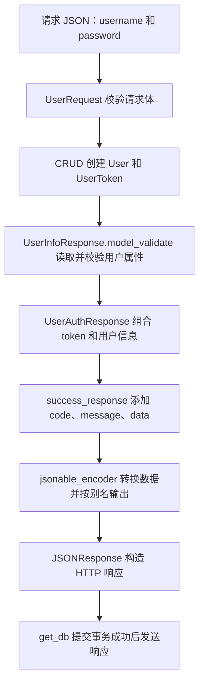

# 35 · FastAPI 项目：封装通用成功响应格式

这次封装把返回响应的工作分成两部分：**`success_response()` 统一外层的 `code/message/data`；Pydantic 模型定义并校验 `data` 里面应该有哪些字段。**注册路由把数据库对象转换成这些模型，再交给响应函数返回。

本篇依据当前项目代码整理，并使用项目环境中的 FastAPI `0.141.1`、Pydantic `2.13.5` 验证关键行为。前置笔记：[34 · 注册用户](../34-FastAPI项目-注册用户/34-FastAPI项目-注册用户.md)。第 34 篇保留封装前的写法，本篇解释封装后的变化。

先对齐两个名称：项目实际目录叫 **`schemes/`**，对应你提到的 `schemas/`；`utils/response.py` 中创建的是 **`success_response()` 函数**，它返回现成的 `JSONResponse` 类的实例，没有自定义一个新的响应类。

## 一、为什么要封装？

### 1.1 封装前，一个路由要自己拼完整响应

注册接口原来的返回代码如今保留在 [routers/users.py](../../toutiao_backend/routers/users.py) 的注释中：

```python
return {
    "code": 200,
    "message": "注册成功",
    "data": {
        "token": user_token.token,
        "userInfo": {
            "id": new_user.id,
            "username": new_user.username,
            "bio": new_user.bio,
            "avatar": new_user.avatar,
        },
    },
}
```

这段代码同时做了三件事：选取用户字段、组织注册业务数据、添加统一响应外壳。

当登录、获取用户信息等接口也需要返回这些内容时，每个路由都手写，会出现重复和不一致。例如某处写 `message`，另一处写 `msg`；某处返回 `userInfo`，另一处返回 `user_info`。字段调整也需要逐个寻找和修改。

这次封装主要解决以下问题：

| 需要解决的问题 | 对应做法 |
| --- | --- |
| 每个接口重复写 `code/message/data` | 抽成 `success_response()` |
| 用户信息字段分散在各个路由中 | 用 `UserInfoResponse` 集中声明 |
| 返回数据缺字段、类型或长度不合要求时难以及时发现 | 创建 Pydantic 模型时校验 |
| 数据库字段与对外字段不完全相同 | 从 ORM 对象中提取响应模型声明的字段 |
| Python 对象不能全部直接放进 JSON | 用 `jsonable_encoder()` 转成 JSON 兼容的数据 |

统一响应格式是本项目的接口约定，FastAPI 并不强制要求外层必须有这三个字段。封装是否有价值，取决于这些规则是否会被多个接口复用。

### 1.2 当前封装后的目标结构

下面使用演示 ID 和令牌，展示当前注册代码生成的响应体。字段顺序不影响 JSON 对象的含义。

```json
{
  "code": 0,
  "message": "注册成功",
  "data": {
    "token": "demo-token",
    "userInfo": {
      "id": 1,
      "username": "learn_demo",
      "nickname": null,
      "bio": "这个人很懒，什么都没留下",
      "avatar": null,
      "gender": "unknown"
    }
  }
}
```

这里按实际代码写 `code: 0`。**当前前端仍然要求 `code === 200`，双方存在不一致**，详见第七节；不能把这个例子理解为前后端已经全部对齐。

## 二、先分清各个文件和模型的职责

| 位置或对象 | 负责什么 | 本次涉及的数据 |
| --- | --- | --- |
| [models/users.py](../../toutiao_backend/models/users.py) 的 `User` | SQLAlchemy ORM 模型，对应数据库表 | 含密码哈希、手机号、时间等数据库字段 |
| [schemes/users.py](../../toutiao_backend/schemes/users.py) 的 `UserRequest` | 定义注册请求体 | `username`、`password` |
| 同文件的 `UserInfoBase` | 提供可复用的个人资料字段 | `nickname`、`bio`、`avatar`、`gender` |
| 同文件的 `UserInfoResponse` | 定义对外返回的用户信息 | 继承个人资料，再加 `id`、`username` |
| 同文件的 `UserAuthResponse` | 定义注册成功时 `data` 的结构 | `token`、用户信息 |
| [utils/response.py](../../toutiao_backend/utils/response.py) | 添加统一外壳并构造 HTTP JSON 响应 | `code`、`message`、`data` |
| [routers/users.py](../../toutiao_backend/routers/users.py) | 组织注册流程并调用以上组件 | 创建用户 → 创建令牌 → 组织响应 |

`UserRequest`、`UserInfoResponse`、`UserAuthResponse` 都继承自 Pydantic 的 `BaseModel`。它们描述数据结构，不创建数据库表。

尤其要注意：**`UserAuthResponse` 对应整个响应中的 `data`，不是包括 `code/message/data` 的完整响应体。**类名里有 `Response`，也不代表它本身就是 HTTP 响应对象。

## 三、第一步：提取通用的成功响应函数

当前 `utils/response.py` 的核心代码如下，仅整理排版：

```python
from typing import Any

from fastapi.encoders import jsonable_encoder
from fastapi.responses import JSONResponse


def success_response(data: Any = None, message: str = "success"):
    content = {
        "code": 0,
        "message": message,
        "data": jsonable_encoder(data),
    }
    return JSONResponse(content=jsonable_encoder(content))
```

### 3.1 函数参数分别表示什么？

| 写法 | 含义 |
| --- | --- |
| `data: Any` | 接收不同业务的数据，例如模型、字典、列表；此处没有限定业务结构 |
| `= None` | 不传业务数据时，默认返回 JSON 的 `null` |
| `message: str = "success"` | 默认提示文字为 `success`，调用时可以覆盖 |
| `"code": 0` | 当前函数固定使用的业务成功码 |

`Any` 是类型注解，不是“任意对象都一定能成功转 JSON”的保证。这个普通 Python 函数也不会仅凭参数类型注解自动执行 Pydantic 校验。

例如：

```python
success_response()
# 响应体：{"code": 0, "message": "success", "data": null}

success_response(data={"id": 1}, message="查询成功")
# 响应体：{"code": 0, "message": "查询成功", "data": {"id": 1}}
```

### 3.2 为什么使用 jsonable_encoder？

本次传入的 `data` 是一个 `UserAuthResponse` 对象。Python 对象需要先整理成 JSON 能表达的数据类型，再交给 `JSONResponse`。

```text
Pydantic 模型、datetime 等 Python 数据
    ↓ jsonable_encoder()
JSON 兼容的 Python 数据：字典、列表、字符串、数字、布尔值、None
    ↓ JSONResponse()
包含 JSON 响应体、状态码、响应头的 HTTP 响应对象
```

例如，模型可以转成字典，日期时间可以转成字符串。`jsonable_encoder()` 的结果通常仍然是 Python 字典或列表，**不是已经生成的 JSON 字符串**。这是直接创建 `JSONResponse` 时需要自己完成的准备工作。参见 [FastAPI：直接返回响应](https://fastapi.tiangolo.com/advanced/response-directly/)。

当前函数先编码 `data`，又编码整个 `content`。外层编码本来就会递归处理里面的 `data`，所以对于本次数据，内层调用是重复的；它不等于把响应编码成了两层 JSON 字符串。

以后可以简化为以下形式，**这只是等效整理示例，本篇未修改业务文件**：

```python
def success_response(data: Any = None, message: str = "success"):
    content = {"code": 0, "message": message, "data": data}
    return JSONResponse(content=jsonable_encoder(content))
```

### 3.3 HTTP 状态码和 code 是两件事

当前没有给 `JSONResponse` 传 `status_code`，因此默认 HTTP 状态码为 `200`，响应的 `Content-Type` 为 `application/json`。

| 内容 | 当前值 | 由谁设置 |
| --- | --- | --- |
| HTTP 状态码 | `200` | `JSONResponse` 的默认参数 |
| JSON 响应体中的业务码 | `0` | `content["code"]` |

改字典中的 `code` 不会自动改变 HTTP 状态码。即使路由使用 `POST`，当前这段代码也不会自动变成 HTTP `201`。

## 四、第二步：定义 data 里面的具体结构

### 4.1 请求模型：UserRequest

当前请求模型已从原来的位置移到 `schemes/users.py`：

```python
class UserRequest(BaseModel):
    username: str
    password: str
```

它用在路由参数 `user_request: UserRequest` 上，描述客户端发来的注册数据。响应模型则描述服务端准备返回的数据。两者可以有不同字段，例如注册请求需要密码，用户信息响应不应包含密码。

### 4.2 复用个人资料字段：UserInfoBase

```python
from typing import Optional

from pydantic import BaseModel, ConfigDict, Field


class UserInfoBase(BaseModel):
    nickname: Optional[str] = Field(None, max_length=50, description="用户昵称")
    bio: Optional[str] = Field(None, max_length=500, description="用户简介")
    avatar: Optional[str] = Field(None, max_length=255, description="用户头像")
    gender: Optional[str] = Field(None, max_length=10, description="用户性别")
```

以 `nickname` 为例：

| 部分 | 作用 |
| --- | --- |
| `Optional[str]` | 值可以是字符串或 `None`，等价于 `str \| None` |
| `Field(None, ...)` | 默认值为 `None`，创建模型时可以不提供这个字段 |
| `max_length=50` | 提供字符串时，长度最多为 50 |
| `description="用户昵称"` | 描述字段用途，可进入模型生成的 JSON Schema |

**“允许值为 `None`”和“允许不传”是两件事。**在 Pydantic v2 中，单写 `nickname: Optional[str]` 而没有默认值，仍要求提供该字段，只是值可以为 `None`。这里因为同时写了默认值 `None`，才允许省略。参见 [Pydantic：字段与默认值](https://docs.pydantic.dev/latest/concepts/fields/)。

这些约束作用于 Pydantic 模型，不会修改数据库列。例如当前 `gender` 只约束为最多 10 个字符的字符串或 `None`，没有在响应 schema 中限定只能使用 `male/female/unknown`。

### 4.3 增加必须返回的字段：UserInfoResponse

```python
class UserInfoResponse(UserInfoBase):
    id: int
    username: str

    model_config = ConfigDict(from_attributes=True)
```

这里的继承使 `UserInfoResponse` 拥有六个字段：

```text
从 UserInfoBase 继承：nickname、bio、avatar、gender
自己增加：          id、username
```

`id` 和 `username` 没有默认值，构造模型时必须能够取得。Pydantic 会检查字段要求，但默认允许部分类型转换，例如当前环境中 `id="3"` 能转换成整数 `3`；不能将其理解成完全禁止类型转换的严格检查。

当前 ORM `User` 还有 `password`、`phone`、时间等属性。这个响应模型没有声明它们，因此按本次转换和导出流程，返回的用户信息中不会包含它们。响应字段清单也使接口不必跟随数据库的每次加字段而改变。

### 4.4 组合令牌和用户信息：UserAuthResponse

```python
class UserAuthResponse(BaseModel):
    token: str
    user_Info: UserInfoResponse = Field(alias="userInfo", description="用户信息")

    model_config = ConfigDict(
        populate_by_name=True,
        from_attributes=True,
    )
```

这段声明表示：`token` 是必填字符串，`user_Info` 是必填的嵌套用户信息模型。

`Field(alias="userInfo")` 还为 `user_Info` 设置了别名：

| 场景 | 名称 |
| --- | --- |
| Python 中访问属性 | `auth_data.user_Info` |
| 使用别名输入数据 | `userInfo=...` 或字典键 `"userInfo"` |
| 按别名导出后的 JSON 字段 | `"userInfo"` |

`alias` 指“别名”，没有字段索引的含义。当前项目使用的 Python 字段名确实是 `user_Info`；更常见的命名风格是 `user_info`，理解本次代码时先保持现有名称。

## 五、第三步：理解 ConfigDict 怎样控制模型

### 5.1 ConfigDict 和 model_config 各是什么？

```python
model_config = ConfigDict(
    populate_by_name=True,
    from_attributes=True,
)
```

`ConfigDict` 是 Pydantic 提供的配置字典类型，源码中基于 `TypedDict` 定义，用来描述可用配置项及其类型。实际调用 `ConfigDict(...)` 得到的是普通字典：本地验证 `type(ConfigDict(from_attributes=True))` 的结果为 `dict`。

`model_config` 是 Pydantic 识别的模型配置属性名。把配置放在这里，Pydantic 才会用它决定这个模型如何处理数据。可以写普通字典，使用 `ConfigDict` 则能获得更明确的类型提示：

```python
# 对本例而言，这两种配置写法表达相同的设置。
model_config = ConfigDict(from_attributes=True)
model_config = {"from_attributes": True}
```

这两行是替代写法，实际使用时选一种。`model_config` 不属于响应数据字段，也不会因为写在类里就出现在 JSON 中。参见 [Pydantic：模型配置](https://docs.pydantic.dev/latest/concepts/config/)。

可以把几类声明放在一起理解：

| 写法 | 回答的问题 |
| --- | --- |
| `id: int` | 这个字段期望什么类型？ |
| `Field(max_length=50)` | 这个字段有什么约束？ |
| `Field(alias="userInfo")` | 这个字段的别名是什么？ |
| `model_config = ConfigDict(...)` | 整个模型按照什么规则接收和处理数据？ |

### 5.2 from_attributes=True：允许从对象属性取值

注册 CRUD 返回的 `new_user` 是 SQLAlchemy 的 `User` 对象，通常这样读取数据：

```python
new_user.id
new_user.username
new_user.bio
```

而字典是用 `data["id"]`、`data["username"]` 取值。`from_attributes=True` 让 Pydantic 在验证对象时，也能根据声明的字段读取对象属性。

因此这句代码才能完成本次转换：

```python
user_info = UserInfoResponse.model_validate(new_user)
```

可以将其处理过程理解为：

```text
读取 new_user.id、new_user.username，以及继承的个人资料属性
    → 检查字段类型、必填要求、长度等约束
    → 得到 UserInfoResponse 实例
```

`model_validate()` 是 `BaseModel` 提供的方法，所以 `UserInfoResponse` 能直接使用。返回值仍然是 Python 模型对象，尚未转换为 JSON，也不会把原来的 `new_user` 改造成另一个类型。

对本项目的 `User` 实例，如果移除 `UserInfoResponse` 的这项配置，再调用 `model_validate(new_user)`，本地验证会得到 `ValidationError`，错误类型为 `model_type`。显式使用 `model_validate(new_user, from_attributes=True)` 也能为单次调用开启该行为；写在类配置里便于复用。参见 [Pydantic：从对象属性创建模型](https://docs.pydantic.dev/latest/concepts/models/#arbitrary-class-instances)。

源码里“从数据库模型中获取值，而不是从请求体中获取值”的注释容易造成误解。更准确的理解是：

- 它允许读取普通对象的属性，ORM 对象只是其中一种。
- 开启后仍然可以接收字典，不会禁止请求体解析得到的字典。
- 它不负责执行数据库查询；不过读取 ORM 属性可能触发 ORM 自身的延迟加载，所以所需属性应提前加载好。当前创建用户后已经执行了 `refresh()`。
- 它不负责选择输入来自 HTTP 请求还是数据库，也不负责决定 JSON 的输出字段名。

### 5.3 populate_by_name=True：有别名时，也允许用原字段名输入

当前字段声明为：

```python
user_Info: UserInfoResponse = Field(alias="userInfo", description="用户信息")
```

在当前默认别名规则下，可以用 `userInfo` 给这个字段提供数据。加上 `populate_by_name=True` 后，Python 中的原字段名 `user_Info` 也可以用：

```python
user_info = UserInfoResponse(id=1, username="learn_demo")

# 使用别名。
auth_a = UserAuthResponse(token="demo-token", userInfo=user_info)

# 使用 Python 字段名；本项目路由用的就是这种方式。
auth_b = UserAuthResponse(token="demo-token", user_Info=user_info)

assert auth_a == auth_b
```

如果去掉这项配置，并且没有开启等效的 `validate_by_name` 配置，那么第二种写法在本例中会报错，提示必填的 `userInfo` 缺失。因为模型没有把传入的 `user_Info` 作为该别名字段的输入。

源码注释中的“允许通过字段名而不是字段索引来设置值”，应该理解成：**允许通过原字段名或别名提供值。这里不涉及索引。**

这项配置控制的是输入时怎样匹配名称，不能仅凭它推断输出一定使用哪个名称。

### 5.4 输出为什么是 userInfo？

当前项目环境中的实际结果如下：

```python
auth = UserAuthResponse(token="demo-token", user_Info=user_info)

auth.model_dump()
# 键为：token、user_Info

auth.model_dump(by_alias=True)
# 键为：token、userInfo

jsonable_encoder(auth)
# 键为：token、userInfo
```

`model_dump()` 将模型导出为字典。本模型未配置默认按别名序列化，所以不传参数时使用 `user_Info`；显式传 `by_alias=True` 才使用 `userInfo`。

FastAPI 的 `jsonable_encoder()` 默认参数是 `by_alias=True`，因此本次响应函数最终输出 `userInfo`。参见 [FastAPI：jsonable_encoder 参数](https://fastapi.tiangolo.com/reference/encoders/) 和 [Pydantic：别名的验证与序列化](https://docs.pydantic.dev/latest/concepts/alias/)。

对应关系是：

```text
Field(alias="userInfo")     声明这个字段的别名
populate_by_name=True       输入时也接受 user_Info
by_alias=True              导出时使用 userInfo
```

如果先执行 `auth.model_dump()` 得到了含 `user_Info` 的普通字典，再把该字典传给响应函数，编码器不会凭空知道要把这个键改成 `userInfo`。别名信息保存在模型里，因此需要在导出模型时就选好名称。

### 5.5 为什么两个响应模型都写了 from_attributes？

这两个设置分别作用于两个模型：

| 配置所在模型 | 控制的事情 | 在当前路由调用中的作用 |
| --- | --- | --- |
| `UserInfoResponse` | 能否从用户对象属性构造用户信息 | `model_validate(new_user)` 正在使用它 |
| `UserAuthResponse` | 能否从某个具有令牌和用户信息属性的对象构造整份认证数据 | 当前通过关键字参数构造，没有依赖这项设置 |

因此，当前这条调用链中，外层 `UserAuthResponse` 的 `from_attributes=True` 不是必需条件；不能误以为外层打开一次，内层就自动能读取 ORM。

`UserInfoResponse` 继承 `UserInfoBase`，这是继承关系。`UserAuthResponse` 的字段类型包含 `UserInfoResponse`，这是嵌套关系。**Pydantic 模型配置可以沿继承关系继承和合并，但不会因为模型嵌套就自动传给内部的 Pydantic 模型。**参见 [Pydantic：配置的传播范围](https://docs.pydantic.dev/latest/concepts/config/#configuration-propagation)。

### 5.6 新版配置写法补充

当前项目的 `populate_by_name=True` 可以工作。对于 Pydantic `2.11+`，官方更推荐用两个配置项分别控制原字段名和别名：

```python
model_config = ConfigDict(
    validate_by_name=True,
    validate_by_alias=True,
    from_attributes=True,
)
```

前两项一起开启，对应本例中“原字段名和别名都能输入”的行为。这是后续整理代码的可选写法，本篇仍按已有的 `populate_by_name` 解释。参见 [Pydantic：populate_by_name](https://docs.pydantic.dev/latest/api/config/#pydantic.config.ConfigDict.populate_by_name)。

## 六、第四步：在路由里把这些组件连接起来

### 6.1 把现在的一行代码拆成三步

当前注册接口最后一行是：

```python
return success_response(message="注册成功",data=UserAuthResponse(token=user_token.token,user_Info=UserInfoResponse.model_validate(new_user)))
```

下面是同一逻辑的展开形式，理解时从最里面往外看：

```python
# 第一步：ORM 用户对象 → 用户信息响应模型。
user_info = UserInfoResponse.model_validate(new_user)

# 第二步：令牌 + 用户信息 → 注册业务数据模型。
auth_data = UserAuthResponse(
    token=user_token.token,
    user_Info=user_info,
)

# 第三步：业务数据 → 统一外壳 → HTTP JSON 响应。
return success_response(
    data=auth_data,
    message="注册成功",
)
```

第一步读取用户属性并校验，第二步组织 `data` 的结构，第三步统一响应外壳并编码。

本项目的 `UserInfoResponse` 已开启从属性读取，因此把 `new_user` 直接作为 `user_Info` 的输入，也可以由嵌套模型完成转换。当前显式调用 `model_validate()`，让这个转换步骤更清楚。

### 6.2 完整的数据流



上图将响应函数中的编码过程合并展示。当前注册路由使用 `Depends(get_db, scope="function")`，因此依赖退出阶段的提交发生在成功响应发送之前；构造好一个 `JSONResponse` 对象，并不表示它已经发送给客户端。

### 6.3 前端最终读取什么？

当前 [xwzx-news/src/store/user.js](../../xwzx-news/src/store/user.js) 从 Axios 返回结果中读取：

```javascript
const token = response.data.data.token;
const userInfo = response.data.data.userInfo;
```

其中第一层 `response.data` 是 Axios 提供的响应体，第二层 `.data` 是后端统一格式中的业务数据字段：

```text
response                 Axios 响应对象
└── data                 后端完整 JSON 响应体
    ├── code
    ├── message
    └── data             UserAuthResponse 对应的内容
        ├── token
        └── userInfo     UserInfoResponse 对应的内容
```

## 七、当前实现中需要理解的边界和不一致

### 7.1 业务成功码还没有和前端统一

封装前注册接口返回 `code: 200`，现在函数固定返回 `code: 0`。前端注册逻辑仍然是：

```javascript
if (response.data && response.data.code === 200) {
  // 保存用户信息和令牌，进入登录状态。
} else {
  // 按注册失败处理。
}
```

所以，**即使数据库注册成功、HTTP 也是 200，当前前端仍会进入失败分支**，并可能携带“注册成功”这段文字返回失败结果。问题出在业务码约定，没有发生在 `ConfigDict` 或模型转换上。

结合现有前端和封装前的接口，后续最小修正是让公共函数继续返回 `code: 200`。如果决定使用 `0` 表示业务成功，就需要同步调整依赖这一约定的前端判断和接口说明。本篇记录现状与原因，未修改这些业务代码。

### 7.2 声明了响应模型，不等于 FastAPI 已自动使用它

当前注册装饰器为：

```python
@router.post("/register")
```

它没有声明 `response_model`。本次校验来自路由里主动执行的 `UserInfoResponse.model_validate(...)` 和 `UserAuthResponse(...)`。

路由最终返回的是已经构造好的 `JSONResponse`，FastAPI 会直接使用它，不再按响应模型对内容执行自动校验和过滤。即便以后添加 `response_model`，继续直接返回 `JSONResponse` 仍然会绕过该自动处理。当前 OpenAPI 也不会仅因路由内部创建了 `UserAuthResponse`，就自动推断出完整成功响应结构。参见 [FastAPI：直接返回 Response 的行为](https://fastapi.tiangolo.com/advanced/response-directly/)。

如果后续需要完整的响应文档和自动校验，可以定义包含 `code/message/data` 的外层模型，在路由声明 `response_model`，并返回符合结构的字典或模型。当前学习阶段先掌握已有的手动转换流程。

### 7.3 success_response 不负责验证所有业务数据

例如 `success_response(data={"随便一个字段": 123})` 也可以返回，因为该函数没有限定 `data` 必须是 `UserAuthResponse`。

本次实现把业务结构的检查放在调用函数之前。若服务端构造响应模型时缺少 `id`，或昵称超过 50 个字符，会抛出 Pydantic `ValidationError`；当前没有专门处理时，它属于服务端响应准备失败，不能当成 FastAPI 对客户端请求体校验失败时自动返回的 `422`。

同样，`jsonable_encoder()` 的职责是编码，不会自动知道密码哈希不能返回。当前没有泄露密码，是因为先转换成了不含 `password` 字段的响应模型。不要把函数注释中的“任何 ORM 对象都要正常响应”理解为任意 ORM 对象都能安全、完整地直接输出。

### 7.4 本次只统一了使用该函数的成功响应

用户名重复时，当前路由仍然抛出：

```python
raise HTTPException(status_code=400, detail="用户名已存在")
```

没有额外异常处理器改变它时，返回的是 `{"detail": "用户名已存在"}`，不会经过 `success_response()`。请求校验失败的响应也没有被这个函数统一。

只有调用该函数的成功路径才使用新格式，其他路由也不会自动全部改变。成功响应封装、错误响应统一、响应模型文档化，是可以分别完成的工作。

## 八、动手观察：不用连接数据库也能看懂转换

在项目根目录执行下面的命令。它只创建一个内存中的 ORM 对象，没有创建会话，也不写数据库。这里的用户 ID、密码哈希和令牌都是演示值。

```bash
.venv/bin/python -B - <<'PY'
import json
import sys

sys.path.insert(0, "toutiao_backend")

from models.users import User
from schemes.users import UserAuthResponse, UserInfoResponse
from utils.response import success_response

user = User(
    id=1,
    username="learn_demo",
    password="demo-hash",
    nickname=None,
    bio="这个人很懒，什么都没留下",
    avatar=None,
    gender="unknown",
)

user_info = UserInfoResponse.model_validate(user)
auth_data = UserAuthResponse(token="demo-token", user_Info=user_info)
response = success_response(data=auth_data, message="注册成功")

print("转换前：", type(user).__name__)
print("转换后：", type(user_info).__name__)
print("默认导出字段：", list(auth_data.model_dump()))
print("按别名导出字段：", list(auth_data.model_dump(by_alias=True)))
print("HTTP 状态码：", response.status_code)
print("Content-Type：", response.headers["content-type"])
print(json.dumps(json.loads(response.body), ensure_ascii=False, indent=2))
PY
```

关键输出应当是：

```text
转换前： User
转换后： UserInfoResponse
默认导出字段： ['token', 'user_Info']
按别名导出字段： ['token', 'userInfo']
HTTP 状态码： 200
Content-Type： application/json
```

最后的响应体包含 `code: 0`、`message: "注册成功"` 和 `data`，其中用户信息没有 `password`。未设置 `exclude_none=True`，所以值为 `None` 的个人资料字段会以 `null` 输出，不会自动消失。

本次还在当前环境中单独验证了这些对照情形：

| 对照操作 | 观察结果 |
| --- | --- |
| 查看 `type(ConfigDict(from_attributes=True))` | 得到 `dict` |
| 检查 `UserInfoResponse.model_fields` | 不包含 `model_config` |
| 在对照模型中移除 `from_attributes`，再验证 ORM 用户 | 报 `model_type` 校验错误 |
| 在对照模型中移除 `populate_by_name`，仍用 `user_Info=` 输入 | 报 `userInfo` 缺失 |
| 仅移除外层模型的 `from_attributes`，保留当前关键字构造方式 | 仍能正常构造 |
| 构造用户信息时缺少 `id` | 报必填字段缺失 |
| 将 `nickname` 设为 51 个字符 | 报字符串过长 |

这些对照使用独立的内存模型，没有改动项目 schema，也没有通过真实注册请求写入数据库。
