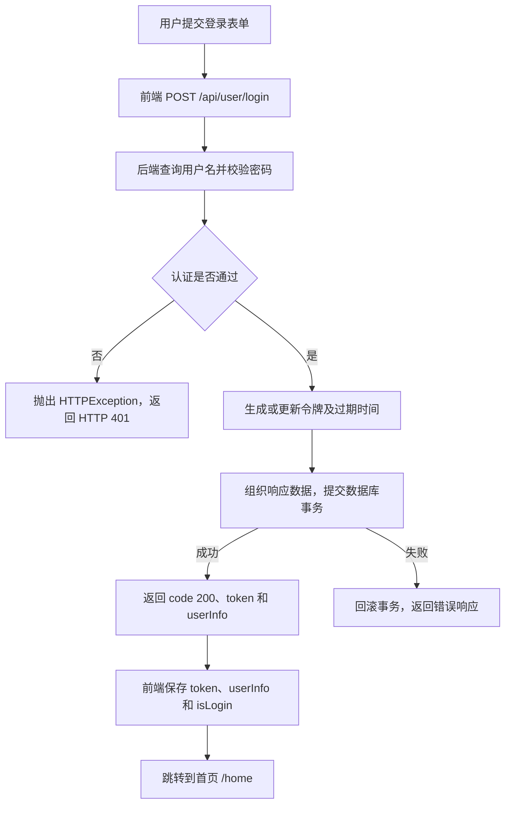

# 37 · FastAPI 项目：用户登录

用户登录的作用是：验证用户名和密码，为验证通过的用户生成或更新访问令牌，把令牌和用户信息返回给前端。前端保存登录状态后跳转到首页，后续请求再携带令牌访问需要认证的接口。

本篇在原有处理链和问题的基础上，结合当前项目代码补充前后端流程、密码校验、事务、响应模型，以及“显示登录成功却没有跳转”的排查记录。

相关笔记：[35 · 封装通用成功响应格式](../35-FastAPI项目-封装通用成功响应格式/35-FastAPI项目-封装通用成功响应格式.md)、[36 · 全局异常处理器](../36-FastAPI项目-全局异常处理器/36-FastAPI项目-全局异常处理器.md)。下一步：[38 · 获取用户信息](../38-FastAPI项目-获取用户信息/38-FastAPI项目-获取用户信息.md)。

## 一、用户登录的处理链

原笔记中的五个步骤仍然是主线：

1. 用户输入用户名和密码。
2. 系统检查用户名是否存在。
3. 系统检查密码是否正确。
4. 系统生成访问令牌。
5. 系统返回访问令牌给用户。

在当前项目里，第 4 步还包括保存令牌和过期时间，第 5 步还会返回用户信息。整个交互如下：



登录时使用用户名和密码证明身份；登录后的用户信息查询使用 token 证明身份，不需要每次重新发送密码。

## 二、各个文件分别负责什么？

| 文件 | 职责 |
| --- | --- |
| [Login.vue](../../xwzx-news/src/views/Login.vue) | 读取表单、展示提示、根据登录结果跳转 |
| [store/user.js](../../xwzx-news/src/store/user.js) | 发送请求，保存用户信息、令牌和登录状态 |
| [routers/users.py](../../toutiao_backend/routers/users.py) | 接收请求，组织认证、生成令牌和响应的流程 |
| [crud/users.py](../../toutiao_backend/crud/users.py) | 查询用户、认证用户、创建或更新令牌记录 |
| [utils/security.py](../../toutiao_backend/utils/security.py) | 生成密码哈希、校验密码 |
| [schemes/users.py](../../toutiao_backend/schemes/users.py) | 定义请求和响应中的数据结构 |
| [config/db_conf.py](../../toutiao_backend/config/db_conf.py) | 提供数据库会话，统一提交、回滚和关闭 |
| [utils/response.py](../../toutiao_backend/utils/response.py) | 构造 `code/message/data` 成功响应 |

项目目录实际叫 `schemes/`，下文沿用这个名称。

## 三、前端怎样发起登录请求？

`Login.vue` 的表单提交后调用 Pinia 用户 store 中的 `login()`。store 使用 Axios 发送：

```javascript
const response = await axios.post(`${apiConfig.baseURL}/api/user/login`, {
  username: userData.username,
  password: userData.password
});
```

本地接口为 `POST http://127.0.0.1:8000/api/user/login`，JSON 请求体示例：

```json
{
  "username": "learn_demo",
  "password": "Example-login-123!"
}
```

这里的账号密码只是示例，需要使用已经注册的账号。当前登录接口不要求先携带 token，因为它本身就是获取 token 的入口。

后端用 `UserRequest` 接收：

```python
class UserRequest(BaseModel):
    username: str
    password: str
```

请求模型负责检查输入结构；用户名是否存在、密码是否匹配，还需要后续业务代码判断。

## 四、后端怎样验证用户名和密码？

### 4.1 先根据用户名查询用户

`get_user_by_username()` 的核心代码：

```python
stmt = select(User).where(User.username == username)
result = await db.execute(stmt)
return result.scalars().first()
```

找到时返回 `User` ORM 对象，找不到时返回 `None`。查出的对象里包含数据库保存的密码哈希，用于后续校验。

### 4.2 authenticate_user() 组合两个判断

当前函数如下，仅整理排版：

```python
async def authenticate_user(db: AsyncSession, user_request: UserRequest) -> User:
    existing_user = await get_user_by_username(db, user_request.username)
    if not existing_user:
        return None

    is_valid = verify_password(user_request.password, existing_user.password)
    if not is_valid:
        return None

    return existing_user
```

| 情况 | 返回值 |
| --- | --- |
| 用户名不存在 | `None` |
| 用户名存在，但密码不匹配 | `None` |
| 用户名和密码匹配 | 当前用户的 `User` 对象 |

先判断用户是否存在，才能访问 `existing_user.password`，否则对 `None` 读取属性会产生程序异常。

当前源代码的返回注解为 `-> User`，但实现中也会返回 `None`。类型描述更准确的写法应为 `-> User | None` 或 `-> Optional[User]`；这里记录现状，不把类型注解当成运行时自动校验。

### 4.3 verify_password() 怎样检查密码？

当前 `utils/security.py` 使用 bcrypt：

```python
def verify_password(plain_password: str, hashed_password: str) -> bool:
    pwd = plain_password.encode("utf-8")
    return bcrypt.checkpw(pwd, hashed_password.encode("utf-8"))
```

`plain_password` 来自本次请求，`hashed_password` 来自数据库；`encode("utf-8")` 把字符串转成 bcrypt 接口需要的字节数据。`checkpw()` 校验明文密码是否与已有哈希匹配，返回布尔值。[bcrypt 官方用法](https://github.com/pyca/bcrypt#usage)

数据库保存的是密码哈希，不是在登录时解密出原密码。也不能重新调用使用随机盐的 `hash_password()`，再简单比较两次哈希字符串是否相等。

这里的 `verify_password()` 是同步函数，直接调用即可；包含异步数据库查询的 `authenticate_user()` 则使用 `await`。

## 五、认证成功后，怎样生成并保存 token？

登录路由执行：

```python
user_token = await users.create_user_token(db, existing_user.id)
```

`create_user_token()` 与注册流程共用，主要完成以下操作：

1. `str(uuid.uuid4())` 生成新的令牌字符串。
2. `datetime.now() + timedelta(days=7)` 计算过期时间。
3. 根据 `user_id` 查询已有 `UserToken` 记录。
4. 有记录时更新 token 和过期时间，没有记录时新增。
5. `db.add()` 将对象交给会话，`flush()` 执行写入，`refresh()` 读取数据库中的值。
6. 返回 `UserToken` 对象，等待外层 `get_db()` 提交事务。

关键字段保存在 [models/users.py](../../toutiao_backend/models/users.py) 的 `UserToken` 模型中：

| 字段 | 含义 |
| --- | --- |
| `user_id` | 令牌属于哪个用户 |
| `token` | 前端后续请求携带的令牌字符串 |
| `expires_at` | 后端判断令牌是否过期的依据 |

当前 token 是保存在数据库里的 UUID 字符串，不是 JWT。用户身份和过期时间通过查数据库获得，不能从这个字符串中直接解码出来。

按当前更新已有记录的逻辑，再次登录会换发 token。原来保存的旧 token 被覆盖后，旧 token 再发起用户信息请求就会被判定无效。

### 5.1 为什么 flush() 之后还需要 commit()？

`flush()` 把当前待处理的变更发送到数据库，但不代表事务已经提交。当前项目把提交统一放在 `get_db()` 的 `yield` 之后：

```python
try:
    yield session
    await session.commit()
except Exception:
    await session.rollback()
    raise
```

登录路由声明 `Depends(get_db, scope="function")`，使这个退出过程在响应发送前完成。这样，只有事务提交成功，客户端才会收到成功响应；提交失败则回滚，并向外传播异常。[FastAPI：带 yield 的依赖与 scope](https://fastapi.tiangolo.com/tutorial/dependencies/dependencies-with-yield/#early-exit-and-scope)

## 六、登录路由怎样组织响应？

当前路由核心代码如下，省略原有长注释：

```python
@router.post("/login")
async def login(
    user_request: UserRequest,
    db: AsyncSession = Depends(get_db, scope="function"),
):
    existing_user = await users.authenticate_user(db, user_request)
    if not existing_user:
        raise HTTPException(
            status_code=status.HTTP_401_UNAUTHORIZED,
            detail="用户名或密码错误",
        )

    user_token = await users.create_user_token(db, existing_user.id)
    return success_response(
        message="登录成功",
        data=UserAuthResponse(
            token=user_token.token,
            user_Info=UserInfoResponse.model_validate(existing_user),
        ),
    )
```

`router` 已设置 `prefix="/api/user"`，因此完整路径为 `/api/user/login`。

响应数据经过两层模型组织：

```text
User ORM 对象
    ↓ UserInfoResponse.model_validate(existing_user)
只包含对外用户信息的 Pydantic 对象
    ↓ UserAuthResponse(token=..., user_Info=...)
包含 token 和用户信息的登录数据
    ↓ success_response() / jsonable_encoder()
HTTP JSON 响应
```

`UserInfoResponse` 配置了 `from_attributes=True`，因此可以从 ORM 对象属性读取模型声明的字段。它没有声明 `password`，所以不会把密码哈希放进用户信息响应。`model_validate()` 也可以接收字典；不能把 `from_attributes=True` 理解为使用该方法的普遍前提，它针对的是从对象属性取值这一方式。[Pydantic：从对象属性创建模型](https://pydantic.dev/docs/validation/latest/concepts/models/#arbitrary-class-instances)

`UserAuthResponse` 中的 Python 字段名是 `user_Info`，别名是 `userInfo`；`populate_by_name=True` 允许构造时使用字段名。当前 `jsonable_encoder()` 按别名输出，所以前端读取的是 `data.userInfo`。

成功响应示例，ID 和 token 均为演示值：

```json
{
  "code": 200,
  "message": "登录成功",
  "data": {
    "token": "demo-token",
    "userInfo": {
      "nickname": null,
      "bio": "这个人很懒，什么都没留下",
      "avatar": null,
      "gender": "unknown",
      "id": 1,
      "username": "learn_demo"
    }
  }
}
```

## 七、为什么已有全局异常处理器，还需要自己 raise 异常？

**业务代码负责判断失败条件，全局异常处理器负责把已经抛出的异常转换成统一响应。**

例如，用户名不存在时，查询返回 `None` 本身是正常结果，不会自动抛异常；密码校验返回 `False` 也不会自动触发全局异常处理器。

因此登录路由需要明确判断：

```python
if not existing_user:
    raise HTTPException(status_code=401, detail="用户名或密码错误")
```

这句话表达了本接口的业务规则：认证不通过，就终止登录并返回未认证错误，不再继续生成令牌。

后续处理链为：

```text
authenticate_user() 返回 None
    ↓
登录路由主动 raise HTTPException
    ↓
get_db() 回滚事务，再次抛出异常
    ↓
框架选中 http_exception_handler
    ↓
转换成统一 JSON，并返回 HTTP 401
```

当前 [HTTP 异常处理器](../../toutiao_backend/utils/exception.py) 会返回：

```json
{
  "code": 401,
  "message": "用户名或密码错误",
  "data": null
}
```

全局处理器不知道 `None` 在每个业务中意味着什么。相同的 `None`，在列表筛选中可能是正常的“没有结果”，在登录中则需要转成认证失败，判断必须由理解业务语义的代码完成。

## 八、前端收到响应后，怎样保存状态和跳转？

`store/user.js` 判断 JSON 响应体中的成功码：

```javascript
if (response.data && response.data.code === 200) {
  this.userInfo = response.data.data.userInfo;
  this.token = response.data.data.token;
  this.isLogin = true;

  return {
    success: true,
    message: '登录成功'
  };
}
```

这里 Axios 的 `response.data` 是整个 JSON 响应体，第二个 `.data` 才是项目自定义的业务数据字段。`success: true` 是 store 返回给页面的结果，不是后端 JSON 中原本存在的字段。

`Login.vue` 收到结果后：

```javascript
if (result.success) {
  showToast({ type: 'success', message: result.message });
  router.push('/');
}
```

[前端路由配置](../../xwzx-news/src/router/index.js) 将 `/` 重定向到 `/home`，因此最终显示首页。页面跳转由前端执行，后端登录接口返回的是 JSON，没有发送 HTTP 重定向。

前端保存 `isLogin` 是为了控制界面；后端仍需要在每个受保护的请求中验证 token，不能把前端的布尔值作为身份依据。

## 九、排错记录：为什么显示“登录成功”，却没有跳转？

当时前后端成功码不一致：后端 `success_response()` 返回 `code: 0`，前端只认可 `code === 200`。

实际过程是：

```text
后端返回 HTTP 200，JSON 为 code 0、message “登录成功”
    ↓
前端判断 0 === 200，结果为 false
    ↓
进入失败分支，返回 success: false
但 message 仍沿用后端的“登录成功”
    ↓
页面显示这段文字，但没有执行 router.push('/')
```

因此，看见提示文字不等于前端已经进入成功分支。要同时检查 HTTP 状态码、JSON 的 `code` 和 store 返回的 `success`。

当前 [success_response()](../../toutiao_backend/utils/response.py) 已修复为：

```python
content = {
    "code": 200,
    "message": message,
    "data": jsonable_encoder(data),
}
```

| 内容 | 当前成功值 | 作用 |
| --- | --- | --- |
| HTTP 状态码 | `200` | HTTP 层面的请求结果 |
| JSON 的 `code` | `200` | 本项目约定的业务成功码 |
| store 返回的 `success` | `true` | 供页面决定是否跳转 |

HTTP 状态码和 JSON 的 `code` 是独立设置的值。业务成功码使用 `0` 也可以，但必须同步调整所有消费它的前端判断；本项目目前统一采用 `200`。

第 35 篇记录的 `code: 0` 是当时的实现及问题，本篇记录的是修复后的登录行为。

## 十、如何验证这条流程？

| 场景 | 应观察到的结果 |
| --- | --- |
| 已注册用户输入正确密码 | HTTP 200、`code: 200`，返回 token 和 userInfo |
| 密码错误或用户名不存在 | HTTP 401，提示“用户名或密码错误” |
| 正常再次登录 | 获得新 token，数据库记录同步更新 |
| 前端处理成功响应 | 保存用户状态，并跳转 `/home` |
| 使用新 token 查询用户信息 | 返回该用户的信息，详见下一篇 |

此前已用独立测试数据库验证正常和错误凭据的登录结果。现有 [test_user_info.py](../../tests/test_user_info.py) 还覆盖“注册 → 登录 → 携带登录 token 查询用户信息”的接口流程；它验证后端响应，不代替浏览器中的跳转检查。
