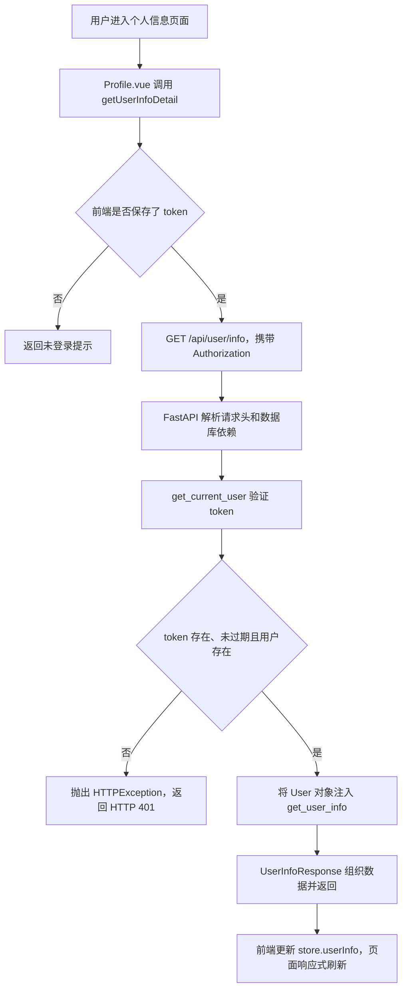

# 38 · FastAPI 项目：获取用户信息

原笔记提出了两个重点：获取当前用户的逻辑经常复用，适合提取成工具函数；后端需要知道如何从前端请求中取得 token。本篇沿着实际请求，补充请求头、认证依赖、数据库查询、响应结构及本次排错过程。

前置笔记：[37 · 用户登录](../37-FastAPI项目-用户登陆/37-FastAPI项目-用户登陆.md)。登录接口先返回 token，本篇接口再验证这个 token，并返回它所属用户的信息。

**当前前端实际发送的是 `Authorization: token`，没有 `Bearer` 前缀。**后端额外兼容 `Bearer token` 写法，两者需要区分，不能把注释中的示例当作正在执行的代码。

## 一、这个接口查询的是谁？

接口为：

```http
GET /api/user/info HTTP/1.1
Authorization: demo-token
```

这里的 `demo-token` 只是演示值，实际请求必须携带登录或注册获得的有效 token。

后端根据 token 查找用户，不需要前端再提交用户名、密码或用户 ID。本接口查询的是“当前经过认证的用户”，不是让客户端任意指定 ID 查询其他用户。

| 项目 | 用户登录 | 获取当前用户信息 |
| --- | --- | --- |
| 方法和路径 | `POST /api/user/login` | `GET /api/user/info` |
| 主要输入 | JSON 中的用户名和密码 | `Authorization` 请求头中的 token |
| 认证方式 | 校验密码 | 查找 token 并验证过期时间 |
| 成功响应的 `data` | `{token, userInfo}` | 用户信息对象本身 |
| 是否生成新 token | 是 | 否 |

## 二、从前端点击到显示用户信息，经过哪些步骤？



上图从前端持有 token 的正常请求展开。若请求完全没有 `Authorization` 头，当前必填头参数校验会先返回 HTTP 422，尚不会进入 token 查询逻辑。

`Profile.vue` 还会先检查前端 `isLogin` 状态，未登录时跳转登录页；这是界面控制。后端的 token 校验仍然必须执行，因为前端状态不等于服务器认证结果。

## 三、如何从前端获取 token？

### 3.1 token 来自前一次登录响应

登录成功后，[store/user.js](../../xwzx-news/src/store/user.js) 已保存：

```javascript
this.token = response.data.data.token;
this.userInfo = response.data.data.userInfo;
this.isLogin = true;
```

发送用户信息请求时，`getUserInfoDetail()` 读取这个 store 中的 `this.token`。如果为空，它直接返回 `{ success: false, message: '未登录' }`，不会继续发请求。

后端不能直接读取浏览器的 Pinia 或 localStorage，只有前端通过 HTTP 请求发送过来的数据，才会出现在后端请求中。

### 3.2 当前前端怎样携带 token？

当前实际代码是：

```javascript
const response = await axios.get(`${apiConfig.baseURL}/api/user/info`, {
  headers: {
    // Authorization: `Bearer ${this.token}`
    Authorization: this.token
  }
});
```

假设 `this.token` 是 `abc123`，实际发送的头就是：

```http
Authorization: abc123
```

第一行带 `Bearer` 的代码被 `//` 注释，不会执行。当前流程中，浏览器、Axios 和 FastAPI 都不会自动为它补上 `Bearer`。

## 四、Header 是所有前端通用的，还是本项目自己定义的？

### 4.1 区分读取工具、请求头名称和传值约定

| 内容 | 含义 |
| --- | --- |
| `Header(...)` | FastAPI 提供的通用请求头读取和校验方式 |
| `Authorization` | HTTP 中用于携带认证凭据的标准请求头名称 |
| 本项目直接把 token 放进去 | 当前前后端共同遵守的传值约定 |
| `Authorization: Bearer token` | 另一种标准化的令牌认证格式 |

Vue、React、手机 App 或 Postman，只要发送了约定的请求头，后端就可以采用相同方式读取。并不是所有前端都会自动发 token，也不是后端写了 `Header` 就会通知前端自动添加请求头。

`Header` 可以读取其他请求头，并非专门服务于 token。如果项目采用 Cookie 传递认证信息，就应从 Cookie 读取；它不会自动从所有位置寻找 token。[FastAPI：Header 参数](https://fastapi.tiangolo.com/tutorial/header-params/)

### 4.2 Header(..., alias="Authorization") 每一部分是什么意思？

```python
authorization: str = Header(..., alias="Authorization")
```

| 部分 | 作用 |
| --- | --- |
| `authorization` | 接收读取结果的 Python 参数名 |
| `str` | 声明参数是字符串 |
| `Header` | 指定从 HTTP 请求头读取 |
| `...` | 声明该请求头必填 |
| `alias="Authorization"` | 明确对应的请求头名称 |

对 `Authorization: abc123`，参数值是完整的字符串 `"abc123"`；对 `Authorization: Bearer abc123`，参数值则是完整的 `"Bearer abc123"`。`Header` 不负责去掉认证前缀，也不负责检查这个 token 是否能在数据库中找到。

HTTP 请求头名称不区分大小写，所以 `Authorization` 与 `authorization` 指向同一个头；这不表示 token 的值也可以随意改变大小写。

## 五、Bearer 从哪来？为什么当前没有它也能工作？

`Bearer` 是认证方式的固定名称，不是 token 字符串的一部分。它只有在请求发送方按这种格式构造请求头时才会出现，例如主动把前端写成：

```javascript
headers: {
  Authorization: `Bearer ${this.token}`
}
```

这段是另一种写法的示意，不是当前已启用的配置。标准 Bearer 认证格式是在 `Authorization` 的值中使用 `Bearer`、一个空格和令牌。[Bearer 认证规范](https://www.rfc-editor.org/rfc/rfc6750.html#section-2.1)

后端目前执行：

```python
token = authorization.replace("Bearer ", "")
```

对以下两种输入，它的效果分别是：

```python
"abc123".replace("Bearer ", "")         # "abc123"，没有匹配内容，保持原样
"Bearer abc123".replace("Bearer ", "")  # "abc123"，移除匹配内容
```

所以当前实际链路是：

```text
前端发送 abc123
    ↓
Header 读取到 abc123
    ↓
replace 没有找到 “Bearer ”，字符串保持原样
    ↓
用 abc123 查询数据库
```

源码里还保留了被注释的 `authorization.split(" ")[1]`。它假设输入至少能按空格拆成两段；对当前直接传来的 `abc123`，拆分结果只有一项，取 `[1]` 会越界，不能直接启用。

`replace()` 是当前项目的一种字符串兼容处理，并不等同于完整的认证协议解析；前后端仍应明确约定所接受的格式。本次修复保留了前端直接传 token 的方式。

## 六、为什么把 get_current_user() 提取为依赖？

原笔记中“获取用户信息过于常用，所以放到工具函数中”的想法，对应的是复用以下认证步骤：读取请求头、查询 token、检查过期时间、取得当前用户，失败时终止请求。

当前 [utils/auth.py](../../toutiao_backend/utils/auth.py) 的核心实现如下，省略已注释的替代写法：

```python
async def get_current_user(
    db: AsyncSession = Depends(get_db, scope="function"),
    authorization: str = Header(..., alias="Authorization"),
) -> User:
    token = authorization.replace("Bearer ", "")
    user = await users.get_user_by_token(db, token)
    if not user:
        raise HTTPException(
            status_code=status.HTTP_401_UNAUTHORIZED,
            detail="token无效",
        )
    return user
```

这个函数成功时返回 `User`，失败时抛异常。后续需要登录身份的接口可以复用 `Depends(get_current_user)`，不用各自复制认证代码。

### 6.1 为什么 db 必须声明 Depends(get_db)？

仅写：

```python
db: AsyncSession
```

只是在声明类型，不会自动创建数据库会话。FastAPI 需要看到 `Depends(get_db)`，才知道应调用数据库依赖并把它提供的会话传入。

在路由函数中定义一个同名 `db` 参数，也不会自动把它传给另一个函数。每个依赖函数都必须声明自己需要的参数来源。

当前依赖关系可以这样读：

```text
get_user_info
└── Depends(get_current_user)：需要一个已认证的 User
    ├── Depends(get_db)：需要数据库会话
    └── Header(...)：需要 Authorization 请求头
```

框架先解析这些依赖。只有 `get_current_user` 成功返回用户，才会执行路由函数体。数据库依赖中的 `scope="function"` 控制会话退出代码在响应发送前执行，事务处理方式沿用上一章。

### 6.2 需要放到中间件里吗？

当前功能使用依赖即可。用户信息接口需要认证，但登录和注册接口不要求先有 token；通过每个路由的 `Depends`，可以明确选择哪些接口需要当前用户，并直接取得 `User` 对象。

中间件适合统一处理请求链路中的公共工作，例如当前项目已有的 CORS。身份认证也可以设计在中间件中，但那会涉及公开路径放行、用户对象保存位置等额外约定，并不是实现本接口的必要步骤。

## 七、后端怎样根据 token 查询用户？

[crud/users.py](../../toutiao_backend/crud/users.py) 中的实现：

```python
async def get_user_by_token(db: AsyncSession, token: str) -> Optional[User]:
    stmt = select(UserToken).where(UserToken.token == token)
    result = await db.execute(stmt)
    db_token = result.scalar_one_or_none()

    if not db_token or db_token.expires_at < datetime.now():
        return None

    stmt = select(User).where(User.id == db_token.user_id)
    result = await db.execute(stmt)
    return result.scalar_one_or_none()
```

具体有两次查询：

1. 在 `user_token` 表中，根据 token 查令牌记录。
2. 令牌存在且未过期时，根据记录的 `user_id` 在 `user` 表中查用户。

`scalar_one_or_none()` 在这里返回查询到的 ORM 对象；没有匹配记录时返回 `None`。`if` 中的 `or` 会短路求值，令牌不存在时不会继续访问 `db_token.expires_at`。

| 情况 | CRUD 函数的返回值 | 认证依赖的处理 |
| --- | --- | --- |
| 找不到 token | `None` | 抛出 HTTP 401 |
| token 已过期 | `None` | 抛出 HTTP 401 |
| token 有效，但用户不存在 | `None` | 抛出 HTTP 401 |
| token 有效且用户存在 | `User` 对象 | 返回用户，继续执行路由 |

token 有效期在生成或更新时设为 7 天，查询时再比较数据库中的 `expires_at`。当前查询接口不会自动续期；重新登录会生成新 token 并更新过期时间。

## 八、路由怎样返回用户信息？

当前 [routers/users.py](../../toutiao_backend/routers/users.py) 的实现：

```python
@router.get("/info")
async def get_user_info(user: User = Depends(get_current_user)):
    user_info = UserInfoResponse.model_validate(user)
    return success_response(message="获取用户信息成功", data=user_info)
```

`@router.get("/info")` 加上 router 的 `/api/user` 前缀，组成 `GET /api/user/info`。函数体不再直接操作数据库，所以不需要重复声明一个未使用的 `db` 参数。

`UserInfoResponse.model_validate(user)` 根据模型字段提取并校验 ORM 属性；模型启用了 `from_attributes=True`。再由 `success_response()` 编码并返回统一 JSON。

成功响应示例：

```json
{
  "code": 200,
  "message": "获取用户信息成功",
  "data": {
    "nickname": null,
    "bio": "这个人很懒，什么都没留下",
    "avatar": null,
    "gender": "unknown",
    "id": 1,
    "username": "learn_demo"
  }
}
```

这里不需要 `UserAuthResponse`，因为本接口不生成或返回 token。它与登录响应有一个重要区别：**`data` 已经是用户信息对象，不再套一层 `userInfo`。**响应模型也不包含数据库密码字段。

## 九、前端如何把响应显示出来？

`getUserInfoDetail()` 在 `code === 200` 时执行：

```javascript
this.userInfo = response.data.data;

return {
  success: true,
  message: '获取用户信息成功',
  data: response.data.data
};
```

`Profile.vue` 调用它，并通过计算属性读取 store：

```javascript
const userInfo = computed(() => userStore.userInfo);
const userBio = computed(() => userStore.userInfo?.bio || '暂无简介');
```

store 中的用户信息更新后，模板中的用户名和简介也随之更新。查询失败时，页面展示 store 返回的错误提示。

还要区分“接口返回的用户 ID”和“当前页面显示的账号文字”：现有 `Profile.vue` 的 `userId` 取的是 `token.substring(0, 5)`，并不是后端返回的 `userInfo.id`。如果要显示数据库用户 ID，应读取 `userInfo.id`；这个显示细节不是本次查询失败的原因。

## 十、排错记录：为什么点击用户信息后显示查询失败？

### 10.1 直接原因：函数没有注册为路由

原来只定义了 `async def get_user_info(...)`，上方缺少 `@router.get("/info")`。因此应用中只有注册和登录路由，没有用户信息路由。

本次排查实际复现的响应是：

```text
GET /api/user/info
HTTP 404
{"detail": "Not Found"}
```

前端 Axios 将这个非成功状态交给 `catch`。store 尝试读取 `error.response?.data?.message`，但默认 404 响应只有 `detail`，于是使用“获取用户信息请求失败，请稍后再试”的通用提示。

修复方式是在函数上补上路由装饰器。定义函数不等于已经对外提供 HTTP 接口。

### 10.2 第二个问题：认证函数没有声明数据库依赖

原来的 `get_current_user()` 只写了 `db: AsyncSession`。当补上路由后，FastAPI 会解析该路由的依赖，尝试把这个没有参数来源声明的类型作为请求字段处理，导致应用注册接口时报错：

```text
FastAPIError: Invalid args for response field!
```

虽然错误文字提到了 response field，本次真正的问题是依赖函数里的 `AsyncSession` 没有声明 `Depends`，不应通过关闭响应模型校验来绕过。

修复为：

```python
db: AsyncSession = Depends(get_db, scope="function")
```

两个问题需要一起修复：先让路径存在，再让该路径的认证依赖能够正确解析和执行。

## 十一、哪些错误会返回 401，哪些会返回 422？

| 请求情况 | 当前接口行为 |
| --- | --- |
| 有效 token，直接放在 Authorization 中 | HTTP 200，返回用户信息 |
| 有效 token，使用 `Bearer token` 格式 | HTTP 200，返回用户信息 |
| 没有 Authorization 请求头 | HTTP 422，缺少必填请求头 |
| 令牌不存在或已过期 | HTTP 401，提示“token无效” |
| 令牌对应的用户不存在 | HTTP 401，提示“token无效” |

无效令牌的 401 由业务依赖主动抛出，再由全局 HTTP 异常处理器转换成：

```json
{
  "code": 401,
  "message": "token无效",
  "data": null
}
```

缺少请求头则属于 FastAPI 参数校验失败，目前仍使用默认的 `detail` 响应格式。全局 `Exception` 兜底并不会替代已经存在的请求校验处理器，相关原理见第 36 篇。

## 十二、如何验证登录和查询已经连通？

已有 [tests/test_user_info.py](../../tests/test_user_info.py) 使用内存数据库，覆盖以下 4 项测试：

1. 注册并登录后，分别使用原始 token 和 `Bearer token` 查询，确认返回当前用户信息且不包含密码或 token 字段。
2. 缺少 `Authorization` 时返回 422。
3. 未知 token 返回 401。
4. 过期 token 返回 401。

此前修复时这 4 项测试已通过。在项目根目录可执行：

```bash
.venv/bin/python -B -m unittest discover -s tests -p 'test_user_info.py' -v
```

手动检查时，可以在浏览器开发者工具的 Network 中找到 `/api/user/info`，依次确认请求方法为 GET、请求头含有实际 token、HTTP 状态码符合预期，以及成功 JSON 的 `data` 直接包含用户信息。
