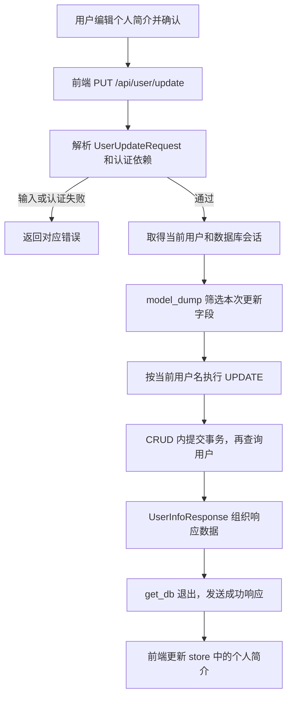

# 39 · FastAPI 项目：修改用户信息

本篇沿用原笔记中的四个核心操作：**通过 PUT 提交用户输入 → 验证 token → 更新当前用户信息 → 返回结果**。重点是理解：如何确定更新哪个用户、怎样只更新传入的字段，以及数据库执行、事务提交和响应返回之间的关系。

内容依据当前项目实现整理。代码中的实际行为与后续可改进之处分开说明，片段仅调整排版或省略注释。

前置笔记：[37 · 用户登录](../37-FastAPI项目-用户登陆/37-FastAPI项目-用户登陆.md)、[38 · 获取用户信息](../38-FastAPI项目-获取用户信息/38-FastAPI项目-获取用户信息.md)。

## 一、先看完整实现思路

1. **提交数据**：前端发送 `PUT /api/user/update`，请求体放要修改的字段，请求头放 token。
2. **验证身份和输入**：FastAPI 解析请求模型及依赖；`get_current_user()` 验证 token 并取得当前用户。
3. **执行更新**：根据当前用户的用户名限定记录，将明确提交且非 `None` 的字段写入数据库。
4. **响应结果**：查询更新后的用户，转换成 `UserInfoResponse`，返回统一成功响应，前端更新页面。

当前前端实现的是修改个人简介；后端请求模型还接受昵称、头像、手机号和性别。



图中的“CRUD 内提交事务”是当前实际写法，与前两章统一交给 `get_db()` 提交的方式有差别，详见第七节。

## 二、前端提交什么数据？

### 2.1 接口路径、请求体和请求头

当前接口为 `PUT /api/user/update`，修改简介的请求示例：

```http
PUT /api/user/update HTTP/1.1
Authorization: demo-token
Content-Type: application/json

{"bio": "正在学习 FastAPI"}
```

`demo-token` 是演示值，实际应使用注册或登录取得的有效 token。请求头负责说明“是谁在操作”，请求体负责说明“准备修改什么”。

当前 [store/user.js](../../xwzx-news/src/store/user.js) 的 `updateUserBio()` 使用：

```javascript
const response = await axios.put(
  `${apiConfig.baseURL}/api/user/update`,
  { bio },
  {
    headers: {
      Authorization: this.token
    }
  }
);
```

这里 `{ bio }` 是 JavaScript 对象属性简写，等同于 `{ bio: bio }`。Axios 的第二个参数是请求体，第三个参数是包含请求头的配置。

前端仍然直接发送 token，没有拼接 `Bearer`；后端沿用上一章的兼容处理。发请求前，store 还会检查 token 是否为空，没有 token 就直接返回“未登录”。

### 2.2 为什么使用 PUT，却只传一个 bio？

当前项目约定使用 PUT 路由，并通过后端逻辑实现部分字段更新。FastAPI 不会因为装饰器写成 `@router.put()`，就自动把没有传入的字段清空。

通常 PUT 用于替换资源，PATCH 用于部分更新；这里应区分 HTTP 方法的一般语义与本项目实际实现的行为。当前接口实际执行的是“只修改筛选出的字段”，前后端均使用 PUT。[FastAPI：更新请求体](https://fastapi.tiangolo.com/tutorial/body-updates/)

## 三、用 UserUpdateRequest 定义允许修改的字段

### 3.1 为什么单独定义更新请求模型？

[schemes/users.py](../../toutiao_backend/schemes/users.py) 新增了：

```python
class UserUpdateRequest(BaseModel):
    nickname: Optional[str] = Field(None, max_length=50, description="用户昵称")
    bio: Optional[str] = Field(None, max_length=500, description="用户简介")
    avatar: Optional[str] = Field(None, max_length=255, description="用户头像")
    phone: Optional[str] = Field(None, max_length=20, description="用户手机号")
    gender: Optional[str] = Field(None, max_length=10, description="用户性别")
```

登录的 `UserRequest` 要求用户名和密码，更新资料的接口则允许只提交某些个人资料字段，因此需要不同的请求模型。

| 字段 | 最大长度 | 当前用途 |
| --- | --- | --- |
| `nickname` | 50 | 用户昵称 |
| `bio` | 500 | 个人简介，当前前端编辑入口使用此字段 |
| `avatar` | 255 | 头像地址字符串 |
| `phone` | 20 | 手机号字符串 |
| `gender` | 10 | 性别字符串 |

### 3.2 Optional[str] 和 Field(None) 分别表示什么？

以 `bio` 为例：

```python
bio: Optional[str] = Field(None, max_length=500)
```

- `Optional[str]` 表示值允许是字符串或 `None`。
- `Field(None, ...)` 提供默认值，所以请求可以不传这个字段。
- `max_length=500` 限制字符串长度，超过后会触发请求校验错误。

允许 `None` 和允许省略字段是两个概念，这个声明同时支持二者。但“模型接受 `None`”不等于“更新时会把数据库设为 NULL”，后面还有 `model_dump()` 的筛选规则。

模型没有 `id`、`username`、`password` 字段。当前默认配置会忽略这些额外输入，它们不会进入用于更新的字典；本接口也不承担修改密码的职责。

目前这些字段主要做类型和长度校验。例如 `phone` 没有手机号格式校验，`gender` 也没有在请求模型中限制为枚举值，这些属于现有校验范围的边界。

## 四、路由如何取得请求数据、当前用户和数据库会话？

### 4.1 三个参数来自三个地方

[routers/users.py](../../toutiao_backend/routers/users.py) 中的路由如下：

```python
@router.put("/update")
async def update_user_info(
    user_update_request: UserUpdateRequest,
    user: User = Depends(get_current_user),
    db: AsyncSession = Depends(get_db, scope="function"),
):
    user = await users.update_user_info(db, user.username, user_update_request)
    user_info = UserInfoResponse.model_validate(user)
    return success_response(message="更新用户信息成功", data=user_info)
```

router 的前缀是 `/api/user`，因此完整路径是 `/api/user/update`。

| 参数 | 来源 | 作用 |
| --- | --- | --- |
| `user_update_request` | JSON 请求体 | 保存本次用户输入，完成请求模型校验 |
| `user` | `get_current_user()` 的返回值 | 确定当前经过认证的用户 |
| `db` | `get_db()` 提供的会话 | 传给 CRUD 函数执行数据库更新 |

`get_current_user()` 仍然读取 `Authorization`，查询 token 是否存在、是否过期，再查出它所属的用户。认证失败会抛 HTTP 401，更新函数体不会继续执行；完全缺少必填请求头时，当前返回 HTTP 422。

### 4.2 为什么上一章查询路由没有 db，这里却需要？

上一章的 `get_user_info()` 只负责把依赖已经查出的 `User` 转成响应模型，函数体不再执行数据库操作，因此不需要直接接收 `db`。

本章路由需要调用：

```python
await users.update_user_info(db, user.username, user_update_request)
```

所以它必须取得会话并传给 CRUD。认证依赖内部也需要数据库，因此两个位置都会声明 `Depends(get_db, scope="function")`。

```text
update_user_info 路由
├── UserUpdateRequest：解析请求体
├── Depends(get_current_user)
│   ├── Header：读取 Authorization
│   └── Depends(get_db)：查询 token 和用户
└── Depends(get_db)：执行资料更新
```

在当前同一次请求中，两处使用相同的 `get_db` 依赖和 scope，且没有关闭依赖缓存，框架会复用同一个会话。本次通过统计会话工厂调用次数验证：一次正常更新请求只创建了一个数据库会话。

### 4.3 怎么保证修改的是当前用户？

传给 CRUD 的用户名来自：

```python
user.username
```

这里的 `user` 是认证依赖查出的数据库用户，不是客户端在请求体里随意指定的用户名。后续 SQL 又通过 `WHERE` 限定这个用户名，因此更新目标由认证结果确定。

## 五、怎样做到只更新传入的字段？

当前 CRUD 中最关键的表达式是：

```python
user_update_request.model_dump(exclude_unset=True, exclude_none=True)
```

### 5.1 model_dump() 把模型转成字典

假设用户只提交：

```json
{"bio": "正在学习 FastAPI"}
```

解析后得到一个 `UserUpdateRequest` 对象。直接调用 `model_dump()` 会包含模型中其他字段的默认值，例如：

```python
{
    "nickname": None,
    "bio": "正在学习 FastAPI",
    "avatar": None,
    "phone": None,
    "gender": None,
}
```

如果把这些默认值全部用于 `UPDATE`，就可能覆盖用户并未打算修改的字段，因此需要筛选。

### 5.2 exclude_unset 和 exclude_none 的区别

| 参数 | 排除什么 |
| --- | --- |
| `exclude_unset=True` | 创建请求模型时没有显式设置的字段 |
| `exclude_none=True` | 当前值为 Python `None` 的字段 |

这里请求体由 FastAPI 解析为模型，可以把 `exclude_unset` 理解为“跳过本次没有提交的字段”。它不是去数据库比较新旧值，也不是自动排除空字符串。[Pydantic：按字段值筛选序列化结果](https://pydantic.dev/docs/validation/latest/concepts/serialization/#excluding-and-including-fields-based-on-their-value)

下面比较同一个 `bio` 字段的几种输入：

| JSON 请求体 | 仅 exclude_unset | 同时 exclude_unset、exclude_none | 当前更新含义 |
| --- | --- | --- | --- |
| `{}` | `{}` | `{}` | 不更新任何资料字段 |
| `{"bio": null}` | `{"bio": None}` | `{}` | 忽略这个 `None`，保留旧简介 |
| `{"bio": ""}` | `{"bio": ""}` | `{"bio": ""}` | 将简介更新为空字符串 |
| `{"bio": "新简介"}` | `{"bio": "新简介"}` | `{"bio": "新简介"}` | 更新简介内容 |

JSON 中的 `null` 会被解析成 Python 的 `None`。**当前传 `null` 不能清空数据库字段为 NULL**，因为 `exclude_none=True` 把它排除了；空字符串 `""` 不是 `None`，会被保留下来。

例如，同时提交昵称和一个 `null`：

```python
request = UserUpdateRequest(nickname="小明", bio=None)
changes = request.model_dump(exclude_unset=True, exclude_none=True)
# changes == {"nickname": "小明"}
```

这两个选项表达的是“显式设置”和“值不是 None”两个条件，不是在比较数据库内容。即使提交的新简介与旧简介相同，仍会进入更新字典。

### 5.3 values(**changes) 中的 ** 是什么？

把字段字典展开成关键字参数：

```python
changes = {"nickname": "小明", "bio": "正在学习 FastAPI"}

stmt = update(User).values(**changes)
# 本例等价于：
stmt = update(User).values(nickname="小明", bio="正在学习 FastAPI")
```

`**` 不执行数据库更新，它只负责参数传递。上面仅演示 `values()` 的写法，实际执行时还必须保留本项目的 `WHERE` 条件。相关基础：[星号与参数解包](../00-python基础补充/10-星号与参数解包.md)。

## 六、CRUD 如何构造并执行 UPDATE？

当前 [crud/users.py](../../toutiao_backend/crud/users.py) 的函数如下：

```python
async def update_user_info(
    db: AsyncSession,
    username: str,
    user_update_request: UserUpdateRequest,
) -> None:
    stmt = (
        update(User)
        .where(User.username == username)
        .values(
            **user_update_request.model_dump(
                exclude_unset=True,
                exclude_none=True,
            )
        )
    )
    result = await db.execute(stmt)
    if result.rowcount == 0:
        raise HTTPException(status_code=404, detail="用户不存在")

    await db.commit()
    user = await get_user_by_username(db, username)
    return user
```

这里的 `404` 与源码中的 `status.HTTP_404_NOT_FOUND` 等值。源码目前注解为 `-> None`，但实际会返回查询到的用户，调用方也把它作为用户使用；这个注解与实现不一致。若保持查询函数可能返回 `None` 的行为，更准确的注解应为 `User | None`，并考虑查询不到时的处理。

### 6.1 UPDATE、WHERE、VALUES 各负责什么？

| 表达式 | 作用 |
| --- | --- |
| `update(User)` | 构造对用户表的更新语句 |
| `.where(User.username == username)` | 限定更新哪个用户 |
| `.values(**changes)` | 指定要写入的字段及新值 |
| `await db.execute(stmt)` | 执行语句，把变更写入当前事务 |

修改简介时，实际 SQL 的含义类似下面这样，值通过绑定参数传入：

```sql
UPDATE user
SET bio = :bio, updated_at = :updated_at
WHERE username = :username;
```

`updated_at` 来自 [models/Bases.py](../../toutiao_backend/models/Bases.py) 中的 `onupdate=datetime.now`，不是前端额外提交的字段。

这一实现直接执行了 `UPDATE`，不需要再对更新语句调用 `db.add()`。它与“修改 ORM 对象属性，再等待 flush”是不同的写法。

### 6.2 result.rowcount == 0 表示什么？

当前代码据此判断没有找到匹配的用户，并主动抛出 HTTP 404。

对于这里的普通 UPDATE，`rowcount` 表示匹配更新条件的行数，不应简单理解为“字段值确实发生变化的行数”。因此，把简介更新成原来的值，不能据此认为用户不存在。某些驱动或语句形式对 `rowcount` 的支持有差别，不应把这个数字推广为所有数据库操作通用的结果判断。[SQLAlchemy：UPDATE/DELETE 的行数](https://docs.sqlalchemy.org/en/20/tutorial/data_update.html#getting-affected-row-count-from-update-delete)

正常情况下认证阶段已经找到了用户；这里的判断是更新阶段的再次检查。抛出的 `HTTPException` 会交给全局异常处理器转换成统一响应。

## 七、更新什么时候真正提交？

### 7.1 当前代码的提交位置

当前执行顺序是：

```text
CRUD 执行 UPDATE
    ↓
CRUD 调用 db.commit()，更新已经提交
    ↓
CRUD 再查询 User 并返回
    ↓
路由创建 UserInfoResponse 和 JSONResponse
    ↓
get_db() 的退出代码再次调用 commit()
    ↓
发送响应
```

[get_db()](../../toutiao_backend/config/db_conf.py) 本身已经负责提交、异常回滚和关闭会话。因此本次更新在 CRUD 内先提交一次，依赖退出时仍然会走自己的提交代码。

### 7.2 为什么需要留意提前 commit？

CRUD 中的第一次提交成功后，修改就已经落库。之后即使查询或响应构造失败，外层 `rollback()` 也只能回滚尚未提交的事务，不能撤销前面已经提交的修改。

本次使用内存数据库做了一个验证：在更新成功提交后，模拟 `UserInfoResponse.model_validate()` 抛错。接口返回了 HTTP 500，但再从独立会话读取数据库，简介已经是新值。

所以不能把当前实现解释成“整次请求任意一步失败，所有修改都会撤销”。

后续若要与前两章的事务管理保持一致，可以考虑让 CRUD 只执行更新和查询，统一由 `get_db()` 决定最终提交或回滚。同一个事务内可以读到自己执行的更新，重新查询并不要求先 `commit()`。这是后续整理建议，当前业务代码尚未按此调整。

## 八、怎样返回更新后的用户信息？

CRUD 返回用户对象后，路由执行：

```python
user_info = UserInfoResponse.model_validate(user)
return success_response(message="更新用户信息成功", data=user_info)
```

`UserInfoResponse` 配置了 `from_attributes=True`，可以从 `User` 的属性取值；`success_response()` 再通过 `jsonable_encoder()` 构造 `code/message/data` JSON。

修改简介后的响应示例，用户数据为演示值：

```json
{
  "code": 200,
  "message": "更新用户信息成功",
  "data": {
    "nickname": "小明",
    "bio": "正在学习 FastAPI",
    "avatar": null,
    "gender": "unknown",
    "id": 1,
    "username": "learn_demo"
  }
}
```

`data` 是用户信息对象本身，与查询用户信息接口一致，不再套一层 `userInfo`，也不会生成新 token。

当前有一个需要区分的模型差异：`UserUpdateRequest` 允许更新 `phone`，但 `UserInfoResponse` 没有声明 `phone`。因此手机号可以保存成功，却不会出现在更新或查询响应中；响应里看不到它，不代表更新一定失败。

## 九、前端怎样显示修改结果？

[Profile.vue](../../xwzx-news/src/views/Profile.vue) 中，用户确认个人简介弹窗后调用：

```javascript
const result = await userStore.updateUserBio(newBioValue.value);
```

store 收到 `code === 200` 的响应后执行：

```javascript
this.userInfo.bio = bio;

return {
  success: true,
  message: '更新个人简介成功'
};
```

随后页面展示成功提示，并通过响应式状态显示新的简介。

要注意，当前前端使用刚才提交的 `bio` 更新本地状态，没有用 `response.data.data` 替换整个用户对象。后端虽然返回完整用户信息，当前这个编辑入口实际只同步简介。

如果简介保存为 `""`，数据库保存的是空字符串；页面计算属性使用 `userInfo?.bio || '暂无简介'`，因此显示“暂无简介”。这属于页面的占位文案，不代表数据库被写成了这几个字。

## 十、当前实现中需要理解的边界

### 10.1 空请求体会怎样？

所有请求字段都有默认值，因此 `{}` 可以通过模型校验。筛选后的更新字典虽然为空，但本项目的 `User` 继承了带 `onupdate` 的 `updated_at` 字段，实际仍会执行类似：

```sql
UPDATE user SET updated_at = :updated_at WHERE username = :username;
```

本次在内存数据库中验证：空请求体返回 HTTP 200，用户资料字段不变，更新时间仍会被更新。`{"bio": null}` 筛选后也是空字典，会有同样的行为。

所以不能把“没有资料字段要更新”理解成当前代码会自动跳过整个 UPDATE。如果希望空更新直接返回原数据或提示用户，应在业务层为 `changes` 为空的情况明确制定规则。

### 10.2 请求模型和数据库约束还需要对应

当前 `gender` 请求字段只限制字符串长度；ORM 模型声明的值则是 `male`、`female`、`unknown`。字符串长度合法不代表它符合这个枚举约定，后续可以在请求模型中使用 `Literal` 或枚举同步约束。

`phone` 在数据库模型中具有唯一约束。更新成其他用户已有的手机号会触发数据库约束错误，由当前 `IntegrityError` 处理器处理；这个处理器尚未专门映射“手机号已使用”的业务提示，相关字符串判断局限见第 36 篇。

### 10.3 常见结果怎样区分？

| 情况 | 当前行为 |
| --- | --- |
| 合法 token 和合法更新数据 | HTTP 200，返回更新后的用户信息 |
| token 不存在或已过期 | HTTP 401，提示“token无效” |
| 缺少 Authorization 头 | HTTP 422，请求参数校验失败 |
| 简介超过 500 个字符 | HTTP 422，请求模型校验失败 |
| UPDATE 没有匹配到用户 | 主动抛出 HTTP 404，提示“用户不存在” |
| 违反数据库唯一约束 | 当前完整性异常处理器返回 HTTP 400 |
| 更新提交之后响应构造失败 | 可能返回 HTTP 500，但先前提交的修改已保存 |

## 十一、本次笔记核对了哪些实际行为？

为避免只凭代码推测，本次使用独立的内存 SQLite 数据库调用了真实接口，验证结果如下：

| 验证内容 | 结果 |
| --- | --- |
| 仅提交 bio | 简介更新，未提交的昵称保留 |
| 认证依赖和路由都声明 get_db | 同一次请求只创建一个会话 |
| 提交 `bio: null` | 原简介保留 |
| 提交 `bio: ""` | 空字符串被保存 |
| 提交空对象 `{}` | 返回成功，执行仅更新 updated_at 的语句 |
| 更新手机号 | 手机号已保存，但响应不包含 phone |
| 超长简介、无效 token、缺少认证头 | 分别返回 422、401、422 |
| CRUD 提交后模拟响应构造失败 | 返回 500，更新仍已提交 |

以上验证针对接口和数据库行为。前端显示过程依据现有 Vue 和 store 代码梳理，没有把它描述成已经完成浏览器点击测试。
