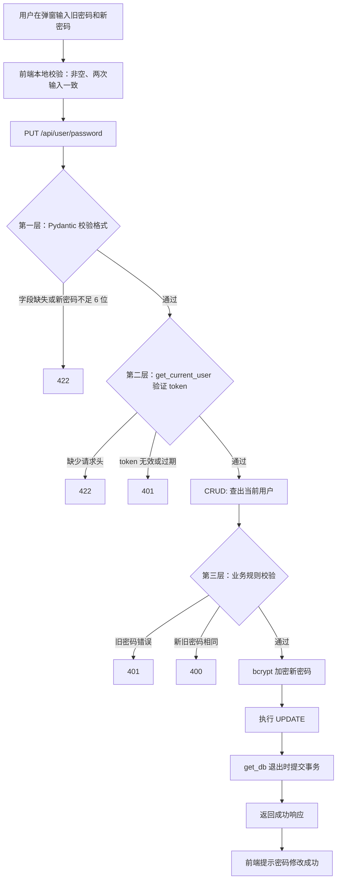

# 40 · FastAPI 项目：修改用户密码

本篇沿用原笔记中的四个核心操作：**通过 PUT 提交新旧密码 → 验证 token 和旧密码 → 加密后写入数据库 → 返回结果**。重点是理解：校验为什么分三层、哪一步该在加密之前完成，以及 `db.add()` 在更新场景中到底做了什么。

内容依据当前项目实现整理。代码中的实际行为与后续可改进之处分开说明，片段仅调整排版或省略注释。

前置笔记：[37 · 用户登录](../37-FastAPI项目-用户登陆/37-FastAPI项目-用户登陆.md)、[38 · 获取用户信息](../38-FastAPI项目-获取用户信息/38-FastAPI项目-获取用户信息.md)、[39 · 修改用户信息](../39-FastAPI项目-修改用户信息/39-FastAPI项目-修改用户信息.md)。

## 一、先看完整实现思路

1. **提交数据**：前端发送 `PUT /api/user/password`，请求体放旧密码和新密码，请求头放 token。
2. **校验输入格式**：Pydantic 检查两个字段是否齐全、新密码长度是否达标。
3. **校验身份**：`get_current_user()` 解析 token，确定"是谁在改密码"。
4. **校验业务规则**：旧密码是否正确、新密码是否与旧密码相同。
5. **写入数据库**：新密码经 bcrypt 加密后执行 UPDATE，事务交给 `get_db()` 提交。
6. **响应结果**：只返回一条成功消息，不返回任何密码相关数据。

与上一章"修改用户信息"最大的不同在于：**这里的校验是分三层的**，而且每一层用的手段不一样。



三层校验的顺序不能随意调换：格式不对就没必要查库，身份不明就没必要比对密码。

## 二、前端提交什么数据？

### 2.1 接口路径、请求体和请求头

当前接口为 `PUT /api/user/password`，请求示例：

```http
PUT /api/user/password HTTP/1.1
Authorization: demo-token
Content-Type: application/json

{"oldPassword": "123456", "newPassword": "abc123"}
```

`demo-token` 是演示值，实际应使用登录取得的有效 token。

当前 [store/user.js](../../xwzx-news/src/store/user.js) 的 `updatePassword()` 使用：

```javascript
const response = await axios.put(`${apiConfig.baseURL}/api/user/password`,
  {
    oldPassword,
    newPassword
  },
  {
    headers: {
      Authorization: this.token
    }
  }
);
```

和上一章一样，前端直接发送 token，没有拼接 `Bearer`；后端沿用兼容处理。

### 2.2 为什么字段名是 oldPassword 而不是 old_password？

因为请求模型给这两个字段都设了 `alias`：

```python
class UserUpdatePasswordRequest(BaseModel):
    old_password: str = Field(..., alias="oldPassword", description="旧密码")
    new_password: str = Field(..., min_length=6, alias="newPassword", description="新密码")
```

`alias` 的作用是：**Python 侧用蛇形命名 `old_password`，JSON 侧用驼峰命名 `oldPassword`**。前端 JavaScript 习惯驼峰，Python 习惯蛇形，`alias` 就是这两套命名习惯之间的翻译层。

需要注意的是，这个模型**没有**设置 `populate_by_name=True`，所以只认驼峰这一种写法。实测：

| 请求体 | 结果 |
| --- | --- |
| `{"old_password": "...", "new_password": "..."}` | HTTP 422，提示 `oldPassword` 字段缺失 |
| `{"oldPassword": "...", "newPassword": "..."}` | HTTP 200 |

对比一下 [schemes/users.py](../../toutiao_backend/schemes/users.py) 里的 `UserAuthResponse`，它就设置了 `populate_by_name=True`，那个模型两种写法都能接受。设不设这个配置，取决于是否需要兼容两种命名。

## 三、UserUpdatePasswordRequest 拦住了什么？

### 3.1 两个字段为什么都用 Field(...)？

`Field()` 的第一个参数是默认值。写 `...`（Ellipsis 省略号对象）表示**没有默认值，必须传**。

对比上一章的 `UserUpdateRequest`：

```python
# 39 章：修改用户信息，字段可选
nickname: Optional[str] = Field(None, max_length=50)   # 默认 None，不传就不改

# 40 章：修改密码，字段必填
old_password: str = Field(..., alias="oldPassword")    # 不传就 422
```

差别来自业务语义：修改资料可以只改一个字段，改密码则必须两个都给 —— 没有旧密码就无法确认操作者身份，没有新密码就无从更新。

### 3.2 min_length=6 在哪一层拦截？

在**进入路由函数之前**。Pydantic 校验发生在 FastAPI 解析请求体的阶段，不通过就直接返回 422，路由函数根本不会被调用，数据库也不会被访问。

实测提交 `{"oldPassword": "123456", "newPassword": "abc"}`：

```
HTTP 422  [{'type': 'string_too_short', 'loc': ['body', 'newPassword'], ...}]
```

把长度这类格式规则放在模型里，好处是 CRUD 函数可以假定"拿到的数据格式一定是对的"，只专注业务规则。

> 补充：`old_password` 没有加 `min_length`。这是合理的 —— 旧密码的长度规则应由"当初注册时的规则"决定，现在再校验一遍没有意义，反而可能把历史上用短密码注册的用户挡在门外。

## 四、路由层做了什么？

```python
@router.put("/password")
async def change_password(
    user_update_password_request: UserUpdatePasswordRequest,
    user: User = Depends(get_current_user),
    db: AsyncSession = Depends(get_db, scope="function")
):
    # 1. 更新用户密码
    await users.update_user_password(db, user.username, user_update_password_request)
    # 2. 响应结果
    return success_response(message="更新用户密码成功")
```

三个参数依然来自三个地方：请求体、认证依赖、数据库依赖。这和上一章一致。

值得注意的是两点：

**第一，路由里没有"这是不是本人"的判断。** 因为用户身份不是前端传来的，而是 `get_current_user()` 从 token 里解析出来的。前端**无法**指定要改谁的密码 —— 接口根本没有接收用户名的入口。这是一种结构上的安全保证，比"先接收 username 再判断是否等于当前用户"更可靠。

**第二，响应不带 `data`。** `success_response(message=...)` 只返回消息。改密码这个操作没有什么需要回传给前端的数据，更不应该把密码或哈希值写进响应体。

> 顺带一提：CRUD 函数 `update_user_password()` 实际 `return user` 了，但路由没有接收这个返回值。这不影响功能，属于可以简化的地方 —— 函数签名上写的返回类型也是 `-> None`，和实际返回值不一致。

## 五、CRUD 的五个步骤

完整代码在 [crud/users.py](../../toutiao_backend/crud/users.py)：

```python
async def update_user_password(db, username, user_update_password_request):
    # 1. 验证旧密码是否正确
    user = await get_user_by_username(db, username)
    if not user:
        raise HTTPException(status_code=404, detail="用户不存在")
    is_valid = verify_password(user_update_password_request.old_password, user.password)
    if not is_valid:
        raise HTTPException(status_code=401, detail="旧密码错误")
    if user_update_password_request.new_password == user_update_password_request.old_password:
        raise HTTPException(status_code=400, detail="新密码不能与旧密码相同")
    # 2. 更新新密码：将新密码加密后更新到数据库中
    user_new_password = hash_password(user_update_password_request.new_password)
    update_stmt = update(User).where(User.username == username).values(password=user_new_password)
    await db.execute(update_stmt)
    # 4. 查询更新后的用户信息
    await db.refresh(user)
    return user
```

### 5.1 第一步：查出当前用户

需要拿到数据库里存的**密码哈希值**，才能比对旧密码。`get_current_user()` 返回的 `user` 对象其实已经包含 `password` 字段了，这里重新查一次属于稍显重复，但不影响正确性。

### 5.2 第二步：校验旧密码

```python
is_valid = verify_password(user_update_password_request.old_password, user.password)
```

注意参数顺序：**第一个是用户刚输入的明文，第二个是数据库里存的哈希**。

bcrypt 的哈希是不可逆的，所以验证方式不是"把数据库里的解密出来对比"，而是"把用户输入的明文用**同样的盐**再算一次，看结果是否一致"。盐值就存在哈希字符串自己里面（`$2b$12$` 后面那一段），所以 `checkpw` 能自己取出来用。

这一步要求旧密码，是为了防止**会话劫持后的账户接管**：即使别人拿到了你的 token，不知道旧密码也改不了密码，你仍然能夺回账户。

### 5.3 第三步：为什么新旧密码的比较要放在加密之前？

```python
if new_password == old_password:       # 先比较
    raise HTTPException(400, ...)
user_new_password = hash_password(...)  # 后加密
```

因为 **bcrypt 是故意设计得慢的**。本项目实测单次 `hash_password()` 耗时约 **178 毫秒**（默认 12 轮）。这个"慢"是安全特性 —— 让暴力破解的成本变得无法承受。

既然一次加密要花掉近 0.2 秒，那么对一个注定要失败的请求先做加密就是纯浪费。把比较提到前面，这类请求可以立即返回。

另外，这里比较的是**两个明文**，所以可以直接用 `==`。如果要比较"新密码是否和数据库里存的旧密码哈希相同"，就必须用 `verify_password()`，不能用 `==` —— bcrypt 每次加盐不同，同样的明文两次加密得到的哈希字符串是不一样的。

### 5.4 第四步：加密并执行 UPDATE

```python
update_stmt = update(User).where(User.username == username).values(password=user_new_password)
await db.execute(update_stmt)
```

这是 SQLAlchemy 的 **Core 风格**更新，和上一章 `update_user_info()` 用的是同一套写法。实际发出的 SQL：

```sql
UPDATE user SET password=?, updated_at=? WHERE user.username = ?
```

`updated_at` 是自动加上的 —— [models/Bases.py](../../toutiao_backend/models/Bases.py) 里定义了 `onupdate=datetime.now`，只要这张表被 UPDATE，这个字段就会自动刷新。

> 我们在 [30 章](../30-FastAPI项目-数据库与ORM配置/30-FastAPI项目-数据库与ORM配置.md) 建库时还写了一个数据库触发器 `trg_user_updated_at`，它带有 `WHEN NEW.updated_at = OLD.updated_at` 守卫。这里 SQLAlchemy 已经显式写了 `updated_at`，触发器会自动让路不重复写。两套机制不会打架。

### 5.5 第五步：refresh 后返回

`db.refresh(user)` 会重新 SELECT 一次，把内存里的 `user` 对象同步成数据库的最新状态。

需要这一步是因为 Core 风格的 `update()` 是直接发 SQL 的，它绕过了 ORM 的对象管理 —— 语句执行完，内存里那个 `user` 对象可能还拿着旧的密码哈希。不过本例中路由并没有用这个返回值，所以这次 refresh 实际上没有被消费。

## 六、db.add() 到底做什么？——从注释掉的旧版本说起

文件末尾保留了一个被注释掉的早期版本：

```python
# async def change_password(db, user, old_password, new_password):
#     if not security.verify_password(old_password, user.password):
#         return False
#     hashed_new_pwd = security.get_hash_password(new_password)
#     user.password = hashed_new_pwd
#
#     # 更新：由 SQLAlchemy 真正接管这个 User 对象，确保可以 commit
#     # 规避 session 过期或关闭导致的不能提交的问题
#     db.add(user)
#     await db.commit()
#     await db.refresh(user)
#     return True
```

### 6.1 疑问：add() 不是用来插入新记录的吗？

这是一个很自然的疑问 —— 在 [25 章新增数据](../25-FastAPI进阶-ORM操作数据-新增数据/25-FastAPI进阶-ORM操作数据-新增数据.md) 里，`db.add()` 确实是用来插入的。这里却拿它来做更新，看上去很矛盾。

**关键在于：`add()` 的语义不是"插入"，而是"把这个对象纳入 session 管理"。** 最终发 INSERT 还是 UPDATE，取决于对象当时处于什么**状态**，而不取决于是否调用了 `add()`。

### 6.2 对象的四种状态

SQLAlchemy 给每个 ORM 对象维护一个状态：

| 状态 | 什么时候是这个状态 | 调 `add()` 的效果 |
| --- | --- | --- |
| **transient** 瞬时 | `User(...)` 刚创建，不属于任何 session | 变成 pending，flush 时发 **INSERT** |
| **pending** 待定 | 已 add，还没 flush | 无变化 |
| **persistent** 持久 | **查询出来的**，或已 flush 过的 | **空操作，什么也不做** |
| **detached** 游离 | 有主键，但脱离了 session | **重新挂回 session** |

用 `sqlalchemy.inspect()` 可以直接观察，实测输出：

```text
1) 新建对象 User(...)     -> transient  | 在 session 里? False
   db.add(fresh) 之后     -> pending    | 在 session 里? True    ← 这才是"插入"的那种用法

2) 查询得到的对象         -> persistent | 在 session 里? True    ← 查询本身就已纳入 session
   db.add(user) 之后      -> persistent | 在 session 里? True    ← 状态没变，空操作
```

### 6.3 实测：add() 对查询出来的对象是空操作

注释版里的 `user` 是通过参数传进来的、从数据库查出来的对象，已经是 persistent 状态。对它调 `add()` 什么也不会发生。

SQLAlchemy 的工作单元（unit of work）有**脏检查**机制：只要对象还在 session 里，改了属性它自己就知道，不需要额外通知：

```text
3) 改属性前 db.dirty     = IdentitySet([])
   user.password = ... 后 = IdentitySet([<User object>])   ← 没调 add()，它自己发现了
   被改的字段: History(added=['NEW_HASH_VALUE'], deleted=['$2b$12$TKev...'])
```

完全不调 `add()`，直接 flush，UPDATE 照样发出来：

```text
只改属性、不调 db.add() → flush 发出: UPDATE user SET password=?, updated_at=? WHERE user.id = ?
```

### 6.4 实测：add() 唯一真正有用的场景

`add()` 对更新场景**唯一**有意义的情况，是对象已经变成 detached。用 `expunge()` 可以手动制造这个状态：

```text
expunge 后（模拟"脱离 session"）  -> detached   | 在 session 里? False
改属性后 flush                    -> SQL: （无）        ← 改动静默丢失！
db.add(user) 之后                 -> persistent | 在 session 里? True   ← add 把它挂回来了
再 flush                          -> UPDATE user SET password=?, updated_at=? WHERE user.id = ?
```

注意中间那一步：游离对象改了属性，flush 时**什么 SQL 都不发，改动悄无声息地丢掉**，不报错。这正是 `add()` 能解决的问题。

### 6.5 结论：那两行注释是一种误解

> `# 更新：由 SQLAlchemy 真正接管这个 User 对象，确保可以 commit`
> `# 规避 session 过期或关闭导致的不能提交的问题`

这段说法在网上流传较广，但推敲下来站不住：

- session **没关**的时候 —— 对象是 persistent，`add()` 是空操作，加不加完全一样。
- session **真关了**的时候 —— `db.commit()` 本身就会直接报错，`add()` 也救不了。

能对得上这句注释的只有 detached 这一种情形。而在本项目里，`user` 和 `db` 来自同一次请求的同一个 session，不会变成 detached。

**所以这行 `db.add(user)` 是多余的，但无害 —— 不能说它错，只是没有必要。** 现行版本把它去掉是对的。

什么时候真的会遇到 detached？比如把对象从一个请求的 session 里取出来，缓存到全局变量，下一个请求换了新 session 再拿来改 —— 那时才需要 `add()` 重新挂载（更常见的做法是用 `session.merge()`）。本项目的写法不会走到那一步。

### 6.6 两个版本真正的差别其实在 Core 与 ORM

`add()` 只是表面差异。两个版本真正的分歧是更新的**风格**：

| | 现行版（Core 风格） | 注释版（ORM 风格） |
| --- | --- | --- |
| 写法 | `update(User).where(...).values(...)` | `user.password = x` |
| 机制 | 编译成 SQL 直接执行，绕过工作单元 | 靠脏检查，flush 时自动生成 UPDATE |
| WHERE 条件 | `username` | `id`（主键） |
| 返回值 | `user` 对象 | `True` / `False` |
| 谁来提交 | `get_db()` 统一提交 | CRUD 内部 `db.commit()` |

实测两种写法对数据库的效果是等价的：

```text
现行版 Core update() 语句
   UPDATE user SET password=?, updated_at=? WHERE user.username = ?
   updated_at : 2026-09-14 09:03:21 -> 2026-09-19 08:10:24   ✅ 已刷新

注释版 ORM 改属性
   UPDATE user SET password=?, updated_at=? WHERE user.id = ?
   updated_at : 2026-09-14 09:03:21 -> 2026-09-19 08:10:24   ✅ 已刷新
```

两边都自动带上了 `updated_at`，因为 `onupdate=datetime.now` 在 Core 和 ORM 两条路径上都会生效。

两种风格都正确，选择依据是场景：批量修改多行时 Core 更合适（一条语句搞定）；已经把对象查出来、只改一两个字段时 ORM 更直观。本例为了校验旧密码已经查出了 `user`，其实 ORM 风格更顺，还能省掉最后的 `refresh()`。

## 七、事务在什么时候提交？

现行版本里 `await db.commit()` 是被注释掉的，也就是说 **CRUD 不自己提交，整个请求是一个事务**，由 [get_db()](../../toutiao_backend/config/db_conf.py) 在依赖退出时统一提交：

```text
CRUD 执行 UPDATE（只写入事务，未提交）
    ↓
CRUD refresh 并返回
    ↓
路由构造成功响应
    ↓
get_db() 退出，调用 commit()  ← 真正落库
    ↓
发送响应
```

这样做的好处是：**中途任何一步失败，修改都会整体回滚**。做了一次验证 —— 在 CRUD 返回之后、构造响应之前人为抛出异常：

```text
接口返回 -> HTTP 500
新密码 abc123 生效了吗 -> False
旧密码 123456 还在吗   -> True
```

密码没有被改掉，`get_db()` 的 `except` 分支执行了 `rollback()`。

改密码这种操作尤其需要这个保证：如果密码已经落库、响应却失败了，用户会以为没改成功，继续用旧密码登录，结果被挡在门外，而且不知道新密码是什么。

## 八、前端怎样处理结果？

[Profile.vue](../../xwzx-news/src/views/Profile.vue) 在发请求之前先做了三项本地校验：

```javascript
if (!oldPassword.value)  { showToast('请输入当前密码'); return; }
if (!newPassword.value)  { showToast('请输入新密码');   return; }
if (newPassword.value !== confirmPassword.value) { showToast('两次密码输入不一致'); return; }
```

注意第三项 —— **"两次输入是否一致"只在前端校验，后端完全不知道有确认框这回事**。这是合理的：确认框是为了防止用户自己打错字，属于交互层面的问题，请求体里只需要一个 `newPassword`。

前端校验不能替代后端校验。前端的作用是减少无效请求、给出即时反馈；后端的校验才是真正的防线，因为请求可以绕过页面直接发送。这也是为什么 `min_length=6` 必须写在 Pydantic 模型里。

之后 store 的 `updatePassword()` 统一把结果包装成 `{ success, message }`，组件据此决定弹成功提示还是失败提示。

## 九、当前实现的边界

### 9.1 改完密码之后，旧 token 仍然有效

实测：改完密码后拿**改密码之前**的那个 token 去请求 `/api/user/info`，仍然返回 HTTP 200。

这意味着如果 token 已经泄露，改密码**不能**把攻击者踢下线。常见做法是改密码成功后一并清除该用户的所有 token（`user_token` 表里按 `user_id` 删除），强制所有设备重新登录。当前实现没有做这一步。

这属于后续可改进项，不是现有代码的 bug —— 只是要清楚它目前的行为边界。

### 9.2 "用户不存在"这个分支实际不可达

```python
user = await get_user_by_username(db, username)
if not user:
    raise HTTPException(status_code=404, detail="用户不存在")
```

这个 404 在当前调用链下走不到：`username` 来自 `get_current_user()` 解析 token 得到的用户对象，能走到这一步就说明用户一定存在。留着它作为防御性检查没有坏处，但不必期待在测试中看到 404。

### 9.3 常见结果怎样区分？

| 情况 | 状态码 | 响应内容 |
| --- | --- | --- |
| 修改成功 | 200 | `更新用户密码成功` |
| 字段名写成蛇形 / 字段缺失 | 422 | Pydantic 校验错误详情 |
| 新密码不足 6 位 | 422 | `string_too_short` |
| 缺少 `Authorization` 请求头 | 422 | 提示 header 缺失 |
| token 无效或已过期 | 401 | `token无效` |
| 旧密码错误 | 401 | `旧密码错误` |
| 新旧密码相同 | 400 | `新密码不能与旧密码相同` |

有一点容易混淆：**缺少请求头返回的是 422，不是 401**。因为 `Header(...)` 在 `get_current_user()` 里是必填参数，参数缺失属于格式问题，在 Pydantic 校验阶段就被拦下了，根本没机会执行到"token 是否有效"的判断。两者的语义确实不同：422 是"你没告诉我你是谁"，401 是"你说了但我不认"。

## 十、本次笔记核对了哪些实际行为？

为避免只凭代码推测，本次把数据库复制了一份副本，用 `httpx.ASGITransport` 直接调用真实接口，验证结果如下：

| 验证内容 | 结果 |
| --- | --- |
| 请求体用 snake_case | 422，只接受 alias 驼峰命名 |
| 请求体用 camelCase | 200，修改成功 |
| 新密码不足 6 位 | 422 `string_too_short` |
| 旧密码错误 | 401 `旧密码错误` |
| 新旧密码相同 | 400 `新密码不能与旧密码相同` |
| 不带 `Authorization` 头 | 422（不是 401） |
| token 无效 | 401 `token无效` |
| 修改后新密码可用、旧密码失效 | 均符合预期 |
| 修改后 `updated_at` 自动刷新 | 已刷新 |
| 修改后旧 token 是否还能用 | 仍然有效，未被踢下线 |
| CRUD 返回后模拟响应构造失败 | 500，密码修改已整体回滚 |
| `hash_password()` 单次耗时 | 约 178 ms |

关于 `db.add()` 的四种对象状态、脏检查和 detached 行为，是用 `sqlalchemy.inspect()` 和 SQL 日志实际观察到的，不是仅凭文档描述。

前端部分依据现有 Vue 和 store 代码梳理，没有把它描述成已经完成浏览器点击测试。
