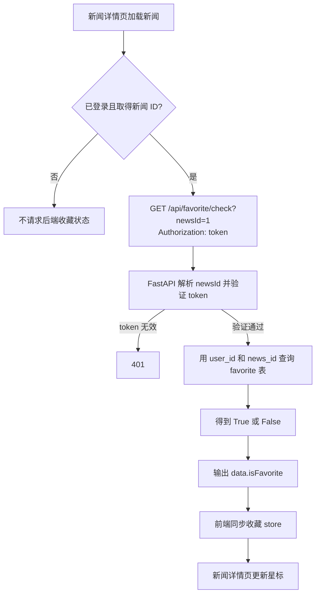

# FastAPI 项目-检查新闻收藏状态

本篇沿用原笔记的四步思路：**前端请求 → 根据 token 确定用户 → 查询收藏表 → 前端更新星标**。重点是区分请求参数、Python 字段名与响应 JSON 字段名，并解释这次遇到的 Pydantic 别名问题。本文记录的是当前项目中的“检查收藏状态”接口，不涉及添加或取消收藏。

相关代码：[新闻详情页](../../xwzx-news/src/views/NewsDetail.vue)、[前端收藏 store](../../xwzx-news/src/store/modules/favorite.js)、[收藏路由](../../toutiao_backend/routers/favorite.py)、[收藏 CRUD](../../toutiao_backend/crud/favorite.py)、[响应模型](../../toutiao_backend/schemes/favorite.py)。

## 一、先看完整流程

1. 新闻详情页取得当前新闻 ID。用户已登录时，前端发送 `GET /api/favorite/check?newsId=1`，并在 `Authorization` 请求头中带上登录 token。
2. FastAPI 将 URL 中的 `newsId` 交给路由参数 `news_id`；`get_current_user()` 验证 token，并取得当前用户的 ID。
3. CRUD 用 `user_id` 和 `news_id` 查询 SQLite 的 `favorite` 表。找到记录返回 `True`，找不到返回 `False`；检查操作不会新增收藏记录。
4. 路由把布尔值放入响应模型，最终输出 `data.isFavorite`。前端读取该值，同步收藏 store，详情页根据 store 显示实心或空心星标。



这里的“当前用户”来自 token，而不是由前端提交 `user_id`。这样后端查询的是**这个登录用户**对**这条新闻**的收藏关系。

## 二、前端发送了什么？

请求示例（token 仅为演示值）：

```http
GET /api/favorite/check?newsId=1 HTTP/1.1
Authorization: demo-token
```

这是 GET 请求，新闻 ID 放在查询参数中，不需要请求体。[前端收藏 store](../../xwzx-news/src/store/modules/favorite.js) 使用 Axios 的 `params: { newsId }` 生成 `?newsId=1`，并从用户 store 取出 token 放进 `Authorization` 请求头。

新闻详情页先加载新闻。只有在用户已登录且新闻详情有 ID 时，才调用 `checkFavoriteStatusApi(newsStore.newsDetail.id)`。`/` 会跳转到首页；目前星标写在**新闻详情页**，首页新闻列表组件没有收藏标识。

## 三、后端怎样确定新闻和用户？

### 3.1 `newsId` 是对外名称，`news_id` 是 Python 参数名

[收藏路由](../../toutiao_backend/routers/favorite.py) 的关键参数如下：

```python
@router.get("/check")
async def check_favorite(
    db: AsyncSession = Depends(get_db),
    user: User = Depends(get_current_user),
    news_id: int = Query(..., alias="newsId", description="新闻ID"),
):
    is_favorite = await is_news_favorite(user.id, news_id, db)
    return success_response(
        message="检查收藏成功",
        data=FavoriteCheckResponse(is_favorite=is_favorite),
    )
```

路由前缀是 `/api/favorite`，因此完整路径是 `/api/favorite/check`。`Query(..., alias="newsId")` 指定 URL 中的参数名为 `newsId`，函数体内仍用 `news_id`。`...` 表示此参数必填，`int` 要求它能解析为整数；缺失或格式不对时，FastAPI 返回 422，不会正常执行查询逻辑。

### 3.2 `get_current_user()` 根据 token 找用户

[认证依赖](../../toutiao_backend/utils/auth.py) 读取 `Authorization` 请求头，兼容直接传 token 和 `Bearer ` 前缀，然后调用 `get_user_by_token()`。[用户 CRUD](../../toutiao_backend/crud/users.py) 会先查 token 记录、检查是否过期，再根据其中的 `user_id` 查用户。

未提供必填请求头时由 FastAPI 返回 422；token 无效、过期或找不到对应用户时，`get_current_user()` 返回 401。验证通过后，路由得到 `user.id`。数据库会话由 `Depends(get_db)` 提供。

## 四、怎样查询收藏表？

[收藏模型](../../toutiao_backend/models/favorite.py) 对应数据库中的单数表名 `favorite`。每条记录用 `user_id` 和 `news_id` 表示“谁收藏了哪条新闻”。表上有 `(user_id, news_id)` 唯一索引，避免同一用户重复收藏同一条新闻；数据库定义可见 [sqlite-database.sql](../../sql/sqlite-database.sql)。

[收藏 CRUD](../../toutiao_backend/crud/favorite.py) 的核心逻辑是：

```python
stmt = select(Favorite).where(
    Favorite.user_id == user_id,
    Favorite.news_id == news_id,
)
result = await db.execute(stmt)
return result.scalar_one_or_none() is not None
```

可以把查询条件理解为：

```sql
SELECT * FROM favorite
WHERE user_id = 当前用户ID AND news_id = 当前新闻ID;
```

`scalar_one_or_none()` 在找到一条记录时返回对象，找不到时返回 `None`；`is not None` 将它转换为布尔值。这里查的是“当前用户是否收藏当前新闻”，不是“这条新闻有没有被任何用户收藏”。当前实现只检查收藏关系是否存在，并不单独查询新闻是否存在。

CRUD 函数虽然也给 `db` 参数写了 `Depends(get_db)`，但此处是路由用 `is_news_favorite(user.id, news_id, db)` **直接调用**它。真正传入会话的是路由的 `Depends(get_db)`；普通 Python 函数调用不会自动执行依赖注入。

## 五、怎样输出前端需要的字段？

前端检查成功后读取 `response.data.data.isFavorite`，因此成功响应的数据形状必须是：

```json
{
  "code": 200,
  "message": "检查收藏成功",
  "data": {
    "isFavorite": true
  }
}
```

未收藏时，`isFavorite` 是 `false`。路由中的局部变量和响应模型中的 Python 字段都叫 `is_favorite`；[响应模型](../../toutiao_backend/schemes/favorite.py) 用 `serialization_alias` 指定输出 JSON 的名字：

```python
class FavoriteCheckResponse(BaseModel):
    is_favorite: bool = Field(
        ...,
        description="是否收藏",
        serialization_alias="isFavorite",
    )
```

路由用 `FavoriteCheckResponse(is_favorite=is_favorite)` 创建模型。[success_response()](../../toutiao_backend/utils/response.py) 再调用 FastAPI 的 `jsonable_encoder()`；当前版本默认按序列化别名输出，因此 JSON 中是 `isFavorite`。如果单独调用 Pydantic 的 `model_dump()`，默认仍会看到 `is_favorite`；要得到别名键需要 `model_dump(by_alias=True)`。

### 5.1 为什么之前的 `alias="isFavorite"` 会报错？

这里要把**模型构造时的输入校验**和**模型输出时的序列化**分开看。`FavoriteCheckResponse(...)` 虽在路由内部创建，传入的关键字参数仍是 Pydantic 要校验的“输入”。`alias="isFavorite"` 同时指定输入别名和输出别名；默认情况下，设置了输入别名后，Pydantic 期望用 `isFavorite` 构造模型：[Pydantic 别名文档](https://docs.pydantic.dev/latest/concepts/alias/)。

```python
class FavoriteCheckResponse(BaseModel):
    is_favorite: bool = Field(alias="isFavorite")

FavoriteCheckResponse(isFavorite=True)   # 成功；Python 属性仍是 .is_favorite
FavoriteCheckResponse(is_favorite=True)  # 默认报 ValidationError
```

项目路由传的是 `is_favorite=`。在上述 `alias` 写法下，Pydantic 找不到必填输入键 `isFavorite`，于是**创建响应模型时就报错**，还没走到 JSON 输出阶段。这不是查询返回了 `False`，也不是前端把字段读错了；出错点在响应模型的构造。

当前只使用 `serialization_alias="isFavorite"`：它只规定输出名称，不改变构造模型时接受的 `is_favorite`，因此与路由写法匹配。对同一个字段，三种写法的作用可以这样比较：

| 字段配置 | 默认接受的构造参数 | `by_alias=True` 时的输出键 |
| --- | --- | --- |
| 无别名 | `is_favorite` | `is_favorite` |
| `alias="isFavorite"` | `isFavorite` | `isFavorite` |
| `serialization_alias="isFavorite"` | `is_favorite` | `isFavorite` |

`alias` 不会把 Python 属性重命名；无论哪种写法，模型内部读取的仍是 `item.is_favorite`。它是 Pydantic 在输入校验和输出序列化阶段使用的名称映射。

### 5.2 如果仍想使用 `alias`，有哪些办法？

最直接的办法是把构造参数改成 `FavoriteCheckResponse(isFavorite=is_favorite)`，与 `alias` 指定的输入名称一致。

Pydantic 还提供一个模型级开关：字段已有输入别名时，仍允许用 Python 字段名提供输入。这个开关叫 **`validate_by_name`**，默认关闭；设为 `True` 后，`isFavorite` 和 `is_favorite` 都可用于构造。下面的 `ConfigDict` 是集中存放模型配置的对象。当前项目没有启用这个开关，仅作为理解别名行为的补充：[Pydantic 校验配置](https://docs.pydantic.dev/latest/concepts/alias/#validation)。

```python
from pydantic import BaseModel, ConfigDict, Field

class FavoriteCheckResponse(BaseModel):
    model_config = ConfigDict(validate_by_name=True)
    is_favorite: bool = Field(alias="isFavorite")

FavoriteCheckResponse(isFavorite=True)   # 可以
FavoriteCheckResponse(is_favorite=True)  # 也可以
```

本接口只是内部用蛇形字段构造响应、对前端输出驼峰字段，使用 `serialization_alias` 更直接。

### 5.3 别名参数的系统总结

本节只覆盖了本接口用到的 `alias` / `serialization_alias` 两个参数。别名相关的参数其实还有 `validation_alias`、`AliasChoices`、`AliasPath`、`alias_generator`，以及 `populate_by_name` / `serialize_by_alias` 等开关；`Query(alias=...)` 和 `Header(alias=...)` 又是另一套机制。

这些内容连同真值表和选用规则，整理在 [15-Pydantic与FastAPI的别名参数](../00-python基础补充/15-Pydantic与FastAPI的别名参数.md)。挑重点说三条：

- **选参数先问"这个模型是收还是发"**：收用 `alias`，发用 `serialization_alias`，两者都是就 `alias` + `populate_by_name`。本接口的模型是"发"，所以 `serialization_alias` 是唯一正确选择。
- **`validation_alias` 完全不影响输出**，即使传了 `by_alias=True` 出来的仍是字段名。
- **Pydantic 和 FastAPI 的默认值相反**：`model_dump()` 默认 `by_alias=False`，而 `jsonable_encoder()` 和 `response_model` 默认 `by_alias=True`。本接口输出能是驼峰，靠的是后者。

## 六、前端收到结果后怎样点亮星标？

[前端收藏 store](../../xwzx-news/src/store/modules/favorite.js) 从 `response.data.data.isFavorite` 取布尔值，返回给 [新闻详情页](../../xwzx-news/src/views/NewsDetail.vue)。详情页在请求成功且结果来自后端时：

- `true`：若本地收藏列表尚无该新闻，则加入列表。
- `false`：若本地收藏列表已有该新闻，则移除。

页面上的 `isFavorite` 计算属性会检查本地收藏列表，决定按钮使用 `star`（实心）还是 `star-o`（空心）。因此数据库有收藏记录，并不会自动改变页面；还需要接口返回正确字段，并由前端把结果同步到 store。

当前前端在未登录时不请求此接口；请求失败时会回退到本地状态，并标记 `isLocal`，详情页不会把这次结果当作后端状态同步。因此排查星标问题时，要先区分“后端实际查询结果”和“浏览器本地收藏状态”。

## 七、如何检查这条链路？

1. 确认访问的是 `/news/detail/1`，并且前端已登录目标用户。首页列表当前没有星标。
2. 在浏览器 Network 中检查是否发出 `GET /api/favorite/check?newsId=1`，请求头是否带有 `Authorization`。
3. 查看状态码：缺少或无效的请求参数、缺少请求头可能得到 422；无效或过期 token 得到 401。
4. 状态码为 200 时，确认响应中的键是 `data.isFavorite`，值是否与数据库 `favorite` 表中该用户、新闻的记录一致。
5. 如果后端返回 `true` 但星标仍未点亮，再检查前端 store 是否接收并保存了这个值，以及当前看的是否为新闻详情页。

本篇最关键的两组对应关系：**URL 的 `newsId` → 路由的 `news_id`**；**响应模型的 `is_favorite` → JSON 的 `isFavorite`**。前者由 `Query(alias=...)` 处理，后者由 `Field(serialization_alias=...)` 处理。
