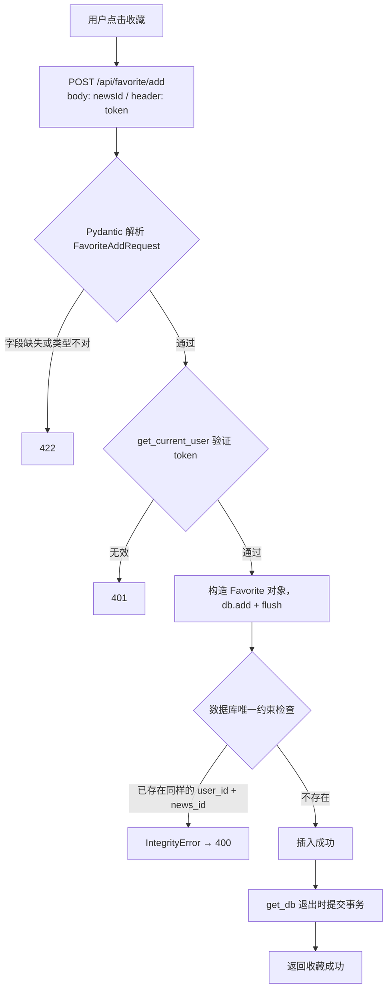

# FastAPI 项目-添加收藏

本篇沿用原笔记的五步思路：**前端 POST → 验证身份 → 写入收藏记录 → 返回结果**。接口本身不复杂，重点放在 `UniqueConstraint` 上：它到底在哪一层生效、和 `unique=True` 有什么区别、重复收藏时实际会发生什么。

前置笔记：[41 · 检查新闻收藏状态](../41-FastAPI项目-检查新闻收藏状态/41-FastAPI项目-检查新闻收藏状态.md)。

本篇的验证在项目数据库副本上真实调用接口完成，输出原样贴出。

## 一、先看完整流程

1. 用户在新闻详情页点击星标，前端发送 `POST /api/favorite/add`，请求体 `{"newsId": 1}`，请求头带 token。
2. Pydantic 用 `FavoriteAddRequest` 解析请求体；`get_current_user()` 验证 token，得到当前用户。
3. CRUD 构造 `Favorite(user_id=..., news_id=...)`，`db.add()` 后 `flush()`。
4. 数据库的唯一约束保证"同一用户 + 同一新闻"只能有一条记录。
5. 返回成功响应，前端更新星标。



注意第 5 步分叉出的 400 —— 这是当前实现的真实行为，第六节详细说明。

## 二、前端发送了什么

```http
POST /api/favorite/add HTTP/1.1
Authorization: demo-token
Content-Type: application/json

{"newsId": 1}
```

和第 41 节的"检查收藏"不同：检查用 GET + 查询参数（`?newsId=1`），添加用 POST + 请求体。原因是 GET 语义上是"读"，POST 是"写"，写操作的参数放请求体更合适。

## 三、请求模型用的是 validation_alias

```python
class FavoriteAddRequest(BaseModel):
    news_id: int = Field(..., description="新闻ID", validation_alias="newsId")
```

前端发驼峰 `newsId`，Python 内部用蛇形 `news_id`。这里用的是 `validation_alias` 而不是 `alias`：

- 这是一个**纯请求模型**，只负责"收"，不会被序列化输出
- `validation_alias` 只管输入，语义比 `alias`（同时管进和出）更精确

对照同文件里的 `FavoriteCheckResponse` 用的是 `serialization_alias`（纯响应模型，只管"发"）—— 一收一发，正好是两个方向。选用规则见 [15-Pydantic与FastAPI的别名参数](../00-python基础补充/15-Pydantic与FastAPI的别名参数.md)。

## 四、路由与 CRUD

```python
@router.post("/add")
async def add_favorite(
        request: FavoriteAddRequest,
        db: AsyncSession = Depends(get_db, scope="function"),
        user: User = Depends(get_current_user),
    ):
    result = await favorite.add_favorite(request.news_id, user.id, db)
    return success_response(message="收藏成功", data=result)
```

```python
async def add_favorite(news_id, user_id, db):
    favorite = Favorite(user_id=user_id, news_id=news_id)
    db.add(favorite)
    await db.flush()
    return favorite
```

和第 41 节一样，**用户身份来自 token，不由前端提交**，所以前端无法替别人收藏。

CRUD 里用 `flush()` 而不是 `commit()`，把事务交给 `get_db()` 统一提交 —— 这是第 40 节确立的做法。`flush()` 之后 `favorite.id` 已经拿得到（数据库分配了主键），但事务尚未提交。

> 这里的 `db.add()` 是真正意义上的"插入"：`Favorite(...)` 是新建对象，处于 transient 状态，`add()` 把它变成 pending，`flush()` 时发 INSERT。这和第 40 节讨论过的"对查询出来的对象调 `add()` 是空操作"是两种不同情形，区别在对象状态。

## 五、UniqueConstraint 详解

```python
class Favorite(ModelBase):
    __tablename__ = "favorite"
    __table_args__ = (
        UniqueConstraint("user_id", "news_id", name="unique_favorite"),
    )
```

### 5.1 它是 DDL 声明，不是运行时检查

这是最关键的一点。`UniqueConstraint` 属于 **Core 层的表结构定义**，它做的唯一一件事是：**在 `create_all()` 生成建表语句时，往里加一句 `CONSTRAINT ... UNIQUE (...)`**。

实测 `CreateTable` 的输出：

```sql
CREATE TABLE favorite (
    id INTEGER NOT NULL,
    user_id INTEGER NOT NULL,
    news_id INTEGER NOT NULL,
    PRIMARY KEY (id),
    CONSTRAINT unique_favorite UNIQUE (user_id, news_id)
)
```

**SQLAlchemy 在插入数据时不会做任何唯一性检查。** 真正拦住重复的是数据库。

### 5.2 实测：模型里写了，数据库没有，照样插进去

为了证明上一点，做了一个对照实验：模型里照常声明 `UniqueConstraint`，但**不用 `create_all()`**，而是手工建一张没有唯一约束的同名表：

```python
c.exec_driver_sql("CREATE TABLE favorite (id INTEGER PRIMARY KEY, user_id INT, news_id INT)")
```

然后插入两条完全相同的 `(1, 1)`：

```text
模型里写着 UniqueConstraint，但数据库表没有该约束
插入两条完全相同的 (1,1) -> 实际入库 2 条，未报错
→ SQLAlchemy 运行时【不做】任何唯一性检查，全靠数据库
```

**结论：约束写在模型里只是"声明意图"，能不能生效取决于数据库里那张表到底有没有这个约束。**

这引出一个实际问题：如果表是先建好的，后来才在模型里加 `UniqueConstraint`，那这个约束**不会自动出现在数据库里** —— 得手动改表，或者用 Alembic 迁移。

### 5.3 组合唯一 ≠ 各列唯一

`UniqueConstraint("user_id", "news_id")` 约束的是**两列组合起来**不重复，不是各自不重复。实测：

| 插入 | 说明 | 结果 |
| --- | --- | --- |
| `(1, 1)` | 首次 | ✅ 成功 |
| `(1, 2)` | 同一用户，不同新闻 | ✅ 成功 |
| `(2, 1)` | 不同用户，同一新闻 | ✅ 成功 |
| `(1, 1)` | 完全重复 | ❌ `UNIQUE constraint failed: favorite.user_id, favorite.news_id` |

这正是收藏表需要的语义：一个用户可以收藏很多新闻，一条新闻可以被很多人收藏，但**同一个人不能把同一条新闻收藏两次**。

如果写成两个单列唯一约束（`user_id` 唯一 + `news_id` 唯一），语义就完全变了 —— 变成"每个用户只能收藏一条新闻，每条新闻只能被一个人收藏"，显然不对。

### 5.4 三种写法的区别

| 写法 | 位置 | 适用 |
| --- | --- | --- |
| `mapped_column(..., unique=True)` | 列上 | **单列**唯一，如 `username` |
| `UniqueConstraint("a", "b")` | `__table_args__` | **多列组合**唯一 |
| `Index("name", "a", "b", unique=True)` | `__table_args__` | 多列组合唯一，且想控制索引本身 |

单列场景下 `unique=True` 和 `UniqueConstraint("col")` 等价，前者更简洁。**多列只能用后两种。**

`UniqueConstraint` 和 `Index(unique=True)` 在多数数据库里效果一样（唯一约束底层就是靠唯一索引实现的），区别在于：`Index` 能额外指定排序方向、部分索引条件等；`UniqueConstraint` 语义更明确，表达的是"业务规则"而不是"查询优化"。

### 5.5 NULL 在唯一约束里被视为"各不相同"

这是个容易忽略的陷阱。实测插入三条 `(1, NULL)`：

```text
插入三条 (1, NULL) -> 实际入库 3 条，全部成功
```

SQL 标准里 `NULL != NULL`，所以含 NULL 的行在唯一约束看来永远不重复。**这意味着可空列上的唯一约束等于没有约束。**

项目的 `favorite.user_id` 和 `news_id` 都是 `NOT NULL`，所以不受影响。但设计表时要记住：**唯一约束涉及的列，通常都应该是 NOT NULL**，否则约束会被悄悄绕过。

### 5.6 本项目的一处名字不一致

模型里写的约束名是 `unique_favorite`：

```python
UniqueConstraint("user_id", "news_id", name="unique_favorite")
```

但数据库里实际存在的是：

```text
sqlite> PRAGMA index_list(favorite);
2|user_news_unique|1|c|0        ← 1 表示 unique
```

```sql
CREATE UNIQUE INDEX "user_news_unique" ON "favorite" ("user_id" ASC, "news_id" ASC);
```

名字不一样，因为**表是用 [sqlite-database.sql](../../sql/sqlite-database.sql) 建的，不是 `create_all()` 建的** —— 模型里那个名字从来没有到达过数据库。

好在约束的**效果**是一样的（同样是 `user_id + news_id` 组合唯一），所以功能正常。但它是一个信号：模型定义和实际表结构是两套独立维护的东西，容易漂移。引入 Alembic 迁移后，这类不一致会由工具统一管理。

## 六、重复收藏时实际发生了什么

原笔记第 4 步写的是"由于 UniqueConstraint 的存在，重复添加不会创建新记录"。这句话**一半对一半不对**，需要修正。

实测连续两次 POST 同一条新闻：

```text
第 1 次 POST /api/favorite/add -> HTTP 200  {"code":200,"message":"收藏成功","data":{...}}
第 2 次 POST /api/favorite/add -> HTTP 400  {"code":400,"message":"数据约束冲突，请检查输入",
                                             "data":{"error_type":"IntegrityError",...}}
数据库里实际有几条: 1
```

- ✅ **"不会创建新记录"是对的** —— 数据库里始终只有 1 条。
- ❌ **但请求本身失败了**，返回 400，不是静默成功。

400 来自项目注册的全局异常处理器 —— [exception_handlers.py](../../toutiao_backend/utils/exception_handlers.py) 里把 `IntegrityError` 映射成了 400。所以用户体验上，重复点收藏会看到一次失败提示。

另外，[routers/favorite.py](../../toutiao_backend/routers/favorite.py) 里 `add_favorite` 的文档字符串写的是"重复添加时返回已有记录"，这**描述的是被注释掉的那段查重代码**，不是当前行为：

```python
# existing = await db.scalar(
#     select(Favorite).where(Favorite.user_id == user_id, Favorite.news_id == news_id)
# )
# if existing is not None:
#     return existing
```

文档字符串和实际行为对不上，建议要么恢复这段代码，要么改掉文档字符串。

### 6.1 处理重复的三种策略

| 策略 | 做法 | 特点 |
| --- | --- | --- |
| **A 先查后插** | 查一次，存在就直接返回 | 多一次查询；**有竞态** |
| **B 插入 + 捕获异常** | 直接插，`IntegrityError` 时回滚再查 | 没有竞态；正常路径只要一次操作 |
| **C 数据库 upsert** | `INSERT ... ON CONFLICT DO NOTHING` | 一条语句搞定；写法依赖具体数据库 |

实测三种都能达到目的：

```text
A 先查后插               : 查到已存在 -> 直接返回 id=1，不插入
B 插入+捕获异常          : UNIQUE constraint failed: f.u, f.n -> 回滚后查已有记录
C ON CONFLICT DO NOTHING : 一条语句搞定，入库共 1 条
```

**策略 A 的竞态问题值得留意**：两个请求同时查询，都发现"不存在"，然后都去插入 —— 第二个仍然会撞上唯一约束报错。所以即使恢复那段注释代码，也**不能完全避免** `IntegrityError`，只是把概率降低了。

这恰恰说明唯一约束的价值：**它是最后一道防线，无论应用层怎么写，数据库都不会让脏数据进去。** 应用层的查重只是为了给出更友好的提示，不能替代约束。

策略 C 在 SQLite 和 PostgreSQL 上的写法：

```python
from sqlalchemy.dialects.sqlite import insert as sqlite_insert

stmt = sqlite_insert(Favorite).values(user_id=user_id, news_id=news_id) \
        .on_conflict_do_nothing(index_elements=["user_id", "news_id"])
await db.execute(stmt)
```

注意要从 `sqlalchemy.dialects.sqlite` 导入 `insert`，通用的 `sqlalchemy.insert` 没有 `on_conflict_do_nothing()`。这也意味着**换数据库时这段代码要改**，是用它换取简洁性的代价。

## 七、本次笔记核对了哪些实际行为

把数据库复制一份副本，用 `httpx.ASGITransport` 调用真实接口，另用独立的内存库验证约束语义：

| 验证内容 | 结果 |
| --- | --- |
| 首次 POST `/api/favorite/add` | 200，写入 1 条 |
| 重复 POST 同一条 | **400**，`IntegrityError`，库里仍是 1 条 |
| `create_all` 为 `UniqueConstraint` 生成的 DDL | `CONSTRAINT unique_favorite UNIQUE (user_id, news_id)` |
| 模型有约束、数据库表没有时插入重复数据 | **成功入库 2 条**，SQLAlchemy 不做运行时检查 |
| `(1,1) (1,2) (2,1)` 三种组合 | 全部成功；再插 `(1,1)` 失败 |
| 三条 `(1, NULL)` | 全部成功，NULL 视为互不相同 |
| 数据库里实际的约束名 | `user_news_unique`，与模型里的 `unique_favorite` 不一致 |
| 三种去重策略 | A/B/C 均可达到目的，A 有竞态 |

相关笔记：[41 · 检查新闻收藏状态](../41-FastAPI项目-检查新闻收藏状态/41-FastAPI项目-检查新闻收藏状态.md)、[13-SQLAlchemy学习路线](../00-python基础补充/13-SQLAlchemy学习路线.md)、[15-Pydantic与FastAPI的别名参数](../00-python基础补充/15-Pydantic与FastAPI的别名参数.md)。
