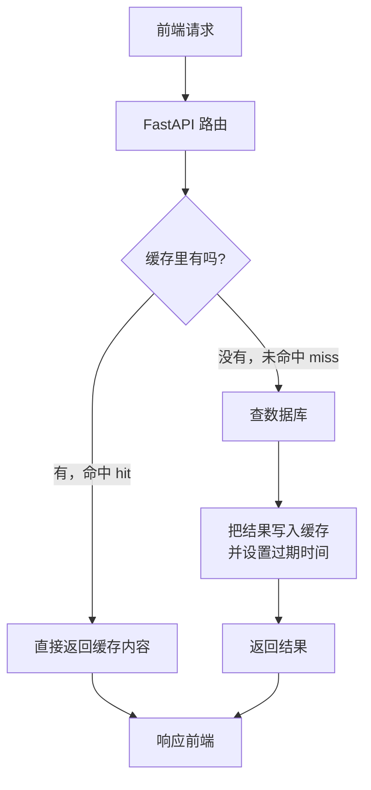

# FastAPI项目-缓存简介及安装Redis服务端

本篇是缓存部分的第一章，只做两件事：**把"缓存到底是什么、什么时候该用"讲清楚，以及把 Redis 服务端装好跑起来。** 客户端接入和实际改造放到下一章。

本篇的数据都在本机实测，包括一个可能和直觉相反的结论 —— **按项目现在的规模，加 Redis 并不会让接口变快**。第三节会用实测数据说明为什么，以及那为什么仍然值得现在学。

## 一、什么是数据缓存

缓存的基本思路只有一句话：**把"算起来慢、但短时间内不会变"的结果先存起来，下次直接拿现成的。**

在 Web 后端里，最常见的形态是把数据库查询结果存到内存里：



三个基本术语：

| 术语 | 含义 |
| --- | --- |
| **命中（hit）** | 缓存里有，直接返回，不碰数据库 |
| **未命中（miss）** | 缓存里没有，得去数据库查 |
| **回源** | 未命中时去找真正的数据源（这里是数据库） |

缓存要解决的从来不只是"快"，更重要的是**保护数据库**：数据库连接数是有限的、昂贵的资源，缓存把大部分重复读挡在数据库外面。

### 缓存的代价

缓存不是白拿的，它用**一致性**换**性能**：

- 数据库里的数据改了，缓存里还是旧的 —— 这段时间用户看到的是**过期数据**
- 多了一个组件要部署、监控、排错
- 代码要处理"缓存挂了怎么办"

所以缓存的核心问题从来不是"怎么存"，而是**"什么时候让它失效"**。第七节会讲。

## 二、缓存的实现方式

按"存在哪里"分，常见的有这么几种：

| 方式 | 存在哪 | 跨进程共享 | 重启后还在 | 有 TTL | 典型用途 |
| --- | --- | --- | --- | --- | --- |
| **Python 字典** | 当前进程内存 | ❌ | ❌ | 要自己写 | 临时、单进程的小缓存 |
| **`functools.lru_cache`** | 当前进程内存 | ❌ | ❌ | ❌ 没有 | 纯函数的计算结果 |
| **Redis** | 独立进程的内存 | ✅ | ✅（可持久化） | ✅ 内置 | **后端缓存的主流选择** |
| **Memcached** | 独立进程的内存 | ✅ | ❌ | ✅ | 老牌方案，只有字符串 |
| **HTTP 缓存 / CDN** | 浏览器、CDN 节点 | — | — | ✅ | 静态资源、公开内容 |

### 进程内字典明明更快，为什么还要用 Redis？

实测对比：

```text
Python 字典读取      0.000017 ms  （约 0.02 微秒）
Redis GET（回环 p50） 0.215000 ms
→ 相差约 13000 倍，差距几乎全在网络往返上
```

字典快一万多倍，但它有三个致命问题：

1. **不能跨进程共享。** 生产环境一般会起多个 worker 进程（`uvicorn --workers 4`）。用字典的话，4 个进程有 4 份各不相同的缓存，用户每次请求命中哪个进程是随机的，看到的数据可能不一致。
2. **重启就没了。** 每次部署、每次重启，缓存全部清空，所有请求瞬间砸到数据库上。
3. **没有过期机制。** 得自己写一套 TTL 和清理逻辑，还要担心内存无限增长。

**Redis 慢的那 0.2 毫秒，买的是"一份所有进程共用、且活得比进程久的缓存"。** 这是架构问题，不是速度问题 —— 这一点比"Redis 很快"重要得多。

## 三、先泼一盆冷水：现在加 Redis 会更快吗？

**不会。** 这是本机实测的结果，不是推测。

先看项目现在的数据规模：

```text
新闻 403 条 / 用户 3 个 / 分类 8 个 / 收藏 4 条
数据库文件大小: 360K
```

再看各类查询的实际耗时（50 次平均）：

```text
【便宜的查询：走索引 / 小表】
   按 id 取单条（走主键索引）                 0.197 ms
   分类列表（8 行小表）                      0.161 ms
   统计总数 COUNT(*)                        0.167 ms
   新闻列表 首页 10 条（带排序）               0.210 ms

【昂贵的查询：全表扫描 / 聚合 / 模糊匹配】
   正文全文 LIKE 搜索（TEXT 列无索引）         0.285 ms
   分类维度聚合统计（GROUP BY + JOIN）        0.228 ms
   深分页 OFFSET 380                        0.214 ms
```

对比 Redis 的读写延迟（`redis-benchmark`，本机回环）：

```text
SET: 157480 requests per second, p50=0.247 msec
GET: 196078 requests per second, p50=0.215 msec
```

**结论很清楚：连"昂贵"的全文搜索（0.285 ms）都和 Redis 的一次网络往返（0.215 ms）在同一量级。** 给这些查询加缓存，省下的时间还不够付网络往返的钱。

原因也不神秘：360 KB 的数据库文件**整个都待在操作系统的页缓存里**，SQLite 读它等于读内存，还省了一次进程间通信。

> 注：两组数字的测量方式不同（一组是 Python 里的 SQLAlchemy 调用，一组是 `redis-benchmark` 的原生压测），不能当作严格的 A/B 对比。但量级结论是成立的。

### 那什么时候缓存才真正划算？

看的不是"要不要快"，而是这四个条件占了几个：

| 条件 | 本项目现在 | 什么时候会变 |
| --- | --- | --- |
| **单次查询本身很慢**（几十毫秒以上） | ❌ 都在 0.2 ms 级 | 数据涨到几十万行、复杂多表 JOIN |
| **数据库在另一台机器上** | ❌ 本地文件 | 换 MySQL / PostgreSQL 独立部署 |
| **并发高，数据库连接是瓶颈** | ❌ 单人开发 | 真实流量上来 |
| **同一份结果被反复请求** | 🟡 分类列表算 | 有了真实用户 |

**一条也不占的时候，加缓存只会增加复杂度和出 bug 的机会。**

### 那为什么现在还要学

1. **上面四个条件，换成 MySQL 部署就立刻占两个。** 学习路线里迟早要走这一步。
2. 缓存不只用来加速查询。**限流计数、验证码、登录 token、分布式锁、排行榜**都靠它 —— 其中 token 存储对本项目就很合适（现在 `user_token` 表每次认证都要查库，而 token 天然有过期时间，正是 Redis 的强项）。
3. 这是后端的通用基本功，面试和实际工作里绕不开。

把这一节的结论记住：**缓存是一种权衡，不是一种优化。** 先判断值不值，再决定加不加。

## 四、什么是 Redis

**Redis**（REmote DIctionary Server，远程字典服务）是一个**把数据存在内存里的键值数据库**，用独立进程运行，通过网络端口对外提供服务。

几个关键特点：

- **内存存储**：所有数据在内存里，所以快
- **单线程处理命令**：命令串行执行，天然没有并发冲突，也不用加锁（网络 IO 是多线程的）
- **支持持久化**：可以定期把内存数据存到磁盘，重启后恢复
- **内置过期机制**：每个键都能设置 TTL，到点自动删除
- **丰富的数据类型**：不只是字符串

**默认端口：6379。**

### 五种基础数据类型

这是 Redis 和 Memcached 最大的区别 —— 它存的不只是字符串。本机实测：

```text
string  SET news:1 '{"id":1,...}' EX 60      存 JSON、计数器
        INCR views:1 三次 -> 3               原子自增，适合浏览量

hash    HGETALL user:1 -> name 小明 age 20    存对象，可以只改其中一个字段

list    LRANGE history:1 0 -1 -> n3 n2 n1     有序可重复，适合浏览历史、消息队列

set     SMEMBERS fav:1 -> 101 102             自动去重（插入了两次 101）

zset    ZREVRANGE hot 0 -1 WITHSCORES
        -> n2 300  n3 200  n1 100             按分数排序，适合热门榜单
```

对照本项目：新闻详情用 `string` 存 JSON、浏览量用 `INCR`、浏览历史用 `list`、收藏用 `set`、热门新闻用 `zset` —— 数据类型是选对了就事半功倍的东西。

### TTL：缓存的核心机制

```text
SET tmp:key "两秒后消失" EX 2
   立刻读:     两秒后消失
   2.2 秒后读: (nil) —— 已自动删除
   TTL:        -2
```

`TTL` 返回值的三种情况：**正数**=剩余秒数，**-1**=永不过期，**-2**=键不存在。

TTL 是缓存最重要的安全阀：**即使你的失效逻辑写错了，数据最多也只会过期 TTL 那么久。** 所以给缓存设 TTL 应该是默认动作，而不是可选项。

## 五、安装 Redis 服务端

### macOS（Homebrew）

```bash
brew install redis
```

本机已装好，版本信息：

```text
Redis server v=8.10.2  os=Darwin 25.5.0 arm64  tcp_port=6379
```

查看是否已安装：

```bash
redis-server --version
```

### 启动方式的两种选择

**方式一：前台运行**（学习阶段推荐，关掉终端就停）

```bash
redis-server
```

**方式二：作为后台服务，开机自启**

```bash
brew services start redis
```

两者的区别值得留意：`brew services start` 会把 Redis 注册为**登录时自动启动**的后台服务，以后一直在跑。学习阶段用前台方式更好 —— 想停就 `Ctrl+C`，也能直接看到日志输出。真正需要常驻时再用 `brew services`。

查看服务状态和停止：

```bash
brew services list
```

```bash
brew services stop redis
```

### Docker（跨平台，不污染本机）

```bash
docker run -d --name redis -p 6379:6379 redis:8-alpine
```

好处是卸载干净、版本随意切换；代价是要先装 Docker。

### Linux（Ubuntu / Debian）

```bash
sudo apt update && sudo apt install redis-server
```

## 六、验证安装

Redis 自带命令行客户端 `redis-cli`。最简单的连通性检查：

```bash
redis-cli ping
```

返回 `PONG` 就说明服务端正常。本机实测：

```text
$ redis-cli ping
PONG
```

看服务端信息：

```bash
redis-cli INFO server
```

```text
redis_version:8.10.2
os:Darwin 25.5.0 arm64
process_id:67111
tcp_port:6379
```

看内存占用和淘汰策略：

```bash
redis-cli INFO memory
```

```text
used_memory_human:932.92K
maxmemory_human:0B          ← 0 表示不限制内存
maxmemory_policy:noeviction ← 内存满了直接报错，不自动淘汰
```

**`maxmemory` 默认是 0（不限制），`maxmemory_policy` 默认是 `noeviction`。** 这个组合对缓存用途其实不合适 —— 缓存应该在内存满时自动丢掉旧数据，而不是报错。生产环境通常会改成：

```text
maxmemory 512mb
maxmemory-policy allkeys-lru    # 内存满时淘汰最久未使用的键
```

学习阶段可以先不管，但要知道有这么回事。

### 手动试几条命令

```bash
redis-cli
```

进入交互模式后：

```text
127.0.0.1:6379> SET news:1 '{"id":1,"title":"AI 新闻"}' EX 60
OK
127.0.0.1:6379> GET news:1
"{\"id\":1,\"title\":\"AI 新闻\"}"
127.0.0.1:6379> TTL news:1
(integer) 60
127.0.0.1:6379> EXISTS news:1
(integer) 1
127.0.0.1:6379> DEL news:1
(integer) 1
127.0.0.1:6379> KEYS *
(empty array)
```

> ⚠️ `KEYS *` 会遍历所有键，**生产环境严禁使用** —— Redis 是单线程的，键多的时候这一条命令会把整个服务卡住。调试时用 `SCAN` 代替。

### 配置文件在哪

```bash
brew info redis
```

Homebrew 装的配置文件一般在 `/opt/homebrew/etc/redis.conf`（Apple Silicon）或 `/usr/local/etc/redis.conf`（Intel）。改完要重启服务才生效。

学习阶段基本不用改。唯一值得注意的是 `bind 127.0.0.1` 这一行 —— 它让 Redis 只接受本机连接。**不要随便改成 `0.0.0.0`**：Redis 默认没有密码，暴露到公网会被立刻入侵。

## 七、缓存策略的基本概念

这些概念下一章写代码时会用到，先建立印象。

### 7.1 Cache-Aside（旁路缓存）—— 最常用的模式

就是第一节流程图里画的那套，读的时候：

```text
1. 先查缓存
2. 命中 → 直接返回
3. 未命中 → 查数据库 → 写入缓存（带 TTL）→ 返回
```

写的时候（更新数据）：

```text
1. 更新数据库
2. 删除缓存（不是更新缓存）
```

**注意第 2 步是"删除"而不是"更新"。** 原因是：删除是幂等的、简单的；如果改成"更新缓存"，两个并发的写操作可能以错误的顺序写入缓存，留下一个永远错误的值。删掉它，下次读自然会回源拿到正确的。

### 7.2 三个经典问题

| 问题 | 是什么 | 常见对策 |
| --- | --- | --- |
| **缓存穿透** | 查一个**根本不存在**的数据，缓存永远不命中，每次都打到数据库 | 把"空结果"也缓存起来（短 TTL）；布隆过滤器 |
| **缓存击穿** | 某个**热点键**刚好过期，瞬间大量请求同时回源 | 加互斥锁，只让一个请求回源；热点键不设过期 |
| **缓存雪崩** | **大量键在同一时刻**集体过期，或 Redis 整个挂掉 | TTL 加随机抖动；Redis 做高可用；降级直连数据库 |

三者的区别可以这么记：**穿透是"数据本来就没有"，击穿是"一个热点键没了"，雪崩是"一大片同时没了"。**

### 7.3 缓存挂了怎么办

这是新手最容易忽略的一点：**缓存应该是"锦上添花"，不是"缺了就崩"。**

代码里访问 Redis 要能容错 —— Redis 连不上时，应当**退化成直接查数据库**，而不是整个接口返回 500。下一章接入客户端时会具体处理。

## 八、本项目哪些地方适合缓存

按"**变化频率**"和"**是否人人相同**"两个维度来判断：

| 数据 | 变化频率 | 人人相同 | 适合缓存 | 理由 |
| --- | --- | --- | --- | --- |
| 新闻分类列表 | 极低 | ✅ | ⭐⭐⭐ 最适合 | 8 行数据，几乎不变，所有人都要 |
| 新闻详情 | 低 | ✅ | ⭐⭐⭐ | 发布后基本不改 |
| 首页新闻列表 | 中 | ✅ | ⭐⭐ | 有新闻就变，TTL 设短一点 |
| 用户登录 token | — | ❌ | ⭐⭐⭐ | **不是缓存，是主存储**；天然带过期时间 |
| 新闻浏览量 | 极高 | ✅ | ⭐⭐ | 用 `INCR` 在 Redis 里累加，定期回写数据库 |
| 用户个人信息 | 低 | ❌ | ⭐ | 每人一份，命中率低 |
| 收藏状态 | 高 | ❌ | ❌ 不适合 | 每人不同，且用户期望点了立刻生效 |

**最值得先做的是新闻分类列表**：数据最稳定、所有人共用、逻辑最简单，适合作为第一个练手对象。

**token 那一行值得单独说**：现在每次认证都要查一次 `user_token` 表，而 token 本来就有 `expires_at`。把它放进 Redis 并用 TTL 管理过期，既省掉一次查库，又省掉"清理过期 token"这件事 —— 这是 Redis 比数据库更合适的典型场景。

## 九、下一步

下一章做客户端接入：

```bash
uv add redis
```

`redis-py` 从 4.2 起内置了异步支持（`redis.asyncio`），不需要额外装 `aioredis`（那个包已经并入 redis-py 并停止维护）。要做的事：

1. 写 Redis 连接配置和连接池（和 `db_conf.py` 里的数据库引擎类似）
2. 封装 `get_cache` / `set_cache` / `delete_cache` 工具函数，处理好序列化和容错
3. 挑一个接口（建议从新闻分类列表开始）改造成 cache-aside
4. 验证缓存命中率和失效逻辑

## 十、本篇核对了哪些实际数据

本机实测，Redis 为临时启动的实例（演示后已关闭）：

| 验证内容 | 结果 |
| --- | --- |
| 本机 Redis 版本 | 8.10.2（Homebrew 安装，演示前未运行） |
| `redis-cli ping` | `PONG` |
| Redis 默认内存策略 | `maxmemory=0`、`noeviction` |
| Redis 读写延迟 | GET p50 = 0.215 ms，SET p50 = 0.247 ms |
| SQLite 便宜查询 | 0.161 ~ 0.210 ms |
| SQLite 昂贵查询（LIKE / GROUP BY / 深分页） | 0.214 ~ 0.285 ms |
| Python 字典读取 | 0.000017 ms（比 Redis 快约 13000 倍） |
| 项目数据规模 | 403 条新闻 / 360 KB 数据库文件 |
| TTL 到期自动删除 | 2 秒后 `GET` 返回 `(nil)`，`TTL` 返回 `-2` |
| 五种数据类型 | string / hash / list / set / zset 均实测 |

**最重要的一条结论：按当前数据规模，SQLite 查询和 Redis 网络往返在同一量级，加缓存不会更快。** 缓存的价值要等到数据量、部署形态或并发量变化之后才体现出来。

相关笔记：[13-SQLAlchemy学习路线](../00-python基础补充/13-SQLAlchemy学习路线.md)、[03-同步与异步](../00-python基础补充/03-同步与异步.md)。
