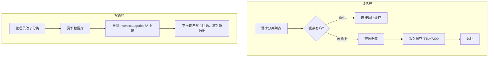
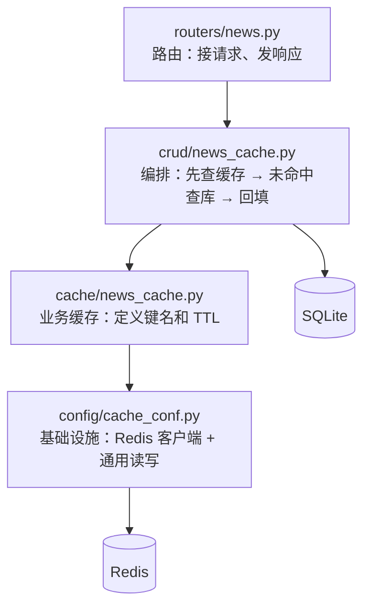

# FastAPI项目-设计缓存策略和缓存新闻列表

上一章封装好了缓存操作函数，本章把它真正用起来：**给新闻分类列表加上缓存**。

内容分三块：缓存策略是什么、Redis 的 `SET` 和 `SETEX` 到底差在哪、以及项目里这套缓存是怎么一层层搭起来的。

前置笔记：[45 · 缓存简介及安装 Redis 服务端](../45-FastAPI项目-缓存简介及安装Redis服务端/45-FastAPI项目-缓存简介及安装Redis服务端.md)、[46 · 封装缓存操作方法](../46-FastAPI项目-封装缓存操作方法/46-FastAPI项目-封装缓存操作方法.md)。

环境：**redis-py 8.1.0 / Redis server 8.10.2**。演示用临时 Redis 实例，跑完已关闭。

## 一、什么是缓存策略

### 1.1 定义

**缓存策略** = 一组约定，规定了这四件事：

| 要回答的问题 | 本项目的答案 |
| --- | --- |
| **什么数据放进缓存** | 变化慢、所有人都要看的数据（新闻分类） |
| **什么时候读缓存、什么时候读数据库** | 先读缓存，没有再读库（Cache-Aside） |
| **缓存活多久** | 按数据稳定性分层设 TTL（分类 7200 秒） |
| **数据变了怎么让缓存失效** | 到期自动失效；数据更新时主动删除 |

**缓存策略不是"怎么存"，而是"什么时候信缓存、什么时候不信"。** 这四个问题里，最难的是最后一个。

### 1.2 Cache-Aside（旁路缓存）

这是最常用的策略，也是本项目用的。核心特征是：**缓存由应用程序主动管理，缓存自己不知道数据库的存在。**

读数据：

```text
1. 先查缓存
2. 命中  → 直接返回
3. 未命中 → 查数据库 → 写入缓存（带 TTL）→ 返回
```

写数据：

```text
1. 更新数据库
2. 删除缓存（注意是删除，不是更新）
```



**为什么写路径是"删除"而不是"更新"？** 两个原因：

1. **删除是幂等的，也更简单。** 更新缓存要重新组织一遍数据结构，逻辑和读路径重复。
2. **更新会有并发顺序问题。** 两个并发的写操作，可能 A 先更新数据库、B 后更新数据库，但缓存里 B 先写、A 后写 —— 结果缓存里永远留着 A 的旧值。删掉它就没这个问题，下次读自然回源拿到正确的。

### 1.3 其他三种策略（对比着理解）

| 策略 | 谁负责读写缓存 | 特点 |
| --- | --- | --- |
| **Cache-Aside**（旁路） | **应用代码** | 最常用；缓存挂了还能走数据库；代码里能看到完整流程 |
| **Read/Write-Through**（读写穿透） | **缓存层自己** | 应用只跟缓存打交道，缓存背后同步读写数据库；要专门的缓存中间件 |
| **Write-Behind**（写回） | 缓存层，异步写库 | 写性能最好；但缓存挂了会丢数据 |
| **Refresh-Ahead**（预刷新） | 缓存层，到期前主动刷新 | 避免过期瞬间的回源高峰；实现复杂 |

后三种都需要缓存层"懂"数据库，通常靠专门的中间件实现。**用 Redis 手写缓存的项目，基本都是 Cache-Aside。**

### 1.4 TTL 分层：按数据稳定性定过期时间

[cache/news_cache.py](../../toutiao_backend/cache/news_cache.py) 里的这段注释其实就是本项目的 TTL 策略：

```python
# 分类、配置: 7200
# 列表：600
# 详情: 1800
# 验证码: 120 -> 数据越稳定，缓存越持久
```

这是一条很实用的经验法则：

| 数据 | TTL | 为什么 |
| --- | --- | --- |
| 新闻分类、系统配置 | 7200 秒（2 小时） | 几乎不变，脏一会儿也没影响 |
| 新闻详情 | 1800 秒（30 分钟） | 发布后基本不改 |
| 新闻列表 | 600 秒（10 分钟） | 有新内容就变，要相对新鲜 |
| 验证码 | 120 秒（2 分钟） | 本身就是短时效的 |

**TTL 的本质是"能容忍数据脏多久"。** 定 TTL 时问自己：这份数据如果晚 N 秒更新，用户会不会有感觉？分类名改了两小时后才生效，没人在意；新闻列表两小时不更新，用户就会觉得这站没人管。

另外，TTL 还是**失效逻辑的兜底**：就算写路径忘了删缓存，数据最多也只脏 TTL 那么久。所以**给缓存设 TTL 应该是默认动作**，不是可选项。

### 1.5 键名设计

```python
CATEGORIES_KEY = "news:categories"
```

用冒号分层是 Redis 的通用约定，好处有三个：

- **看得懂**：`news:categories`、`news:detail:1`、`user:token:abc` 一眼知道是什么
- **好清理**：可以按前缀批量找（用 `SCAN news:*`，不要用 `KEYS`）
- **不撞车**：不同业务用不同前缀，不会互相覆盖

键名**写成模块级常量**而不是散落在各处的字符串字面量，这一点做得对 —— 读和写必须用同一个键，写成常量就不会拼错。

## 二、SET 和 SETEX 的区别

先看真实签名：

```text
SETEX: setex(name, time, value)
SET  : set(name, value, ex=None, px=None, nx=False, xx=False, keepttl=False, get=False, exat=None, pxat=None)
```

**两者都能"设置值 + 设置过期时间"，而且都是单条命令。** 区别在下面几点。

### 2.1 最关键的区别：SET 不带 `ex` 会把已有的 TTL 抹掉

这是最容易踩的坑。实测：

```text
setex 设置后              TTL = 100
set(k, v2) 不带 ex 后      TTL = -1   ← -1 表示永不过期，TTL 没了！
set(k, v3, keepttl=True)  TTL = 100  ← 保住了
set(k, v4, ex=50)         TTL = 50   ← 用新的覆盖
```

**`SET` 默认会重置键的所有元数据，包括过期时间。** 所以：

- 想更新值但保留原来的过期时间 → 必须显式写 `keepttl=True`
- `SETEX` 不存在这个问题，因为它**强制**要求传秒数，想漏都漏不掉

这也是 `SETEX` 在缓存场景下的一个小优势：**它在语法层面就杜绝了"忘记设过期时间"。**

### 2.2 SETEX 的秒数必须是正整数

```text
setex(t,  60, v)  ✅  TTL=60
setex(t,   0, v)  ❌ ResponseError: invalid expire time in 'setex' command
setev(t,  -1, v)  ❌ ResponseError: invalid expire time in 'setex' command
```

传 0 或负数直接报错。如果 `expire` 参数是算出来的（比如"距离某个时间点还有多少秒"），要注意可能算出非正数。

### 2.3 SET 独有的几个开关

`SETEX` 只能干"设置值+过期"这一件事，`SET` 能干的更多。实测：

```text
set(n,'第一次',nx=True) -> True    （键不存在，写入成功）
set(n,'第二次',nx=True) -> None    （键已存在，不覆盖）
现在 n 的值 = '第一次'              ← nx 常用来做分布式锁

set(n,'第三次',xx=True) -> True    （只在存在时才写）
set(m,'x',xx=True)     -> None    （m 不存在，不写）

set(n,'第四次',get=True)-> 返回旧值 '第三次'  （写入同时拿回旧值）
```

| 开关 | 作用 | 典型用途 |
| --- | --- | --- |
| `nx=True` | 只在键**不存在**时写 | **分布式锁**；防止缓存击穿时多个请求同时回源 |
| `xx=True` | 只在键**已存在**时写 | 只想刷新已有缓存，不想凭空创建 |
| `keepttl=True` | 保留原有 TTL | 更新值但不重置过期时间 |
| `get=True` | 写入同时返回旧值 | 原子地"取出并替换" |
| `px` / `exat` / `pxat` | 毫秒级 TTL / 绝对时间点过期 | 精细控制过期时刻 |

`nx=True` 特别值得记 —— **`SET key value NX EX 30` 是实现分布式锁的标准写法**，因为"检查不存在"和"写入"是一个原子操作，不会有两个请求同时抢到锁。

### 2.4 原子性：两者都是一条命令

```text
❌ 反例（两条命令，中间可能崩）:  SET key value  +  EXPIRE key 60
✅ SETEX key 60 value / SET key value EX 60 —— 单条命令，原子完成
```

如果分成 `SET` 再 `EXPIRE` 两条，万一中间进程崩了或网络断了，就会留下一个**永不过期的键**。缓存里堆满这种键，内存迟早满。

**所以写缓存永远用带过期时间的单条命令**，不要拆成两步。

### 2.5 该用哪个

| | `SETEX` | `SET(..., ex=...)` |
| --- | --- | --- |
| 强制带过期时间 | ✅ 语法上强制 | ❌ 可以漏写 |
| 支持 nx / xx / keepttl / get | ❌ | ✅ |
| 毫秒级 / 绝对时间过期 | ❌ | ✅ |
| redis-py 状态 | **已标记废弃** | 推荐 |

redis-py 里调用 `setex` 会看到：

```text
DeprecationWarning: Call to deprecated setex. (Use 'set' instead.) -- Deprecated since version 2.6.12.
```

**Redis 官方文档也把 `SETEX` 标为"自 2.6.12 起由 `SET` 的 `EX` 选项取代"。** 新代码推荐 `set(key, value, ex=seconds)`。

项目当前 [cache_conf.py](../../toutiao_backend/config/cache_conf.py) 用的是 `setex`：

```python
return await redis_client.setex(key, expire, value)
```

功能完全正常，实测写入和 TTL 都对：

```text
存字符串 -> True   redis 里: 'hello'                      TTL=60
存列表   -> True   redis 里: '[{"id": 1, "name": "头条"}]'  TTL=60
```

学习阶段用 `setex` 没问题，而且它"强制带过期"这一点对新手反而是保护。知道有废弃这回事，以后写新代码时换成 `set(..., ex=...)` 就好。

## 三、项目实现：新闻分类缓存

### 3.1 四层结构

这次改造的代码分在四个文件里，职责逐层收窄：



| 层 | 文件 | 知道什么 | 不知道什么 |
| --- | --- | --- | --- |
| 基础设施 | `config/cache_conf.py` | 怎么连 Redis、怎么序列化 | 不知道"新闻""分类"是什么 |
| 业务缓存 | `cache/news_cache.py` | 分类的键名叫什么、TTL 多久 | 不知道数据从哪来 |
| 编排 | `crud/news_cache.py` | 先查缓存后查库这个流程 | 不关心 Redis 的细节 |
| 路由 | `routers/news.py` | 接口路径、响应格式 | 完全不知道有缓存 |

**最值得注意的是最后一行：路由层对缓存一无所知。** 这意味着以后想去掉缓存、换成别的缓存，路由代码一行都不用改。

### 3.2 第一层：`config/cache_conf.py`

这是第 46 章做的，提供与业务无关的通用能力：

```python
redis_client = redis.Redis(host=..., port=..., db=0, decode_responses=True)

async def get_json_cache(key: str) -> Any: ...      # 读并 json.loads
async def set_cache(key, value, expire=3600) -> bool: ...  # dict/list 自动 json.dumps
async def delete_cache(key: str) -> bool: ...
```

关键点：**这一层只认"键"和"值"，不认业务概念。** 它不知道什么是新闻分类，也不该知道。

### 3.3 第二层：`cache/news_cache.py`

```python
from config.cache_conf import get_json_cache, set_cache

CATEGORIES_KEY = "news:categories"

async def get_news_categories() -> Any:
    return await get_json_cache(CATEGORIES_KEY)

async def set_news_categories(categories: List[Dict[str, Any]], expire: int = 7200) -> bool:
    return await set_cache(CATEGORIES_KEY, categories, expire)
```

这一层薄得几乎像是多余的，但它把两件事固定了下来：**这份数据的键名**和**它的 TTL**。

好处是：读缓存和写缓存用的是同一个常量，不会一边写 `news:categories` 一边读 `news:category`；TTL 也只在这里出现一次，要调只改一处。

以后加新闻详情缓存，就在这个文件里加 `NEWS_DETAIL_KEY = "news:detail:{id}"` 和对应的一对函数，形式完全一样。

### 3.4 第三层：`crud/news_cache.py` —— Cache-Aside 的实际编排

```python
async def get_category_list(skip=0, limits=100, db=Depends(get_db)):
    # 1. 先从缓存中获取
    cached_categories = await get_news_categories()
    if cached_categories is not None:
        return cached_categories

    # 2. 未命中：查数据库
    stmt = select(Category).offset(skip).limit(limits)
    result = await db.execute(stmt)
    cache_categories = result.scalars().all()

    # 3. 回填缓存
    if cache_categories is not None:
        cached_categories = jsonable_encoder(cache_categories)
        await set_news_categories(cached_categories, expire=7200)
    return cached_categories
```

这就是 1.2 节那三步的逐字翻译。两个细节值得说：

**判断用的是 `is not None` 而不是 `if cached_categories:`。** 这很重要 —— 如果缓存里存的是一个空列表 `[]`，`if []` 是假，会被当成"未命中"又去查一次库。用 `is not None` 才能区分"缓存里没有"和"缓存里存的就是空的"。

**回源查库用的是同一个 `db` 会话。** 缓存层和数据库层共用一次请求的事务，不会额外开连接。

### 3.5 第四层：`routers/news.py`

```python
@router.get("/categories")
async def get_category_news(skip:int=0, limit:int=100, db: AsyncSession = Depends(get_db)):
    category_list = await news_cache.get_category_list(skip, limit, db)
    return {"code": 200, "msg": "success", "data": category_list}
```

对比改造前被注释掉的那行：

```python
#category_list = await news.get_category_list(skip, limit, db)      # 改造前：直接查库
category_list = await news_cache.get_category_list(skip, limit, db) # 改造后：走缓存
```

**路由层的改动只有一个词**：`news` → `news_cache`。函数签名、参数、返回结构全都没变，这正是分层的价值。

### 3.6 为什么必须先过 `jsonable_encoder`

```python
cached_categories = jsonable_encoder(cache_categories)
```

这一行不能省。`select(Category)` 查出来的是 **ORM 对象列表**，而 Redis 只能存字符串。实测直接序列化会失败：

```text
查出来的是: Category 对象（ORM 实例）
直接 json.dumps(ORM 对象)   -> ❌ TypeError: Object of type Category is not JSON serializable
jsonable_encoder 之后       -> ✅ list，第一项 dict
   datetime 被转成了: '2026-09-14T09:03:21'  类型 str
直接 json.dumps(datetime)  -> ❌ TypeError: Object of type datetime is not JSON serializable
```

`jsonable_encoder` 干了两件 `json.dumps` 干不了的事：

1. 把 **ORM 对象**转成 dict
2. 把 **`datetime`** 转成 ISO 8601 字符串

它是 FastAPI 提供的工具，平时返回响应时 FastAPI 自己在用（见 [41 章](../41-FastAPI项目-检查新闻收藏状态/41-FastAPI项目-检查新闻收藏状态.md) 第五节），这里我们手动调用它，把数据变成"能存进 Redis 的形状"。

> 注意一个副作用：`jsonable_encoder` 会把 ORM 对象的**所有字段**都转出来，包括 `created_at`、`updated_at`。实测缓存里存的是这样：
>
> ```json
> {"created_at": "2026-09-14T09:03:21", "id": 1, "name": "头条", "sort_order": 1, "updated_at": "2026-09-14T09:03:21"}
> ```
>
> 前端其实只要 `id` 和 `name`。想只缓存需要的字段，可以先过一遍 Pydantic 响应模型再 `jsonable_encoder`。

### 3.7 端到端验证

连续请求两次 `/api/news/categories`，统计发出了几条 SELECT：

```text
第 1 次 -> HTTP 200  发出 SELECT 1 条  (未命中，回源查库)
         返回 ['头条', '社会', '国内', '国际', '娱乐', '体育', '科技', '财经']
第 2 次 -> HTTP 200  发出 SELECT 0 条  (命中缓存)
         返回 ['头条', '社会', '国内', '国际', '娱乐', '体育', '科技', '财经']
```

**第二次请求一条 SQL 都没发**，说明 Cache-Aside 生效了。

Redis 里实际存的内容：

```text
键名 : news:categories
TTL  : 7200 秒
类型 : string
长度 : 928 字节
内容 : [{"created_at": "2026-09-14T09:03:21", "id": 1, "name": "头条", "sort_order": 1, ...}, ...]
```

注意 **类型是 `string`** —— 虽然存的是一个列表，但在 Redis 眼里它就是一串 JSON 文本。这也是为什么读的时候必须用 `get_json_cache` 而不是 `get_cache`。

也可以直接用 `redis-cli` 看：

```bash
redis-cli TTL news:categories
```

```bash
redis-cli GET news:categories
```

## 四、两个可以再打磨的地方

不影响本章功能，但值得知道。

### 4.1 `delete_cache()` 目前不工作

```python
return await redis_client.delete(key=key)
```

`delete` 的签名是 `delete(*names)` —— **只收位置参数**。写成 `key=key` 会报错，实测：

```text
delete 的真实签名: (self, *names: 'KeyT') -> 'int | Awaitable[int]'
删除缓存失败: BasicKeyCommands.delete() got an unexpected keyword argument 'key'
delete_cache('c:str') 返回 False
键真的被删了吗: 1  (0=已删除)
```

改成 `redis_client.delete(key)` 即可（去掉 `key=`）。

这个函数现在还没被调用，所以没有暴露出来。但它是 **1.2 节写路径的关键一环** —— 等做到"管理员改了分类要让缓存失效"时，就必须依赖它。

### 4.2 缓存键没有包含 `skip` / `limit`

接口接收 `skip` 和 `limit` 参数，但缓存键固定是 `news:categories`。实测：

```text
先请求 ?skip=0&limit=3   -> 返回 3 条（回源查库，limit 生效）
再请求 ?skip=0&limit=100 -> 返回 3 条（命中了上一次的缓存）
```

第二次请求要 100 条，却拿到了上一次缓存的 3 条。

这不算 bug —— 分类一共就 8 条，实际调用也从不分页。但它揭示了一条通用规则：**缓存键必须包含所有影响结果的参数**。比如新闻列表按分类和页码查，键就得是 `news:list:{category_id}:{page}`，否则不同的查询会互相串。

分类列表更合适的做法是**干脆不接收分页参数**，永远返回全部 8 条 —— 数据本来就少，分页没有意义，键也就天然唯一了。

## 五、本篇核对了哪些实际行为

演示用 Redis 为临时实例（跑完已 `shutdown`），数据库用的是副本：

| 验证内容 | 结果 |
| --- | --- |
| 修正后的 `set_cache` 存字符串 / 列表 | 均成功，TTL 正确 |
| `SET` 不带 `ex` 覆盖已有键 | **TTL 变成 -1**，过期时间被抹掉 |
| `SET` 带 `keepttl=True` | TTL 保留为 100 |
| `SETEX` 传 0 或 -1 | `ResponseError: invalid expire time` |
| `SET` 的 `nx` / `xx` / `get` | 行为均符合预期，`nx` 在键存在时返回 `None` |
| 两次请求 `/api/news/categories` | 第 1 次 1 条 SELECT，**第 2 次 0 条** |
| Redis 里的分类缓存 | 键 `news:categories`，类型 `string`，TTL 7200，928 字节 |
| `json.dumps(ORM 对象)` | `TypeError: not JSON serializable` |
| `json.dumps(datetime)` | `TypeError: not JSON serializable` |
| `jsonable_encoder` 之后 | ORM → dict，`datetime` → ISO 字符串 |
| `delete_cache()` | **`TypeError`，键未被删除** |
| 不同 `limit` 请求 | 第二次命中了第一次的缓存，键不区分参数 |

相关笔记：[45 · 缓存简介及安装 Redis 服务端](../45-FastAPI项目-缓存简介及安装Redis服务端/45-FastAPI项目-缓存简介及安装Redis服务端.md)、[46 · 封装缓存操作方法](../46-FastAPI项目-封装缓存操作方法/46-FastAPI项目-封装缓存操作方法.md)、[41 · 检查新闻收藏状态](../41-FastAPI项目-检查新闻收藏状态/41-FastAPI项目-检查新闻收藏状态.md)。
