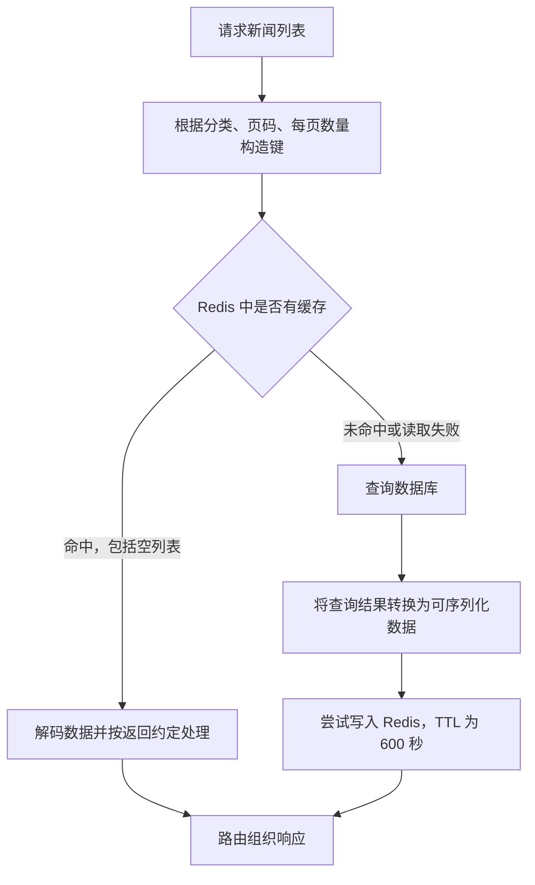

# FastAPI项目-缓存新闻列表

上一章给新闻分类列表加上了缓存，本章继续缓存**某个分类、某一页的新闻列表**。这次不仅要设计分页缓存键，还要处理 SQLAlchemy 查询结果、Python 字典和 JSON 之间的转换。

本篇按当前项目的四层结构展开：`config/cache_conf.py` → `cache/news_cache.py` → `crud/news_cache.py` → `routers/news.py`，再解释 `scalars()` 和 `mappings()` 两种查询结果如何进入缓存。

前置笔记：[47 · 设计缓存策略和缓存新闻列表](../47-FastAPI项目-设计缓存策略和缓存新闻列表/47-FastAPI项目-设计缓存策略和缓存新闻列表.md)、[46 · 封装缓存操作方法](../46-FastAPI项目-封装缓存操作方法/46-FastAPI项目-封装缓存操作方法.md)。

> 本篇的代码是用于学习的整理示例，没有修改后端实现。当前代码在缓存命中时返回 `News` 对象列表，未命中时返回字典列表；下文分别给出**统一返回字典**和**统一返回 ORM 对象**的写法，不把这两种返回约定混在一起。

## 一、先明确这次缓存什么

### 1.1 分类列表和新闻列表的区别

分类列表通常只有少量数据；新闻列表会受到分类、页码和每页数量的影响，不能把所有请求都写进同一个 `news:list` 键。

| 请求参数 | 缓存键示例 | 含义 |
| --- | --- | --- |
| `categoryId=1&pageNum=1&pageSize=10` | `news:list:1:1:10` | 分类 1，第 1 页，每页 10 条 |
| `categoryId=1&pageNum=2&pageSize=10` | `news:list:1:2:10` | 分类 1，第 2 页，每页 10 条 |
| `categoryId=2&pageNum=1&pageSize=10` | `news:list:2:1:10` | 分类 2，第 1 页，每页 10 条 |
| `categoryId=1&pageNum=1&pageSize=20` | `news:list:1:1:20` | 分类 1，第 1 页，每页 20 条 |

规则是：**影响查询结果的参数，应参与缓存键的构造。** 后续如果增加搜索关键词、排序方式，也要相应调整键名。

### 1.2 本次仍然使用旁路缓存



这里缓存的是响应中的 `data.list`。当前路由中的新闻总数 `total` 仍单独查询数据库，`has_more` 则由总数、偏移量和列表长度计算。

因此，**新闻列表缓存命中，不代表整个接口不再执行 SQL**。

## 二、从底层到路由：缓存新闻列表的步骤

### 2.1 第一步：`config/cache_conf.py` 提供通用读写

对应文件：[config/cache_conf.py](../../toutiao_backend/config/cache_conf.py)。

这一层负责连接 Redis、JSON 编解码和异常处理，不负责新闻分类、页码等业务参数。

```python
import json
from typing import Any

import redis.asyncio as redis

redis_client = redis.Redis(
    host="localhost",
    port=6379,
    db=0,
    decode_responses=True,
)


async def get_json_cache(key: str) -> Any:
    try:
        value = await redis_client.get(key)
        if value is None:
            return None
        return json.loads(value)
    except Exception as e:
        print(f"获取缓存失败: {e}")
        return None


async def set_cache(key: str, value: Any, expire: int = 3600) -> bool:
    try:
        if isinstance(value, (dict, list)):
            value = json.dumps(value, ensure_ascii=False)
        return await redis_client.setex(key, expire, value)
    except Exception as e:
        print(f"设置缓存失败: {e}")
        return False
```

需要区分三个操作：

- `decode_responses=True`：让 Redis 客户端把响应字节解码为 Python 字符串，**不会自动解析 JSON**。
- `json.dumps()`：把 Python 列表、字典等可序列化数据转换为 JSON 字符串；`ensure_ascii=False` 让中文直接保留在文本中。
- `json.loads()`：把 JSON 字符串解析为 Python 列表、字典等对象，**不会自动创建 ORM 对象**。

这里使用的是 Redis 的 **string 类型来存 JSON 文本**。Redis 也支持其他数据类型，并不是只能保存字符串。

项目当前调用 `setex(key, expire, value)`，顺序是“键、秒数、值”。也可以写成：

```python
return await redis_client.set(key, value, ex=expire)
```

不要混用两套参数，写成 `setex(key, value, ex=expire)`。两者的详细区别见第 47 篇。

如果 Redis 没启动，读取函数返回 `None`，业务层继续查询数据库；写入函数返回 `False`，只要业务层继续返回数据库结果，接口仍然可以成功。**接口成功与缓存写入成功是两件事。**

### 2.2 第二步：`cache/news_cache.py` 封装业务键名

对应文件：[cache/news_cache.py](../../toutiao_backend/cache/news_cache.py)。

```python
from typing import Any, Optional

from config.cache_conf import get_json_cache, set_cache

NEWS_LIST_KEY = "news:list"


async def get_cache_news_list(
    category_id: Optional[int],
    page: int,
    page_size: int,
) -> Any:
    key = f"{NEWS_LIST_KEY}:{category_id if category_id else 'all'}:{page}:{page_size}"
    return await get_json_cache(key)


async def set_cache_news_list(
    category_id: Optional[int],
    page: int,
    page_size: int,
    news_list: list[dict[str, Any]],
    expire: int = 1800,
) -> bool:
    key = f"{NEWS_LIST_KEY}:{category_id if category_id else 'all'}:{page}:{page_size}"
    return await set_cache(key, news_list, expire)
```

**读和写必须使用完全相同的键名规则。** 这一层只负责定位缓存，不查询数据库。

当前函数默认 TTL 为 `1800` 秒，但新闻列表业务调用时显式传入 `expire=600`，所以本次新闻列表的实际 TTL 是 **600 秒，即 10 分钟**。

`all` 只是当前键名函数预留的占位：这里 `None` 或 `0` 都会得到 `all`。当前路由要求整数分类 ID，CRUD 查询始终包含分类过滤条件；**键名里有 `all`，不代表已经实现“查询全部分类”**。

### 2.3 第三步：`crud/news_cache.py` 编排缓存和数据库

对应文件：[crud/news_cache.py](../../toutiao_backend/crud/news_cache.py)。

先采用当前列表路由足够使用的方案：**两个分支都返回字段字典列表**。

```python
from fastapi import Depends
from fastapi.encoders import jsonable_encoder
from sqlalchemy import select
from sqlalchemy.ext.asyncio import AsyncSession

from cache.news_cache import get_cache_news_list, set_cache_news_list
from config.db_conf import get_db
from models.news import News


async def get_category_news_list(
    category_id: int,
    skip: int = 0,
    page_size: int = 10,
    db: AsyncSession = Depends(get_db),
):
    # 路由传来的 skip = (page - 1) * page_size。
    page = skip // page_size + 1

    # 1. 命中缓存：已经是 list[dict]，可以直接返回。
    cached_news_list = await get_cache_news_list(category_id, page, page_size)
    if cached_news_list is not None:
        return cached_news_list

    # 2. 未命中：查询 ORM 对象列表。
    stmt = (
        select(News)
        .where(News.category_id == category_id)
        .offset(skip)
        .limit(page_size)
    )
    result = await db.execute(stmt)
    news_list = result.scalars().all()

    # 3. ORM 列表转换为字段字典列表，时间字段转换为字符串。
    cache_data = jsonable_encoder(news_list)

    # 4. 尝试回填；set_cache 失败会返回 False，不阻止返回查询结果。
    await set_cache_news_list(category_id, page, page_size, cache_data, expire=600)
    return cache_data
```

这段代码有四个细节：

1. **使用 `//` 计算整数页码。** `/` 会得到 `1.0`，最终拼成 `news:list:1:1.0:10`，与整数页码的键不同。
2. **判断命中用 `is not None`。** 空列表 `[]` 也是有效缓存，表示当前分类的这一页没有新闻，不应该每次都回源。
3. **`scalars().all()` 无记录时返回空列表。** 不必再通过 `if news_list is not None` 判断有没有结果，可以直接编码并缓存 `[]`。
4. **缓存命中与未命中的返回结构相同。** 此示例两个分支都返回 `list[dict]`，路由无需判断数据来自哪里。

页码换算以 `page_size > 0`、`skip` 来自整页偏移量为前提。如果函数允许任意 `skip`，应直接把偏移量放进键中，避免不同偏移量换算成同一页。接口也应校验 `pageNum >= 1`、`pageSize >= 1`；当前路由还没有这些范围限制。

### 2.4 第四步：`routers/news.py` 调用缓存版本

对应文件：[routers/news.py](../../toutiao_backend/routers/news.py)。

```python
@router.get("/list")
async def get_category_news_list(
    category_id: int = Query(1, description="分类ID", alias="categoryId"),
    page: int = Query(1, description="页码", alias="pageNum"),
    page_size: int = Query(10, description="每页数量", alias="pageSize"),
    db: AsyncSession = Depends(get_db),
):
    offset = (page - 1) * page_size

    # 从原来的 news.get_category_news_list 切换到缓存版本。
    news_list = await news_cache.get_category_news_list(
        category_id, offset, page_size, db
    )
    news_count = await news.get_category_news_count(category_id, db)

    return {
        "code": 200,
        "msg": "success",
        "data": {
            "list": news_list,
            "total": news_count,
            "has_more": news_count > offset + len(news_list),
        },
    }
```

这里保留原文件的导入和 `router` 定义，只展示路由函数。它只需要列表本身和列表长度，不需要执行 `item.title` 等属性访问，所以字典列表可以满足要求。

当前路由没有声明 `response_model`。普通返回值会由 FastAPI 编码为 JSON 响应，前端收到的是 JSON 数据，不会收到 Python ORM 实例。

## 三、SQLAlchemy 对象与 JSON 的互相转换

### 3.1 先区分 ORM 对象、字典和 JSON 文本

| 数据形态 | 示例 | Python 中怎么使用 |
| --- | --- | --- |
| ORM 对象 | `News(id=1, title="示例新闻")` | `item.title` |
| Python 字典 | `{"id": 1, "title": "示例新闻"}` | `item["title"]` |
| JSON 字符串 | `'[{"id": 1, "title": "示例新闻"}]'` | 先用 `json.loads()` 解析 |

**字典不是 JSON 字符串，`jsonable_encoder()` 也不是 `json.dumps()`。** 两者分别负责把对象变成可序列化的数据，以及把数据编码成文本。

```text
写入缓存：
list[News] → jsonable_encoder → list[dict] → json.dumps → JSON 字符串 → Redis

读取缓存：
Redis → JSON 字符串 → json.loads → list[dict]
                                      ↓ 按调用方的需要选择
                                直接返回 / 构造 News 对象
```

### 3.2 ORM → Python 字典 → JSON

```python
import json
from datetime import datetime

from fastapi.encoders import jsonable_encoder
from models.news import News

news_item = News(
    id=1,
    category_id=1,
    title="示例新闻",
    content="新闻正文",
    publish_time=datetime(2026, 9, 22, 10, 30),
)

data = jsonable_encoder(news_item)  # dict；publish_time 变成字符串
json_text = json.dumps(data, ensure_ascii=False)  # str
```

不能直接写 `json.dumps(news_item)`：标准 JSON 编码器不认识 SQLAlchemy ORM 实例。直接序列化包含 `datetime` 的普通字典，也会遇到时间对象不可序列化的问题。

对本项目已加载的字段，`jsonable_encoder()` 会处理 ORM 属性和时间值，默认跳过 `_sa_instance_state` 等 SQLAlchemy 内部状态。它不是严格的字段白名单；如果接口只允许返回部分字段，应显式选择字段或使用 Pydantic 响应模型。

### 3.3 JSON → Python 字典 → ORM

```python
data = json.loads(json_text)  # dict；时间仍是字符串
news_item = News(**data)     # 创建一个 News 实例
```

`**data` 表示把字典展开成关键字参数，例如：

```python
News(**{"id": 1, "title": "示例新闻"})
# 等价于：
News(id=1, title="示例新闻")
```

字典的键应与模型属性对应，例如 `category_id`、`publish_time`。如果缓存的是响应别名 `categoryId`、`publishTime`，必须先映射回来，不能原样传给 `News`。

但“成功创建对象”不等于“恢复所有字段的 Python 类型”。**SQLAlchemy 构造函数不会根据 `Mapped[datetime]` 自动把字符串转成 `datetime`。**

本项目的 [News 模型](../../toutiao_backend/models/news.py) 有 `publish_time`，继承的 [Base](../../toutiao_backend/models/Bases.py) 还有 `created_at` 和 `updated_at`。需要在反序列化时恢复这三个字段：

```python
from datetime import datetime

from models.news import News


def news_from_cache(item: dict) -> News:
    data = item.copy()
    for field in ("publish_time", "created_at", "updated_at"):
        value = data.get(field)
        if isinstance(value, str):
            data[field] = datetime.fromisoformat(value)
    return News(**data)
```

这里使用 `copy()` 避免直接修改传入的字典；值为 `None` 或已经是 `datetime` 时保留原值。该函数针对本项目生成的 ISO 时间字符串和字段结构，其他模型中的特殊类型需要另外处理。

### 3.4 如果调用方要求 ORM，两个分支都返回 ORM

下面是 2.3 节 CRUD 函数的**替代方案**，复用其导入以及上面的 `news_from_cache()`：

```python
async def get_category_news_list(
    category_id: int,
    skip: int = 0,
    page_size: int = 10,
    db: AsyncSession = Depends(get_db),
):
    page = skip // page_size + 1
    cached_news_list = await get_cache_news_list(category_id, page, page_size)

    if cached_news_list is not None:
        return [news_from_cache(item) for item in cached_news_list]

    stmt = (
        select(News)
        .where(News.category_id == category_id)
        .offset(skip)
        .limit(page_size)
    )
    result = await db.execute(stmt)
    news_list = result.scalars().all()

    # 只把编码后的数据交给缓存；保留查询得到的 ORM 对象列表。
    await set_cache_news_list(
        category_id, page, page_size, jsonable_encoder(news_list), expire=600
    )
    return news_list
```

这与当前实现有一个区别：当前未命中分支把 `cached_news_list` 覆盖成了 `jsonable_encoder()` 的结果，最后返回的是字典列表。上面的写法保留 `news_list`，避免出现“命中时可以 `.title`，未命中时却不能”的差异。

### 3.5 重建 ORM 不会恢复数据库 Session

| 来源 | 对象类型 | 与当前 Session 的关系 |
| --- | --- | --- |
| 当前 `db.execute(select(News))` 查询得到 | `News` | 由当前 Session 管理（persistent） |
| `News(**data)` 重建得到 | `News` | 临时对象（transient），没有关联 Session |

缓存重建的对象可以读取属性、计算时间、序列化为响应。但对它修改 `title` 后调用 `db.commit()`，**不会自动更新数据库记录**。

#### 为什么？因为它是 transient，不是 detached

这是最关键、也最反直觉的一点。实测：

```python
cached = {"id": 1, "category_id": 1, "title": "从缓存重建的标题", ...}
obj = News(**cached)
```

```text
News(**cached) -> 状态 = transient   （注意：带了主键 id=1，但仍是 transient）
inspect(obj).identity = None         ← None！Session 不认识它的身份
```

**虽然字典里有 `id=1`，但 SQLAlchemy 并不把它当成"数据库里那一行"。**

对照 [08-ORM对象](../00-python基础补充/08-ORM对象.md) 第二节讲的：ORM 对象 = 列值 + 一本记账本。`News(**cached)` 只填了列值，**记账本是空的** —— `identity` 是 `None`，没有 Session，没有改动历史。对 SQLAlchemy 来说，它和 `News(title="全新的新闻")` 没有区别，就是一个**还没入库的新对象**。

`id=1` 在它眼里只是"你给这个新对象预设了一个主键值"，而不是"这是数据库里 id=1 的那一行"。

#### 所以 `db.add()` 会发 INSERT，不是 UPDATE

回顾 [40 章第六节](../40-FastAPI项目-修改用户密码/40-FastAPI项目-修改用户密码.md)：`add()` 的作用是"把对象纳入 Session 管理"，发 INSERT 还是 UPDATE **取决于对象状态**。

transient → `add()` → pending → flush 时发 **INSERT**。实测：

```text
add() 之后 -> 状态 = pending   ← flush 时会发 INSERT
flush -> 发出 ['INSERT']
❌ IntegrityError: (sqlite3.IntegrityError) UNIQUE constraint failed: news.id
→ 主键 1 已存在，INSERT 撞唯一约束
```

**`add()` 不是"不起作用"，而是起了错误的作用** —— 它老老实实地想插入一条新记录，结果撞上了已存在的主键。

> 如果缓存里的字段不全，报错会更早、更让人困惑。比如只缓存了部分字段时会先撞 `NOT NULL constraint failed: news.publish_time` —— 看起来像是"字段没填全"，实际根源仍是"走了 INSERT 而不是 UPDATE"。

#### 怎样把重建的对象真正关联回数据库

实测三种可行做法：

```text
A. await db.merge(obj)   SQL=['SELECT', 'UPDATE']   改动落在 merge 返回的对象上
B. db.get() 再改          SQL=['SELECT', 'UPDATE']   最直白
C. Core update() 语句     SQL=['UPDATE']             连对象都不用
```

**做法 A：`merge()` —— 专门干这件事的工具**

```python
obj = news_from_cache(item)      # transient
obj.title = "改过的标题"
merged = await db.merge(obj)     # ← 这里
await db.flush()                 # 发出 UPDATE
```

`merge()` 做了三步：按主键去数据库 `SELECT` 出那一行 → 拿到（或复用）一个 persistent 对象 → 把你这个对象上的值**盖到它身上**。

实测：

```text
merge 发出的 SQL = ['SELECT']   ← 先 SELECT 把数据库里那行读进来
merged 的状态     = persistent
merged is obj ?   = False        ← 注意：返回的是【另一个】对象！
obj 自己还是       = transient    ← 原对象没有被挂上去
merged.title      = '从缓存重建的标题'   ← 缓存里的值已经盖上去了
flush -> 发出 ['UPDATE']         ← 这次是 UPDATE，不是 INSERT
```

**最容易踩的坑在倒数第三行：`merge()` 返回的是一个新对象，传进去的那个仍然是 transient。** 必须用返回值：

```python
merged = await db.merge(obj)   # ✅ 用返回值
await db.merge(obj)            # ❌ 丢掉返回值，后续改 obj 依然无效
```

**做法 B：干脆重新查一次**

```python
live = await db.get(News, item["id"])   # Session 管理的 persistent 对象
live.title = "改过的标题"
await db.flush()
```

SQL 次数和 `merge()` 一样（都是 SELECT + UPDATE），但语义更直白，也不会有"返回的是另一个对象"这种陷阱。**大多数情况下这是更好的选择。**

**做法 C：根本不碰对象，直接发 UPDATE**

```python
await db.execute(update(News).where(News.id == item["id"]).values(title="改过的标题"))
```

只有一条 `UPDATE`，连 SELECT 都省了。**如果你已经明确知道要改哪一行的哪些字段，这是最省事的做法** —— 和 [40 章](../40-FastAPI项目-修改用户密码/40-FastAPI项目-修改用户密码.md) 改密码用的是同一套写法。

#### 进阶：`make_transient_to_detached()` 及其陷阱

SQLAlchemy 提供了一个把 transient 对象"认领"成 detached 的函数：

```python
from sqlalchemy.orm import make_transient_to_detached

obj = News(**cached)
make_transient_to_detached(obj)   # transient → detached，identity 被设成 (1,)
db.add(obj)                        # detached + add → 重新挂回 Session
```

```text
make_transient_to_detached 后 -> detached  identity=(1,)
```

**但它有一个很隐蔽的陷阱：它会清空改动历史。** 实测改动写在前后，结果完全不同：

```text
改 title 在 make_transient_to_detached 之【前】
   flush 发出 -> （什么也没发）        ← 改动被静默丢弃！

改 title 在 make_transient_to_detached 之【后】
   flush 发出 -> ['UPDATE news SET title=?, updated_at=? WHERE news.id = ?']
```

先改后转换，**改动无声无息地消失了，也不报错**。这种 bug 极难排查。

对比 `merge()` 就稳妥得多 —— 它是靠"和数据库里的行比对差异"来决定 UPDATE 什么，不依赖改动历史：

```text
merge -> ['SELECT ...', 'UPDATE news SET title=?, updated_at=? WHERE news.id = ?']
```

**结论：除非很清楚自己在做什么，否则不要用 `make_transient_to_detached()`。**

#### 决策表

| 你想干什么 | 用什么 | 为什么 |
| --- | --- | --- |
| 只是读字段、拼响应 | **别重建 ORM**，直接用字典或 Pydantic 模型 | 最省事，见下 |
| 要改一两个已知字段 | **Core `update()`** | 一条 SQL，不用对象 |
| 要改多个字段、逻辑复杂 | **`db.get()` 重新查**再改 | 语义直白，没有陷阱 |
| 手上已有一个完整对象要整体覆盖 | **`await db.merge(obj)`**，用返回值 | 专门为此设计 |
| `db.add(重建对象)` | ❌ 不要 | 会发 INSERT，撞主键 |
| `make_transient_to_detached()` | ⚠️ 除非很清楚 | 会静默丢弃之前的改动 |

#### 最后：多数情况根本不需要重建 ORM

**缓存的用途是"读"。** 如果只是希望用 `.title` 这种属性访问、校验字段或统一响应格式，用 Pydantic 响应模型就够了：

```python
class NewsItem(BaseModel):
    id: int
    title: str
    publish_time: datetime            # Pydantic 会自动把 ISO 字符串转成 datetime
    model_config = ConfigDict(from_attributes=True)

items = [NewsItem(**item) for item in cached_news_list]
items[0].title        # 照样能点出来
```

比重建 ORM 好在三点：**Pydantic 会自动做类型转换**（不用手写 `news_from_cache` 里那段 `datetime.fromisoformat`）、**字段缺失会立刻报错**而不是留下一个半残对象、**不会让人误以为它能写回数据库**。

**判断标准很简单：这份数据是要"写回去"，还是只是"看一眼"？** 只是看一眼，就别把它变回 ORM 对象。

## 四、如果使用 `result.mappings().all()`，怎么存取缓存

### 4.1 `mappings()` 不等于“自动展开模型字段”

**结果的结构首先取决于 `select()` 选择了什么。** `mappings()` 只是让每行结果按映射方式访问，返回的元素是 `RowMapping`，不是 `News` 实例。

| 查询和取值方式 | 每个元素的结构（示意） |
| --- | --- |
| `select(News)` + `scalars().all()` | 一个 `News` ORM 实例 |
| `select(News)` + `mappings().all()` | `{"News": News对象}` |
| `select(News.id, News.title)` + `mappings().all()` | `{"id": 1, "title": "示例新闻"}` |
| `select(News.__table__)` + `mappings().all()` | 包含表中各列的字段映射 |

每种取值方式应使用一次新的查询结果；不要先对同一个 `result` 调用 `.all()`，再期望另一种 `.all()` 还能读到相同数据。

### 4.2 查询整个实体：先取出 `row["News"]` 再缓存

对于当前简单的 `select(News)` 查询，可以继续使用 `mappings()`，但应先取出里面的 ORM 实体，再编码为扁平的字段字典列表。

写入缓存，以下片段放在未命中的分支中，沿用当前 `db` 和分页参数：

```python
stmt = (
    select(News)
    .where(News.category_id == category_id)
    .offset(skip)
    .limit(page_size)
)
result = await db.execute(stmt)
rows = result.mappings().all()

news_list = [row["News"] for row in rows]
cache_data = jsonable_encoder(news_list)

await set_cache_news_list(category_id, page, page_size, cache_data, expire=600)
```

写进去的结构与 `scalars()` 方案一致：

```json
[
  {"id": 1, "title": "示例新闻", "category_id": 1}
]
```

这里和后面的 JSON 示例都只展示部分字段，便于观察结构。

读取缓存时，按返回约定选择：

```python
cached_news_list = await get_cache_news_list(category_id, page, page_size)
if cached_news_list is not None:
    # 方案 A：路由需要字段字典列表。
    return cached_news_list

    # 方案 B：若要求 ORM，使用下面这一行替换上面的 return。
    # return [news_from_cache(item) for item in cached_news_list]
```

未命中分支也要对应返回 `cache_data` 或 `news_list`，保持约定一致。对只查询一个实体的场景，`scalars()` 可以省去手动取 `row["News"]` 这一步。

### 4.3 如果已经把带 `"News"` 的嵌套结构存进 Redis

当初的报错来自这组操作：

```python
rows = result.mappings().all()  # 此 result 来自 select(News)
cache_data = jsonable_encoder(rows)
await set_cache_news_list(category_id, page, page_size, cache_data, expire=600)
```

编码后，`News` 实例变成了字典，但外层的 `"News"` 键仍然存在：

```json
[
  {
    "News": {
      "id": 1,
      "title": "示例新闻",
      "category_id": 1
    }
  }
]
```

此时对外层 `item` 调用 `News(**item)`，相当于：

```python
News(News={"id": 1, "title": "示例新闻", "category_id": 1})
```

模型没有名为 `News` 的属性，因此报错：

```text
TypeError: 'News' is an invalid keyword argument for News
```

如果选择保留这种嵌套缓存格式，就必须在读取时解包：

```python
cached_rows = await get_cache_news_list(category_id, page, page_size)
if cached_rows is not None:
    # 统一返回字段字典列表时：
    return [item["News"] for item in cached_rows]

    # 统一返回 ORM 时，用下面这一行替换上面的 return：
    # return [news_from_cache(item["News"]) for item in cached_rows]
```

未命中时同样要解包后返回。例如字典方案返回 `[item["News"] for item in cache_data]`；ORM 方案返回 `[row["News"] for row in rows]`。

**这种格式可以存取，但存储和读取必须约定好同一层结构。** 对当前新闻列表，更容易维护的是 4.2 节的扁平格式。

### 4.4 查询具体列：`mappings()` 直接得到字段映射

如果只需要新闻 ID 和标题，可以选择具体的列：

```python
stmt = select(News.id, News.title).where(News.category_id == category_id)
result = await db.execute(stmt)
rows = result.mappings().all()
# 每一项类似：{"id": 1, "title": "示例新闻"}
```

如果需要当前新闻表的全部列，而不需要查询 ORM 实体，可以选择表对象。以下是完整的写缓存片段：

```python
stmt = (
    select(News.__table__)
    .where(News.category_id == category_id)
    .offset(skip)
    .limit(page_size)
)
result = await db.execute(stmt)
rows = result.mappings().all()

# RowMapping → 普通 dict → 处理 datetime 等值。
cache_data = jsonable_encoder([dict(row) for row in rows])
await set_cache_news_list(category_id, page, page_size, cache_data, expire=600)
```

读取时仍然使用 4.2 节的扁平格式读取方式，直接返回列表或通过 `news_from_cache()` 构造 ORM。

注意：

- `dict(row)` 只完成映射容器的转换，不会把其中的 `datetime` 转成字符串，所以这里仍需要 `jsonable_encoder()`。
- 对 `select(News)` 得到的实体映射调用 `dict(row)`，结果仍是 `{"News": News对象}`，不会自动去掉这一层。
- 只查询 `id` 和 `title` 就只能得到这些字段。即使构造出 `News`，也不会自动补齐其他数据库字段，不能把它当作完整新闻记录。
- 如果使用列别名或关联查询，应检查实际键名以及嵌套结构，再决定缓存格式。

### 4.5 改变缓存结构后，要处理旧数据

改完 Python 代码，Redis 中原来存入的数据不会自动改变。将嵌套格式改为扁平格式后，应等待旧键的剩余 TTL 到期，或只删除受影响的新闻列表键。

可以先查看现有键和内容，再决定是否删除：

```bash
redis-cli -n 0 --scan --pattern 'news:list:*'
redis-cli -n 0 --raw GET news:list:1:1:10
```

确认目标后，删除单个旧键的命令是：

```bash
redis-cli -n 0 DEL news:list:1:1:10
```

如果之前页码用 `/` 计算，旧键可能是 `news:list:1:1.0:10`，应按实际键名处理。更大范围的格式迁移也可以使用带版本的键，例如 `news:list:v2:1:1:10`。

项目当前的 `delete_cache()` 仍使用 `redis_client.delete(key=key)`，与客户端签名不符，不能依赖它完成清理；正确调用形式是 `redis_client.delete(key)`。这个问题在第 47 篇已有记录。

## 五、如何确认列表缓存真正生效

### 5.1 请求接口，再检查 Redis

本地服务运行时，请求实际路由：

```bash
curl 'http://127.0.0.1:8000/api/news/list?categoryId=1&pageNum=1&pageSize=10'

redis-cli -n 0 --raw GET news:list:1:1:10
redis-cli -n 0 TYPE news:list:1:1:10
redis-cli -n 0 TTL news:list:1:1:10
```

写入成功时，应能读到 JSON 列表；类型为 `string`，TTL 为剩余秒数，刚写入时接近 `600`。`TTL=-2` 表示键不存在，`TTL=-1` 表示键存在但没有过期时间。

缓存命中分支不会重新写入，所以反复命中不会自动把 TTL 延长到 600 秒。

### 5.2 对比两次请求的数据库行为

从目标键不存在开始，在数据库内容不变的条件下，当前路由的预期行为是：

| 请求 | 新闻列表查询 | 新闻总数查询 | Redis 行为 |
| --- | --- | --- | --- |
| 第一次，未命中 | 1 次 | 1 次 | `GET` 后回填 `SETEX` |
| 第二次，命中 | 0 次 | 1 次 | `GET` |

如果改用 `set(..., ex=600)`，写入命令会是带 `EX` 的 `SET`。本地调试时也可以短时运行 `redis-cli MONITOR` 观察命令，结束后按 `Ctrl+C` 退出。

看到 `GET` 只能证明发起过读取；应结合键中确实存在数据，以及分类新闻列表的 `SELECT` 是否消失，判断是否真正命中。

### 5.3 缓存后的数据新鲜度

当前实现主要依靠 600 秒 TTL 失效，尚未在新闻更新时主动清理列表缓存。新增新闻、修改标题或增加浏览量后，已经缓存的列表可能暂时显示旧值。

总数又是实时查询的，因此 `list` 和 `total` 不一定来自同一时刻的数据。需要更强的一致性时，应继续设计更新后的失效策略，以及列表与总数的缓存方式。

## 六、本篇核对了哪些实际行为

使用项目虚拟环境中的 **SQLAlchemy 2.0.52、FastAPI 0.141.1、redis-py 8.1.0**，通过内存 SQLite 和专用 Unix socket 上的临时 Redis 实例进行验证。测试直接加载本篇示例中的函数，分别运行字典方案和 ORM 方案；没有修改项目数据库或正在运行的业务 Redis，临时实例测试后已关闭。

这些结果验证的是笔记中的两种整理方案，不表示当前后端代码的返回类型差异已经被修改。

| 核对内容 | 结果 |
| --- | --- |
| `select(News)` + `mappings().all()` | 每项外层键为 `News`，值为 ORM 实例 |
| 上述结果经过 JSON 编解码 | 仍保留 `News` 外层，内部值变为字段字典 |
| 对嵌套数据执行 `News(**item)` | 复现 `invalid keyword argument` 报错 |
| `select(News.__table__)` + `mappings()` | 得到包含表中各列的字段映射 |
| `select(News.id, News.title)` + `mappings()` | 只包含 `id`、`title` 两个键 |
| 对含时间字符串的字典直接 `News(**data)` | 对象创建成功，但时间字段仍为 `str` |
| 检查重建对象的 ORM 状态 | `transient=True`，没有关联 Session |
| 无记录时调用 `scalars().all()` | 返回 `[]`，可以作为有效空结果缓存 |
| 两种方案的 CRUD 函数各连续调用两次 | 第一次 1 条列表 SELECT，第二次 0 条，编码后的内容相同 |
| 空列表缓存再次读取 | 返回 `[]`，不再执行列表 SELECT |
| ORM 方案的时间字段还原 | 三个时间字段恢复为 `datetime` |
| 两种方案接入路由后各请求两次 | 均为 HTTP 200，响应内容相同，SELECT 数量从 2 条降为 1 条 |
| 新闻列表写入后的 TTL | 为正数，且不超过设定的 600 秒 |
| 实体映射解包、保留嵌套、查询表列三种方案 | 均完成临时 Redis 写入、读取及结构核对 |

补充第 3.5 节后追加的核对（在项目数据库副本上运行，原库未改动）：

| 核对内容 | 结果 |
| --- | --- |
| 重建对象的 `identity` | **`None`** —— 即使字典里有 `id=1`，Session 也不认它的身份 |
| `db.add(重建对象)` + `flush()` | 发出 **INSERT**，`IntegrityError: UNIQUE constraint failed: news.id` |
| 字段不全时 `add()` 的报错 | 先撞 `NOT NULL constraint failed: news.publish_time` |
| `await db.merge(obj)` | 发出 `SELECT`；返回 persistent 对象；`flush` 时发 **UPDATE** |
| `merge()` 返回值与传入对象 | **`merged is obj` 为 `False`**，原对象仍是 transient |
| `db.get()` 重新查再改 | `SELECT` + `UPDATE`，2 条语句 |
| Core `update()` 语句 | 仅 1 条 `UPDATE`，不需要 SELECT |
| `make_transient_to_detached()` 后的状态 | `detached`，`identity=(1,)` |
| 改动写在 `make_transient_to_detached()` **之前** | **flush 什么也不发，改动被静默丢弃** |
| 改动写在 `make_transient_to_detached()` **之后** | 正常发出 `UPDATE news SET title=?, updated_at=? WHERE news.id = ?` |

相关笔记：[47 · 设计缓存策略和缓存新闻列表](../47-FastAPI项目-设计缓存策略和缓存新闻列表/47-FastAPI项目-设计缓存策略和缓存新闻列表.md)、[46 · 封装缓存操作方法](../46-FastAPI项目-封装缓存操作方法/46-FastAPI项目-封装缓存操作方法.md)。
